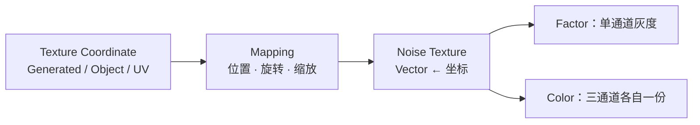
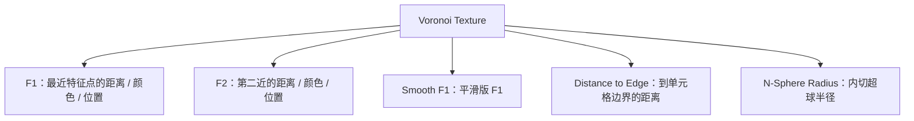

# 02 · 噪声家族：Noise / Voronoi / Wave / Gabor（2–2.5h）⭐

> **一句话**：程序化材质的全部素材，就是六七个噪声节点各自的输出做成学习和障蔽组合——先看清它们各自「画」出来的是什么形状，才有得选。
> 依据：[Texture Nodes · 官方手册 5.2](https://docs.blender.org/manual/en/latest/render/shader_nodes/textures/index.html) · [Noise](https://docs.blender.org/manual/en/latest/render/shader_nodes/textures/noise.html) · [Voronoi](https://docs.blender.org/manual/en/latest/render/shader_nodes/textures/voronoi.html) · [Wave](https://docs.blender.org/manual/en/latest/render/shader_nodes/textures/wave.html) · [Gabor](https://docs.blender.org/manual/en/latest/render/shader_nodes/textures/gabor.html) · [White Noise](https://docs.blender.org/manual/en/latest/render/shader_nodes/textures/white_noise.html)

---

## 一、先订正两件会让你卡住的事

### 1. Musgrave 已经不在了（从 4.1 起）

5.2 手册的纹理节点列表里**没有 Musgrave**，`textures/musgrave.html` 这个页面直接是 404。它的功能被合并进了 Noise Texture：

> Release Notes 原话：The *Musgrave Texture* node was replaced by the *Noise Texture* node. Existing shader node setups are converted automatically, and the resulting renders are identical. The `Dimension` input is replaced by a `Roughness` input, where `Roughness = power(Lacunarity, -Dimension)`. The `Detail` input value must be subtracted by 1 compared to the old Musgrave Texture node.

**换算表（看老教程时用）**

| 老 Musgrave | 现在 Noise |
| ----------- | ---------- |
| 整个节点 | Noise Texture，`Type` 下拉选非 fBM 的那四种 |
| `Dimension` | `Roughness = Lacunarity ^ (-Dimension)` |
| `Detail` | `Detail - 1` |
| （没有） | 额外的 `Distortion` 输入和 `Color` 输出（这是合并带来的好处） |

> 所以：下次看到老教程说「加个 Musgrave，选 fBM」，你的动作是**加 Noise Texture，把 Type 改成 fBM**。同一件事，位置不一样。

### 2. Voronoi 的花纹在 5.0 变了

> 5.0 Rendering 原话：Voronoi Texture nodes are now several times faster by using a faster hashing algorithm. However, this changes the resulting pattern.

含义很直接：**节点行为没变，但同样的参数在 5.0 前后会画出不同的单元格分布**。跟着 5.0 之前的教程复刻「第 3 个案例那种石头」是复刻不出来的——不要浪费时间试图对齐，直接自己调 `Scale` 和 `Randomness` 到你满意为止。

---

## 二、Noise Texture：最常用的那一个



**输入（参数是动态的，按 Type 与 Dimensions 显示）**

| 输入 | 作用 | 手感 |
| ---- | ---- | ---- |
| `Vector` | 采样坐标（留空则用 Generated） | 06 篇会专门讲坐标怎么选 |
| `W` | 1D / 4D 时的额外一维 | 动画时把它接 Time 可以做「缓慢演化」 |
| `Scale` | 基础八度的缩放 | **最常用的旋钮**，越大花纹越密 |
| `Detail` | 八度层数，**可以是小数**（2.5 = 2 层与 3 层各一半混合） | 决定「细碎程度」 |
| `Roughness` | 平滑 ↔ 尖锐峰值之间的混合 | 决定「八度之间差多少」 |
| `Lacunarity` | 相邻八度的倍率差 | 决定纹理是不是有明确的层叠感 |
| `Offset` | 每一层加的偏移 | 决定细节层出现的门槛 |
| `Gain` | 额外的倍率微调 | 想让细节更显著时用 |
| `Distortion` | 扭曲量 | 云、大理石、破损类几乎必开一点 |

**Type 下拉（这就是老 Musgrave 的五种）**

| Type | 画出来像什么 | 典型用途 |
| ---- | ------------ | -------- |
| **fBM**（默认） | 均匀、各向同性的团絮 | 基础脏污、积尘、起伏的基底 |
| **Multifractal** | 不均匀、随地而异，像真地形 | 地形、腐蚀的不均匀区域 |
| **Hybrid Multifractal** | 有峰有谷， roughness 会变 | 山脉从平原拔地而起的感觉 |
| **Ridged Multifractal** | 尖锐山脊 | 山脉、岩石裂纹、闪电 |
| **Hetero Terrain** | 类 Hybrid，但带河道感 | 侵蚀地形、流痕 |

### ⭐ `Normalize fBM` 这一条一定要懂

手册原文：勾选时确保输出落在 0.0–1.0；**不勾时值域最多是 -(Detail+1) 到 Detail+1**。

```text
后果：Detail = 8 且没勾 Normalize → 输出可能是 -9 ~ 9
把这个值直接接到 Mix Color 的 Factor 上 → 几乎整面饱和成 A 或 B
```

> 判断标准：**任何要当 Factor / 遮罩用的噪声，输出必须是 0–1。** 两条路：勾 `Normalize fBM`（省事），或者在后面挂一个 `Map Range` 手动收拢（可控）。差别见 03 篇。

### 手册 Notes 里的两个经典「怪现象」

| 现象 | 根因 | 手册给的三条解法 |
| ---- | ---- | ---------------- |
| 网格排列的一堆物体，噪声值全是 0.5 | 手册证明了：**在任何噪声 scale 倒数的整数倍位置上采样，结果必然是 0.5** | ① 改噪声 Scale 避开对齐；② 给坐标加一个任意 Offset；③ 提到更高维度再调那一维 |
| 平面上出现规则条带 | 平面沿某一轴轻微倾斜，导致垂直方向变化过慢，把噪声的网格结构暴露出来了 | 把坐标**随便旋转一个角度** |

---

## 三、Voronoi Texture：细胞/几何单元专用



| Feature | 画出来是什么 | 用途 |
| ------- | ------------ | ---- |
| `F1` | 标准的 Worley 细胞 | 鹅卵石、地砖、盔甲鳞片 |
| `F2` | 第二近的距离（对比更强） | 和 F1 组合做**带倒角的细胞** |
| `Smooth F1` | F1 的平滑版本 | 手册示例：`F1 - Smooth F1` 直接得到倒角细胞边界 |
| `Distance to Edge` | 到边界的距离，**越靠中线越亮** | ⭐ 砖缝、裂纹、马赛克接缝、以及任何「只留边缘一圈」的图层 |
| `N-Sphere Radius` | 每个细胞里能塞多大一个球 | ⭐ 手册示例：用这一个输出就能做出「紧密排布的球」

**关键参数**

| 参数 | 作用 |
| ---- | ---- |
| `Distance Metric` | Euclidean / Manhattan / Chebychev / Minkowski（`Exponent` 参数：1=Manhattan，2=Euclidean，32≈Chebychev）→ **换度量=换细胞的「圆度」** |
| `Randomness` |  randomness 越低，细胞越规则成网格；1.0 是标准的杂乱随机 |
| `Exponent` | 只在 Minkowski 下出现，控制距离的计算方式 |
| `Normalize` | 确保输出在 0–1（手册注明：**F2 模式下偶有越界**） |

> ⚠️ 手册 Notes：`Randomness` 给太低时会出现渲染瑕疵，成因和 White Noise 的 Notes 是同一类（浮点精度），解法也一致。

---

## 四、Wave Texture：条带与同心圆

| 属性 | 选项 | 效果 |
| ---- | ---- | ---- |
| `Type` | `Bands` / `Rings` | 直条 / 同心圆 |
| Direction | X / Y / Z / **Diagonal**（仅 Bands）/ **Spherical**（仅 Rings） | `Spherical` 是「靶心」式的同心球壳 ⇒ **年轮、木瘤、行星图层** |
| `Wave Profile` | `Sine` / `Saw` | Saw 有明确的单向锯齿感（不对称） |
| `Distortion` + `Detail` + `Detail Scale` + `Roughness` | 让条带被噪声扭曲 | 手册 Hint 明说：这里的扭曲本质就是**用 Noise 的 Color 输出去偏移采样坐标**；`Detail / Detail Scale / Roughness` 三个参数就是那个内部 Noise 的参数 |
| `Phase Offset` | 沿方向的相位 | 扭曲自己做不出来时，用它做额外的手动控制 |

> 手册的 Hint 值得记住：**任何纹理都能用「把坐标和一个噪声混一下」来扭曲**。Wave 只是把这套流程内置了。这条通用技法在 05 篇会反复用到。

---

## 五、Gabor Texture：5.x 里最被低估的一个

> 手册原文：Gabor noise is visually characterized by random interleaved bands whose direction and width can be controlled.

| 输入 | 作用 |
| ---- | ---- |
| `Scale` | 全局缩放 |
| `Frequency` | **垂直于**噪声方向上的变化率（不同于 Scale） |
| `Anisotropy` | 1 = 完全定向；0 = 全向 |
| `Orientation` | 2D 时是角度；3D 时是单位方向向量 |

三个输出要分开看：

| 输出 | 特点 | 用途 |
| ---- | ---- | ---- |
| `Value` | 相位 × 强度，会有**对比度不足的淡区** | 直接用 |
| `Phase` | 只有相位，没有随机强弱 → **手规整、无淡区** | 手册点名适合 sand dunes（沙丘）这类有结构感的图案 |
| `Intensity` | 只有强弱 → **接近 0 的地方就是 Phase 的奇点** | 想藏掉那些「条纹汇合处」的不自然斑点，就乘一个 Intensity 的变体 |

> ⚠️ 手册也提醒：如果只是想要「各向同性的噪声」，**用 Noise Texture 更便宜**——Gabor 计算更贵，它的价值在于「定向 + 相位可控」。

---

## 六、White Noise Texture：随机数生成器，不是噪声图

它的输出是「按种子算出来的随机值」，和 Perlin / Worley 完全不是一回事：

| 用法 | 怎么做 |
| ---- | ------ |
| 每个物体一个随机数 | 给它喂一个「每个物体固定但互不相同」的向量（通常是 Object 坐标或 Object Info 的 Random 经过 Vector） |
| Cell noise（格状随机） | 手册示例：先用 `Vector Math → Snap` 把坐标吸附到网格，再喂 White Noise ⭐ |
| 抖动 / 颗粒感 | 直接当高频均匀白噪点用 |

**手册 Notes（低质量 White Noise 的三条救法）**

1. 消除有问题的那一维（降维度，或乘 0）；
2. 给种子加一个任意值（避开整数边界）；
3. 对种子取绝对值（统一 +0 / -0）。

---

## 七、选型速查表

| 你要做 | 首选节点 | 关键参数 | 备注 |
| ------ | -------- | -------- | ---- |
| 通用脏污 / 积尘底噪 | Noise · fBM | Scale 高、Detail 5–10、Distortion 0.5 | 归一化！ |
| 山脉 / 岩石裂纹 | Noise · Ridged Multifractal | Detail 6–12 | |
| 地形侵蚀 | Noise · Hetero Terrain / Hybrid | Distortion 给一点 | |
| 大理石 / vein | Noise · fBM → ColorRamp 卡高值 | Detail 高 + Distortion 大 | |
| 鹅卵石 / 鳞片 / 砖 | Voronoi · F1 或 Smooth F1 | Randomness 0.7–1.0 | 5.0 之后花纹分布变了 |
| 砖缝 / 裂纹网格 | Voronoi · Distance to Edge | 再卡一个小于阈值 | |
| 紧密排布的球 / 气泡 | Voronoi · N-Sphere Radius | 输出 `Radius` 直接当高度用 | |
| 木纹（简化） | Wave · Rings + Spherical + Distortion | Detail Scale 高、Distortion 大 | |
| 沙丘 / 编织 / 定向刮痕 | Gabor · Phase | Anisotropy ≈1，调 Orientation | 比 Noise 贵 |
| 每个物体一个随机数 | White Noise | 种子 = 每物体固定的向量 | |
| 立方格子/方块拼贴的随机装饰 | White Noise + Vector Math → Snap | 手册示例 | |

---

## 八、常见坑

- ❌ **照老教程找 Musgrave** → 4.1 起并进 Noise 了 → 用 Noise 的 `Type` 下拉，`Detail` 记得减 1
- ❌ **照古早 5.0 之前教程调 Voronoi 的 Randomness 想复刻图案** → 5.0 换了哈希，花纹不同 → 自己调
- ❌ **Noise 出来一片 0.5（尤其棋盘排布的一堆物体）** → 整数倍位置采样必得 0.5 → 改 Scale / 加 Offset / 提维度
- ❌ **平面上出现规则条带** → 轻微倾斜暴露了网格结构 → 把坐标旋转一个任意角度
- ❌ **噪声没归一化就接 Factor** → Detail 高时值域远超 0–1 → 大面积饱和 → 勾 `Normalize fBM` 或补 `Map Range`
- ❌ **Voronoi 的 Randomness 给到 0** → 得到规则网格 + 手册明说的渲染瑕疵 → 至少给 0.1 以上
- ❌ **以为 Noise 就是「每物体随机」** → Noise 是空间的函数，同一位置的物体必然一样 → 要随机器用 White Noise 或 `Object Info → Random`
- ❌ **用了 4D 维度但没用上 W** → 白白付出手册警告的「维度越高渲染越贵」
- ❌ **为一点点全向噪声用了 Gabor** → 手册明说 Noise 更划算 → Gabor 留给「定向」需求
- ❌ **见到 `Detail` 可以填小数却不敢用** → 它本来就是为「2 层和 3 层混合」设计的

---

## 九、自检

| # | 自检点 | 通过标准 |
| - | ------ | -------- |
| ① | Musgrave 去向 | 说出它从哪个版本并入了哪个节点，并写出 Detail 和 Dimension 两条换算 |
| ② | Type 选型 | 给「岩石裂纹 / 积尘 / 地形 / 木纹」四个目标，各报出一个 `Type` 并说出理由 |
| ③ | 归一化 | 说出 Level Detail = 10 且不勾 Normalize 时的值域，以及接 Factor 会发生什么 |
| ④ | Voronoi 的五个 Feature | 说出 Feature 的五个选项里，**哪两个是做「边界/缝隙」的**，以及它们各自的含义 |
| ⑤ | 5.0 行为变化 | 说出 Voronoi 在 5.0 改了什么、会不会影响节点用法 |
| ⑥ | 实操 | **不看教程**：在一个平面上分别用 Noise(fBM) / Voronoi(Distance to Edge) / Wave(Rings+Spherical) / White Noise 各出一张图，并说出各自的参数组合 |

---

## 十、速查

```text
【Noise Texture】
Type:    fBM / Multifractal / Hybrid Multifractal / Ridged Multifractal / Hetero Terrain
         ↑ 老教程的 Musgrave 就藏在这里
Scale      花纹密度（最常动）
Detail     层数，可小数（2.5 = 2层与3层混合）
Roughness  平滑 ↔ 尖锐（= 老 Musgrave 的 Lacunarity^(-Dimension)）
Distortion 扭曲（云雾 / 大理石 / 破损几乎都开一点）
Gain       细节强弱微调
Dimensions 1D/2D/3D/4D，越高越贵，够用就行
☑ Normalize fBM   要做遮罩 / Factor 时必须勾
                   （不勾时值域最大 = ±(Detail+1)）

【老 Musgrave 换算】
Detail_new  = Detail_old - 1
Roughness   = Lacunarity ^ (-Dimension_old)

【Voronoi Texture】
Feature:  F1  F2  Smooth F1  Distance to Edge(做缝)  N-Sphere Radius(排球)
Distance Metric: Euclidean / Manhattan / Chebychev / Minkowski(+Exponent)
Randomness: 1.0 杂乱 ←→ 0.0 规则网格（太低会有渲染瑕疵）
⚠ 5.0 起换哈希，同一个参数的花纹与 5.0 之前不同

【Wave Texture】
Type: Bands(条) / Rings(同心圆)
Direction: X/Y/Z / Diagonal(仅Bands) / Spherical(仅Rings，做年轮/靶心)
Profile: Sine / Saw
Distortion+Detail+Detail Scale+Roughness = 内部那个 Noise 的参数
通用技法：任何纹理都能靠「坐标 + 噪声」来扭曲

【Gabor Texture】
只有「定向 + 相位可控」时才值得用（全向噪声用 Noise 更便宜）
Anisotropy 1=完全定向  0=全向
输出选谁：Value=直接用 / Phase=规整无淡区(沙丘) / Intensity=找奇点

【White Noise Texture】
定位是「随机数」不是「噪声图」
每物体一个随机数 / Snap 之后做 cell noise
精度问题三招：去掉问题那维 / 加个偏移 / 取绝对值
```

---

## 资源

- [Texture Nodes 索引 · 官方手册 5.2](https://docs.blender.org/manual/en/latest/render/shader_nodes/textures/index.html)
- [4.1 Release Notes · Musgrave Texture](https://developer.blender.org/docs/release_notes/4.1/rendering/)
- [5.0 Release Notes · Voronoi Texture](https://developer.blender.org/docs/release_notes/5.0/rendering/)
- YouTube · Erindale（单个噪声节点讲得最细的频道）
- YouTube · Blender Secrets（短技巧，注意筛选 5.x 的

---

> **下一步**：[`03-遮罩语言-灰度即一切.md`](03-遮罩语言-灰度即一切.md)。上一节攒完素材，下一步学怎么把它们切成「哪里、多少」——这才是程序化材质真正的技术含量所在。
