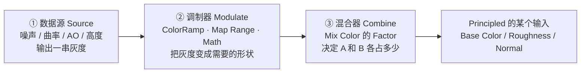
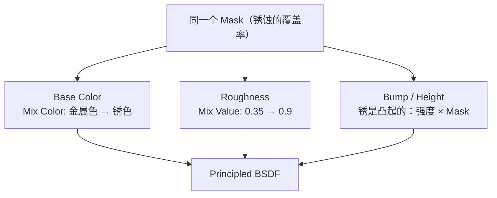

# 03 · 遮罩语言：灰度即一切（1.5–2h）⭐

> **一句话**：程序化材质里所有让人觉得「高级」的效果，追到底都是同一件事——把一串 0 到 1 的灰度，翻译成「哪里有、有多少」。
> 依据：[Color Nodes](https://docs.blender.org/manual/en/latest/render/shader_nodes/color/index.html) · [Math Nodes](https://docs.blender.org/manual/en/latest/render/shader_nodes/utilities/math/index.html) · [Vector Nodes](https://docs.blender.org/manual/en/latest/render/shader_nodes/utilities/vector/index.html) · [Implicit Conversion](https://docs.blender.org/manual/en/latest/render/shader_nodes/utilities/implicit_conversion.html)

---

## 一、三层心智模型

任何一套程序化材质，不管多复杂，节点都能归到这三层：



> **绝大多数新手的错误**：花 80% 时间调第 ① 层（换噪声、加 Distortion），却在第 ② 层只用了一个默认值。但真正决定观感的恰恰是第 ② 层——同样的噪声，用不同的 ColorRamp 能做出泥土、铁锈、瓷砖缝三种完全不同的东西。

### 两件必须分清的事

| 概念 | 含义 | 例子 |
| ---- | ---- | ---- |
| **值 Value**（单通道） | 一个 0–1 的灰度 | 「这里锈多少」 |
| **颜色 Color**（三通道） | 三个 0–1 | 「锈是什么颜色」 |

同一个采样接口经常同时有 `Fac` 和 `Color` 两个输出，**做遮罩用 `Fac`，做视觉用 `Color`**。混着用不会报错，但会出现「颜色被当成单一强度」这种难以描述的怪结果（颜色可按需要隐式转成灰度，见手册 Implicit Conversion）。

---

## 二、调制器：四种工具的取舍

| 工具 | 位置 | 擅长 | 不擅长 |
| ---- | ---- | ---- | ------ |
| **Color Ramp** | `Shift+A → Color → Color Ramp` | ⭐ 直觉式曲线：拖黑白滑块看马上就有反馈 | 精确数值控制（手抖一格就变了） |
| **Map Range** | Math 分类 | ⭐ 把任意值域线性收拢到 0–1；可调目标区间（比如收到 0.4–0.9） | 非线性曲线形状 |
| **RGB Curves** | Color 分类 | 每个通道单独一条任意曲线 | 上手成本高，通常没必要 |
| **Float Curve** | Math 分类 | 单通道的任意曲线 | 同上 |
| **Math**（Greater/Less Than） | Math 分类 | ⭐ **硬边界**：二值化 0/1 | 任何需要过渡的地方 |

### ColorRamp：这一篇最该练熟的一个节点

```text
典型用法（这是重点）：
 Noise Fac → ColorRamp → Mask

 ColorRamp 的两个滑块位置 = 「低于下限的是全黑，高于上限的是全白」

 滑块靠得越近 → 过渡越硬
 滑块拉到重叠 → 几乎二值化（等同于 Greater Than）
 滑块拉开到两端 → 保留噪声原本的柔和过渡
```

| 想要的效果 | 怎么拖 |
| ---------- | ------ |
| 只有很小一部分区域有值 | 把两个滑块都推到高数值一侧（比如 0.6 / 0.75） |
| 大面积铺、只留一点点空隙 | 把两个滑块推到低数值一侧（比如 0.1 / 0.25） |
| 边界清晰（格子缝、斑点） | 两个滑块靠近，间距甚至可以调到极小 |
| 柔和云雾（积尘） | 两个滑块拉开，中间跨度高 |

> 判断标准不是滑块的具体数值，而是**覆盖率**：先用它把有值的区域控制到 15% 左右，再谈别的。训练方法就是把同一个噪声接到 ColorRamp 上，试着把覆盖率分别控制在 5% / 15% / 40% 三档——手感到位了，后面所有内容都变简单。

---

## 三、混合器：`Mix Color` 的 Factor 语义

5.2 手册里 `Mix Color` 在 **Color 分类**里（`Color → Mix Color`）。老教程叫它 `MixRGB`，位置也变了——**手册里现在已经没有 Converter 这个分类**。

```text
Mix Color 的三个输入：
  A：底色
  B：要混进去的东西
  Factor：0 = 完全是 A，1 = 完全是 B，0.5 = 各一半

⚠️ Factor 是有业务语义的：它必须是 0–1。
   超出部分会被截断 → 表现为「某些区域莫名其妙全变成 B」
```

### 归一化：什么时候必须做

| 信号来源 | 是否天然 0–1 | 处理 |
| -------- | ------------ | ---- |
| Noise `Fac`（勾了 Normalize fBM） | ✅ | 直接用 |
| Noise `Fac`（**没勾** Normalize） | ❌ 值域最多 ±(Detail+1) | 勾上，或补 `Map Range` |
| Voronoi `Distance`（勾 Normalize） | ✅ | 用；F2 模式可能偶有越界 |
| Pointiness（04 篇） | ⚠️ 大致 0–1 但极性要靠 `ColorRamp` 校准 | ColorRamp 归一化 + 反相 |
| Math 相加的结果 | ❌ 可能到 2.0 | `Map Range` 或乘 0.5 |
| 两个遮罩相乘 | ✅ 越乘越小，不会超 1 | 直接用 |

> **口诀：进 Mix Factor 之前，先问一句「这个值的最大值可能是多少」。**

---

## 四、把灰度接到材料属性上

同一个遮罩，可以同时驱动多个通道，这是「层次感」的来源：



| Principled 输入 | 一般 | 跳过会发生什么 |
| --------------- | ---- | -------------- |
| `Base Color` | 必做 | 看不到 mask，等于没做 |
| `Roughness` | **几乎必做** | ⚠️ 只改颜色不改粗糙度 → 看起来像贴纸、很假。这是最高频的失败模式 |
| `Bump`（或具体的 Height 层） | 建议做 | 缺了凹凸，看起来是平的 |
| `Metallic` | 看情况 | 锈蚀层一般是非金属（metal=0），所以在「锈蚀区域把 Metallic 降下来」是加分项 |

> 关于 Roughness 与 Metallic 的合理数值范围（金属 Base Color 0.75–1.0、非金属 0.02–0.25 之类），见 [`../../05-材质PBR与烘焙/01-PBR原理与Principled-BSDF全解.md`](../../05-材质PBR与烘焙/01-PBR原理与Principled-BSDF全解.md)。程序化不豁免物理——**节点算得再花，数值给错一样难看**。

---

## 五、常见坑

- ❌ **只在 Base Color 上做效果** → 看着像贴上去的贴纸 → 同一张 mask 必须同时驱动 Roughness（最好还有 Bump）
- ❌ **噪声没归一化就进 Mix Factor** → 大面积饱和 → 勾 `Normalize fBM` 或补 `Map Range`
- ❌ **把 Color 输出当 Factor 用** → 颜色会被隐式转成灰度，结果和肉眼看到的不一致 → 用 `Fac` 输出（或显式加 `RGB to BW`）
- ❌ **用 `Greater Than` 做云雾** → 硬得像棋盘 → ColorRamp 的滑块才是对的
- ❌ **用 ColorRamp 追求精确数值** → 手抖一格就变样 → 要精确数值用 `Math` / `Map Range`
- ❌ **两个 mask 相加** → 结果可能到 2.0 → 用相乘（遮罩相乘 = 交集，且不会超界）
- ❌ **层次堆到十几层** → 不但没人看得出来，还慢 → 一般三层足够（05 篇的分层法）
- ❌ **按快捷键找不到 Mix Color** → 手册里在 Color 分类，且 Converter 已经不存在了 → `F3` 搜 Mix Color
- ❌ **忘了这些节点 glTF 全都不认** → 导出后全丢 → 必须在烘焙之前就用完

---

## 六、自检

| # | 自检点 | 通过标准 |
| - | ------ | -------- |
| ① | 三层模型 | 随便给一套节点树，能指出每个节点属于「数据源 / 调制器 / 混合器」哪一层 |
| ② | Factor 语义 | 说出 Factor 必须是 0–1 的原因，以及超界的表现是什么 |
| ③ | 归一化 | 给出「Noise 没勾 Normalize + Math 相加 + 两个遮罩相乘」三个信号，各说出会不会超界 |
| ④ | ColorRamp 手感 | **实操**：给一张噪声，90 秒内用 ColorRamp 把覆盖率调到约 15% 和约 40% 两档 |
| ⑤ | 多层驱动 | 说出同一张 mask 应同时驱动哪三个 Principled 输入，以及漏了 Roughness 的后果 |
| ⑥ | 节点位置 | 说出 5.2 里 `Mix Color` / `Color Ramp` 在哪个分类（并知道老教程的 Converter 已不在） |

---

## 七、速查

```text
【三层模型】
噪声 / 曲率 / AO / 高度   → 数据源
ColorRamp / Map Range / Math  → 调制器
Mix Color (Factor)       → 混合器 → Principled 输入

【用什么改灰度形状】
要直觉手感      → ColorRamp（拖滑块，看反馈）
要精确值域      → Map Range（还可映射成 0.4~0.9 这种区间）
要硬边界(二值)  → Math → Greater Than / Less Than
要任意弯曲      → Float Curve / RGB Curves（进阶）

【ColorRamp 覆盖率手感】
滑块推到高侧(0.6/0.75)  → 只有少部分有值（锈斑、斑点）
滑块推到低侧(0.1/0.25)  → 大面积铺满（积尘、base 层）
滑块靠近              → 边界更硬
滑块拉开              → 过渡更柔（云雾）

【Mix Color】
Factor 0 = 全是 A   1 = 全是 B   0.5 = 各一半
⚠ Factor 必须在 0~1：超界会莫名其妙全变成 B
  进 Factor 之前先问：「这个值的最大值可能是多少？」
快速对比有无这一层：Shift+Ctrl+Alt+Left/Right（Factor 设 0 / 1）

【遮罩组合】
相乘 = 交集（不会超界，最常用）
相加 = 并集（可能到 2.0，之后必须 Map Range）
取反 = 1 - x（或用 Invert Color）

【同一张 mask 至少要驱动】
① Base Color  ② Roughness（漏了必假）  ③ Bump/Height

【注意】
这些节点 glTF 一个都不认 → 必须在烘焙前用完
```

---

## 资源

- [Color Nodes · 官方手册 5.2](https://docs.blender.org/manual/en/latest/render/shader_nodes/color/index.html)
- [Math Nodes · 官方手册 5.2](https://docs.blender.org/manual/en/latest/render/shader_nodes/utilities/math/index.html)
- [Implicit Conversion · 官方手册 5.2](https://docs.blender.org/manual/en/latest/render/shader_nodes/utilities/implicit_conversion.html)（颜色 ↔ 值 的隐式转换规则）
- [`../../05-材质PBR与烘焙/01-PBR原理与Principled-BSDF全解.md`](../../05-材质PBR与烘焙/01-PBR原理与Principled-BSDF全解.md)（可信数值范围）

---

> **下一步**：[`04-边缘与曲率检测-Pointiness-AO-Bevel.md`](04-边缘与曲率检测-Pointiness-AO-Bevel.md)。这一篇的 mask 都是「随机分布的」，而真实世界里，磨损和积灰有很强的地方偏好——它们只出现在边缘和角落。下一节做「位置感知」的 mask。
