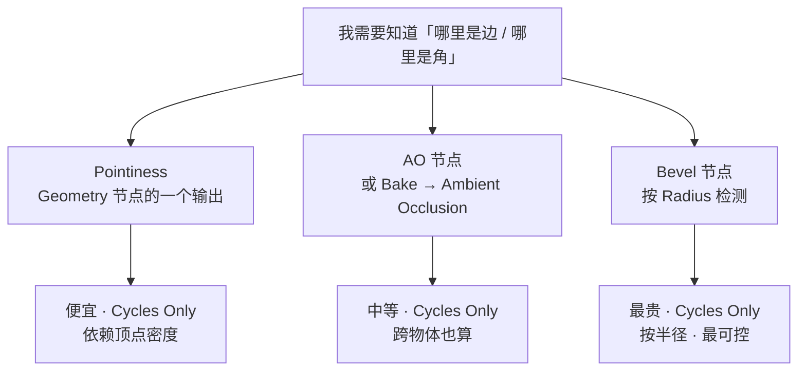
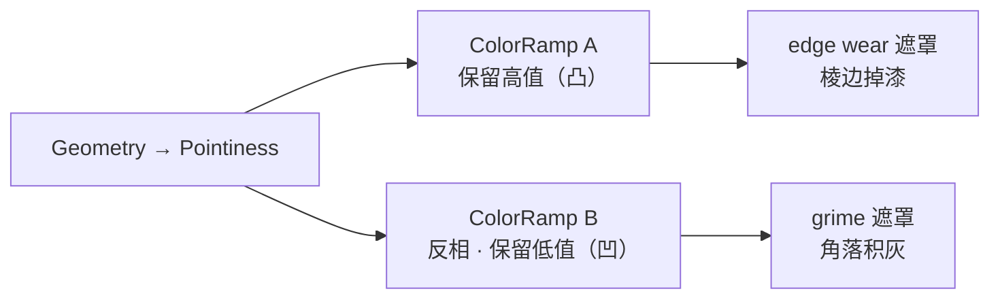
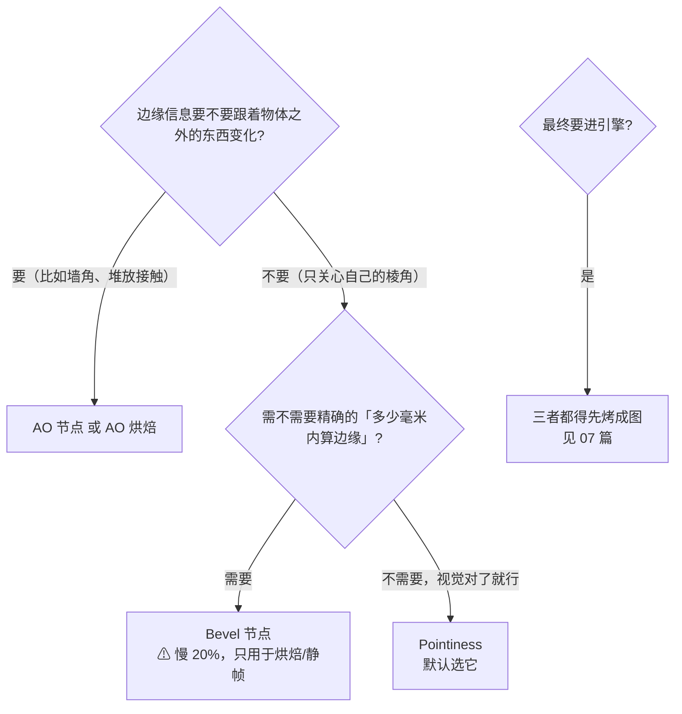

# 04 · 边缘与曲率检测：Pointiness / AO / Bevel 节点（1.5h）

> **一句话**：真实世界里，磨损不会平均分布——它只出现在能被手摸到、能被雨淋到的地方；所以「想办法让噪声看起来不均匀」是死路，「根据几何算出来」的遮罩才可信。
> 依据：[Geometry 节点](https://docs.blender.org/manual/en/latest/render/shader_nodes/input/geometry.html) · [Ambient Occlusion 节点](https://docs.blender.org/manual/en/latest/render/shader_nodes/input/ao.html) · [Bevel 节点](https://docs.blender.org/manual/en/latest/render/shader_nodes/input/bevel.html)

---

## 一、先订正：Blender 里没有 Curvature

| 常见说法 | 实际情况 |
| -------- | -------- |
| 「加一个 **Curvature** 节点」 | ❌ 没有这个节点。5.2 的输入节点清单里不存在同名条目 |
| 「烤一张 **Curvature** 图」 | ❌ 官方 Bake Type 里也没有这一项（Stage 4 · 04 已订正一次） |
| 「用 `Geometry → Pointiness`」 | ✅ 这是唯一的曲率来源（近似值），见下一节 |

> 这两个叫法来自 Substance Designer 的 Curvature map，是被教程作者顺手带进来的。在 Blender 里查不到时不要怀疑自己——**它确实不存在**。

---

## 二、三个来源，成本与适用完全不同



| 来源 | 位置 | 输出什么 | 开销 | 适用场景 |
| ---- | ---- | -------- | ---- | -------- |
| **Pointiness** | `Geometry → Pointiness` | 逐顶点的曲率近似：**亮 = 凸角，暗 = 凹角** | 最省 | ⭐ 磨损 / 积尘的默认首选 |
| **Ambient Occlusion 节点** | `Input → Ambient Occlusion` | 着色点上方半球的遮蔽程度 | 手册原话：expensive shader | 需要**跨物体**（放到场景里才有 AO）的效果 |
| **Bevel 节点** | `Input → Bevel` | 按 `Radius` 找到边/角，输出 Normal（类似真实圆角） | 手册原话：**可能让渲染慢 20%** | ⭐ 需要「按真实半径精确圈选边缘」时；手册建议**只用于烘焙或静帧** |
| AO 烘焙 | `Render → Bake → Ambient Occlusion` | 一张 AO 图 | 一次性 | ⭐ 是最终要进引擎的东西——真正导出时总是走这条路 |

### Pointiness 的正确用法

手册原文：

> An approximation of the curvature of the mesh per vertex. Lighter values indicate convex angles, darker values indicate concave angles. It allows you to do effects like dirt maps and wear-off effects.

关键的三个字是 **per vertex（逐顶点）**——这决定了它的两个特性：

| 特性 | 后果 |
| ---- | ---- |
| 它是**逐顶点插值的** | 顶点越密，曲率越精细；一个只有 8 个顶点的 Cube，用 Pointiness 做不出任何有意义的边缘 mask |
| 它是**近似** | 不像真正的微分曲率那样精确，但足够做视觉表达 |

**极性**（务必记住，搞反了整套逻辑就全反了）：

```text
Pointiness 值小（偏暗） = 凹进去的地方（沟缝、角落、内角）→ 积灰 / 积污 / 生锈开始的地方
Pointiness 值大（偏亮） = 凸出来的地方（棱边、转角、外角）→ 磨损 / 掉漆 / 被手摸亮的地方
```

同一个输出，用**两个极性相反的 ColorRamp** 就能一次做出两张 mask：



---

## 三、三条 Source 的取舍原则



### AO 节点的两个关键参数

| 参数 | 含义 | 怎么设 |
| ---- | ---- | ------ |
| `Distance` | 多远以内的物体算遮蔽 | **0 或留空 = 无限远**（什么都不设时会把整个场景算进去）→ 想要「物体自身的缝隙」就要设一个具体的米数 |
| `Only Local` | 只算物体自身，不含其他物体 | ⭐ 做单一道具的边缘蒙版时打开，能避免「搬到另一个场景效果就变了」 |
| `Inside` | 检测凸形（反转语义） | 一般不用 |
| `Samples` | 采样数 | 手册提醒："Keep as low as possible for optimal performance" |

> 手册里还有一句很重要的话：只在 performance 敏感时用 Pointiness 或**烘焙 AO** 代替 AO 节点——这就是为什么 (@ baking) 不是可选项而是必经之路。

---

## 四、Bevel 节点：贵但在正确场合无可替代

手册说了三件事，都值得记住：

1. 它像 bump mapping 一样**不改真几何，只改着色**（「rounded corners」的观感）；
2. **可能让渲染慢 20%**，所以「建议主要用在烘焙或静帧」；
3. 手册给了两个「得不到合法结果」的条件（Caustics 相关 + OSL 配 OptiX）。

| 参数 | 值 | 说明 |
| ---- | -- | ---- |
| `Radius` | 米 | 决定「多宽的范围算边缘」——这是它比 Pointiness 强的地方 |
| `Normal` | 可选 | 不接就用着色法线；常和 Bump 节点组合 |
| `Samples` | 默认 4 | 越高质量越好也越慢 |

> **Bevel 节点 + 蒙版的做法**：Bevel 输出的是 Normal，要当 mask 用得把它「变成标量」——通常的做法是把它和原法线做比较（差异越大 = 越靠近边缘），或者干脆用它来驱动 Bump 强度。先记住它的成本高，别在调试阶段常开。

---

## 五、还有一个：Random per Island

手册里 `Geometry → Random per Island` 同样标了 Cycles Only：

> A random value for each connected component (island) of the mesh. It is useful to add variations to meshes composed of separated units like tree leaves, wood planks, or curves of multiple splines.

| 用途 | 怎么做 |
| ---- | ------ |
| 一堆木板每块颜色略不同 | `Random per Island` → 驱动 ColorRamp / Hue/Saturation |
| Array 修改器的每个副本不同 | 手册示例明确点了这个用法（配合 `Object Info → Random` 能做到更彻底的对象级随机） |

⚠️ 它和 `Object Info → Random` 的区别要分清：

| | `Random per Island`（Cycles Only） | `Object Info → Random` |
| - | ---------------------------------- | ---------------------- |
| 粒度 | 网格内每个**连通块**一个值 | 每个**物体**一个值 |
| EEVEE 可用 | ❌ | ✅ |
| 典型场景 | 一块 blend 里被切开的多块木板，每块不同 | 场景里散落的多个物体互不相同 |

---

## 六、常见坑

- ❌ **在 EEVEE 里调 Pointiness 蒙版** → 完全没有效果，还会以为自己接错了 → 手册明确标 Cycles Only，**先切到 Cycles**
- ❌ **找 Curvature 节点 / Curvature 烘焙类型** → 都没有 → `Geometry → Pointiness`
- ❌ **极性别搞反** → 棱边上反而在积锈、转角反而干净 → 记住「亮=凸，暗=凹」，而且掉漆在亮、积灰在暗
- ❌ **给一个 Cube 用 Pointiness 想出边缘效果** → 8 个顶点的物体做不出锐利过度(它是逐顶点插值的) → 要么加几何，要么改用 Bevel 节点
- ❌ **AO 节点的 Distance 留空就期望它是「物体自身缝隙」** → 实际会算进整个场景
- ❌ **为了更精细的边缘检测就去常开 Bevel 节点** → 手册说了可能慢 20% → 只在烘焙或静帧阶段开
- ❌ **想靠 Pointiness 得到精确「多少毫米」的边缘** → 它是近似 → 用 Bevel 节点的 Radius
- ❌ **用 Random per Island 想做「每个物体不同」** → 那是 `Object Info → Random` 的活
- ❌ **以为 UE/Bevy 里也能用这些节点** → 全部考前烤成图 → 07 篇

---

## 七、自检

| # | 自检点 | 通过标准 |
| - | ------ | -------- |
| ① | Curvature 的事 | 说出 Blender 里没有 Curvature 节点/烘焙类型，并给出正确的替代 |
| ② | 成本管理 | 说出 Pointiness / AO / Bevel 的开销排序，以及 Bevel 为什么只适合烘焙或静帧 |
| ③ | 极性 | 不看教程说出「亮=凸且适合做磨损，暗=凹且适合做积灰」 |
| ④ | Cycles Only | 说出这四个能力（Pointiness、Random per Island、AO 节点、Bevel 节点）在 EEVEE 下的表现 |
| ⑤ | AO 参数 | 说出 `Distance` 留空会怎样、什么时候该勾 `Only Local` |
| ⑥ | 实操 | **不看教程**：在一个已经加了倒角的方块上，用 Pointiness 同时做出「棱边掉漆」和「角落积灰」两张 mask |

---

## 八、速查

```text
【边缘/曲率的三条来源】
Pointiness            Geometry 节点输出 · 最省 · Cycles Only · 逐顶点近似
Ambient Occlusion 节点 Input → AO · 贵 · Cycles Only · 算跨物体
Bevel 节点            Input → Bevel · 最贵(慢20%) · Cycles Only · 按 Radius 精确

【Pointiness 极性】
亮 = 凸角 → 磨损 / 掉漆 / 被摸亮
暗 = 凹角 → 积灰 / 积污 / 锈蚀起点
两张 mask 并行：一个 ColorRamp 保留高值，另一个反相保留低值

【AO 节点】
Distance   留空/0 = 无限远（把整个场景算进去）→ 要设具体米数
Only Local 只算物体自身（做单道具时打开，避免换场景效果就变）
Samples    尽可能低（手册原话）
手册建议：performance 敏感时用 Pointiness 或「烘焙 AO」代替 AO 节点

【Bevel 节点】
Radius  决定多宽算边缘（这是它强于 Pointiness 的原因）
Samples 默认 4
输出是 Normal，当 mask 用需要转成标量
⚠ 手册：可能让渲染慢 20% → 只用于烘焙或静帧
⚠ Caustics 场景 + OSL(OptiX) 下拿不到正确结果

【Random per Island】
粒度：网格内每个连通块一个值（Cycles Only）
粒度对照：Object Info → Random = 每个物体一个值（EEVEE 也能用）

【所有指向总线】
这些节点引擎一个都不认 → 最终必须烤成图（见 07 篇）
```

---

## 资源

- [Geometry 节点 · 官方手册 5.2](https://docs.blender.org/manual/en/latest/render/shader_nodes/input/geometry.html)
- [Ambient Occlusion 节点 · 官方手册 5.2](https://docs.blender.org/manual/en/latest/render/shader_nodes/input/ao.html)
- [Bevel 节点 · 官方手册 5.2](https://docs.blender.org/manual/en/latest/render/shader_nodes/input/bevel.html)
- [`../../05-材质PBR与烘焙/04-烘焙原理与Cycles烘焙设置.md`](../../05-材质PBR与烘焙/04-烘焙原理与Cycles烘焙设置.md)（AO 烘焙的参数）

---

> **下一步**：[`05-分层堆叠-磨损-污渍-积尘.md`](05-分层堆叠-磨损-污渍-积尘.md)。现在你手上有「随机分布的噪声」和「位置感知的边缘 mask」两类素材了，接下来把它们按真实世界的形成顺序叠起来——这就是「脏」的全部秘密。
