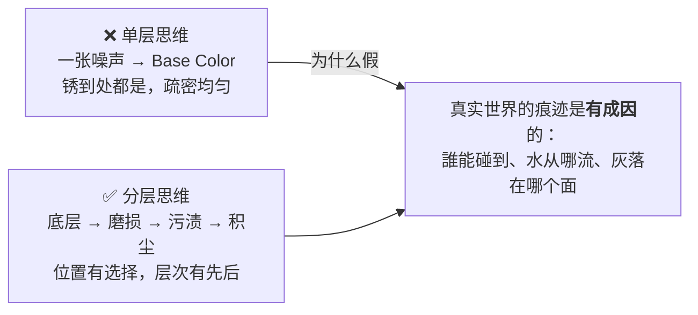
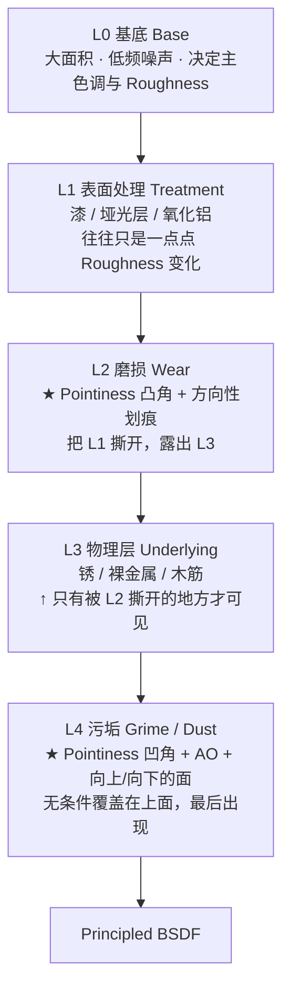
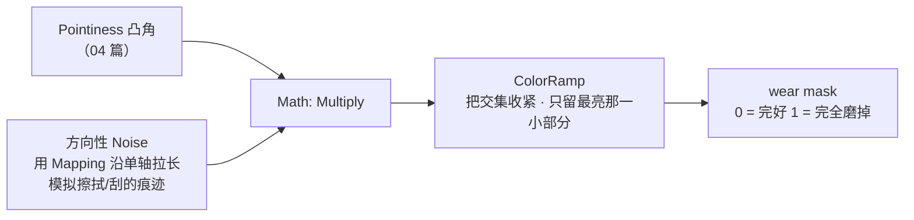

# 05 · 分层堆叠：磨损 · 污渍 · 积尘（1.5–2h）

> **一句话**：现实里的表面状态是「按顺序长出来的」——先有漆，漆被划破，铁在破处生锈，灰尘最后落在最上面；程序化材质只要按这个顺序叠，就会出现那种说不清但一看就对的真实感。
> 依据：本页为技法归纳；物理数值范围见 [`../../05-材质PBR与烘焙/01-PBR原理与Principled-BSDF全解.md`](../../05-材质PBR与烘焙/01-PBR原理与Principled-BSDF全解.md)

---

## 一、为什么「一层做完」会显得假



两个可验证的判断标准：

| 现象 | 单层 / 分层 |
| ---- | ---------- |
| 锈均匀铺满整个面 | 单层 ❌ |
| 锈集中在边缘、螺栓周围、下沿流水处 | 分层 ✅ |
| 划痕方向和物体使用方式无关 | 单层 ❌ |
| 向上的面干净，向下的面积水痕 | 分层 ✅ |

---

## 二、四层参考模型

> 这不是教条，只是一个「够用」的切分方式。实际用其中的 2/3/4 层就足够了，不要堆到十层。



### 顺序为什么重要

| 顺序对了会怎样 | 顺序错了会怎样 |
| -------------- | -------------- |
| 锈只长在被划破的地方 | 锈盖在完好漆面上（畸形） |
| 灰尘覆盖一切，包括划痕 | 划痕划在灰尘之上（时间倒流） |
| 随手写一个新的变体只需要改参数 | 每次都得重搭节点树 |

---

## 三、每层具体怎么搭

### L0 基底

```text
低频 Noise (Scale 小、Detail 3–5、勾 Normalize)
  → ColorRamp（压缩对比，让它只是"不均匀"而不是"有图案"）
  → 驱动 Base Color 的明度微调 + Roughness 的 ±0.1 抖动
```

> 基底的作用不是「看起来有东西」，而是**打破 cg 感里最致命的「绝对均匀」**。哪怕只有这一层，效果也会比纯色好很多。

### L2 磨损（本篇的核心）



关键三步：

| 步骤 | 技巧 | 为什么 |
| ---- | ---- | ------ |
| ① 位置感知 | 用 Pointiness（凸角）+ 手动想要的区域 | 磨损不会随机分布 |
| ② 方向打散（重要） | 在 `Mapping` 里把某一轴的 Scale 拉到 5–20 倍 | ⭐ 拉长之后的噪声才像「擦痕/划痕」，各向同性的噪声只会像污点 |
| ③ 收紧 | 两个 mask **相乘**（交集），再过 ColorRamp 卡阈值 | 交集让磨损「有理由」，也让结果更可信 |

### L4 污垢 / 积尘

```text
Pointiness 凹角（反相）+ AO + 「朝上的面」
  ↓ 相乘
ColorRamp 收紧
  ↓
同时驱动：Base Color（往 dust 色偏）+ Roughness（通常升高）
```

三条物理常识（这些比 PBR 数值更能决定你可不可信）：

| 常识 | 怎么实现 |
| ---- | -------- |
| 灰落在**朝上的面**，不在乎侧面 | `Texture Coordinate → Normal` 与世界 Z 轴做点积 → 只取朝上的部分（或烘焙 AO 直接拿到） |
| 水痕**往下走** | 把噪声沿 Y/Z 轴拉长，让它垂向流动 |
| 凹角**永远比凸角脏** | Pointiness 的反相（04 篇） |

---

## 四、每个 Principled 输入要不要跟着变

一张 mask 只改 Base Color 是不够的（03 篇已经强调过），这里给出更完整的对照：

| Principled 输入 | 磨损 / 锈变时要动吗 | 通常怎么动 |
| --------------- | -------------------- | ---------- |
| `Base Color` | ✅ 必动 | 用 Mix Color 在两种材料色之间插值 |
| `Roughness` | ✅ **几乎必动** | 磨掉的地方更亮/更粗糙；被摸亮的地方反而更光滑（看材质） |
| `Metallic` | ⚠️ 看情况 | 锈/污是非金属 → 有覆盖处的 `Metallic` 要往 0 掉（这一步常被忘） |
| `Bump` / Height | ✅ 建议 | 锈是凸起的：把同一 mask 也接到 Bump 的 Height |
| `Normal` | — | 通常不做程序化（法线来自烘焙或贴图） |

> 数值范围务必遵循 Stage 4 · 01 的表：金属 Base Color 约 0.75–1.0，非金属 0.02–0.25。**程序化不豁免物理**——把锈色的明度给到 0.9 且 Metallic 不降到 0，出来会像一块很亮的塑料。

---

## 五、三种配方的差异

| 配方 | L0 基底 | 特征层 | 最容易漏的一步 |
| ---- | ------- | ------ | -------------- |
| **锈蚀金属** | 深灰金属 + 低频噪声 | 锈斑：用 Voronoi 做大块的斑驳簇才可信 | ⭐ 锈区域的 **Metallic 要降到 0** |
| **脏污塑料** | 单色 + 极轻的不均匀 | 磨痕集中在边角；积尘集中在凹处 | 塑料的 Roughness 变化幅度要小（0.3→0.5），给太大秒变橡胶 |
| **混凝土** | 两个不同 Scale 的噪声相乘（大块 + 细骨料） | 表面的坑：`Voronoi → Distance to Edge` 取缝隙，再叠一层少量高频噪点 | 需要用 Bump 给出细微的颗粒凹凸 |

> 「斑块状」这个词很重要：**面积大块的、边缘不规则的、成簇的**才像锈；均匀的细噪点看起来永远像噪声。（为此经常会用一个低 Scale 的 Voronoi 或 Noise 去「调制」高频噪声的强度。）

---

## 六、常见坑

- ❌ **锈均匀铺满整个面** → 没有位置感知 → 接 Pointiness / AO，或用大尺度噪声调制强度
- ❌ **各向同性的噪声当划痕** → 看起来像霉斑 → 用 `Mapping` 把某一轴的 Scale 拉大，做出方向性
- ❌ **只改 Base Color 不改 Roughness** → 像贴上去的贴纸 → 这是最高频失败模式
- ❌ **锈的地方 Metallic 还是 1** → 一块很亮的塑料 → 覆盖层的 Metallic 必须降到 0
- ❌ **灰尘盖住一切，包括刚刚才做的磨损细节** → 顺序/强度搞反 → grime 的强度要克制（15% 左右就够）
- ❌ **叠了十几层** → 慢但看不出差别 → 一般三层足够（base / wear / grime）
- ❌ **把太多时间花在极细微差别上** → 游戏资产里看不到 → 判断标准应该是：**在正常游戏镜头距离下看得到**就行
- ❌ **水文痕迹方向乱给** → 看着毫无来由 → 竖直向下拉长，且从边缘/孔口开始溯源
- ❌ **直接就做的缺少 AO 层** → 进引擎后 Object 之间交界处没有暗角 → 还有一条路：烤一张 AO 图（07 篇）

---

## 七、自检

| # | 自检点 | 通过标准 |
| - | ------ | -------- |
| ① | 顺序观 | 说出 L0→L4 的堆叠顺序，并说明为什么 grime 必须在 wear 之后 |
| ② | 位置感知 | 给一张「铁板」，说出锈应该出现在哪三个地方，以及对应的 mask 来源 |
| ③ | 方向性 | **实操**：用 `Mapping` 把一个各向同性噪声变成「被单向摩擦过的擦痕」，不看教程完成 |
| ④ | 多通道 | 说出同一张 mask 至少要驱动 Base Color / Roughness / Bump 三处；以及 Metallic 什么时候也必须动 |
| ⑤ | 克制 | 说出 grime 的强度为什么必须节制（给出大约的量级） |
| ⑥ | 判断距离 | 说出评价自己作品时该用多远的距离看（提示：不是贴到屏幕上数像素） |

---

## 八、速查

```text
【分层顺序】
L0 Base        低频噪声打破「绝对均匀」
L1 Treatment   漆 / 处理层（常常只是 Roughness 变化）
L2 Wear        Pointiness 凸角 × 方向性噪声 → 撕开 L1
L3 Underlying  锈 / 裸材（只出现在 L2 撕开处）
L4 Grime/Dust  Pointiness 凹角 + AO + 朝上的面 → 最后盖上去

【做 contamin 痕 / 划痕】
相同点：噪声都要先拉长方向 —
① Mapping 把某一轴 Scale 拉到 5~20 倍 → 噪声拉长（最关键一步）
② 与 Pointiness 凸角相乘 → 只出现在能被摩擦到的地方
③ ColorRamp 卡阈值，只留最亮的一小撮

【每个 mask 最少驱动三处】
Base Color ✅   Roughness ✅✅（最常被漏）   Bump ✅
Metallic：锈 / 污 / 灰都要往 0 降

【克制原则】
grime 强度 ~15% 就够（多了会盖掉前面所有细节）
三层足够，不要叠十几层
评价标准 = 正常游戏镜头距离看得出来，不是贴到屏幕上数像素

【选型】
锈蚀金属：用 Voronoi 做「斑块状」 + 锈区域 Metallic 降到 0
脏污塑料：Roughness 变化幅度要小（0.3→0.5）
混凝土：两个不同 Scale 的噪声相乘（大块 + 细骨料）+ 细微 Bump
```

---

## 资源

- [`../../05-材质PBR与烘焙/01-PBR原理与Principled-BSDF全解.md`](../../05-材质PBR与烘焙/01-PBR原理与Principled-BSDF全解.md)（可信数值范围）
- [`04-边缘与曲率检测-Pointiness-AO-Bevel.md`](04-边缘与曲率检测-Pointiness-AO-Bevel.md)（位置感知 mask 的来源）
- YouTube · SouthernShotty「How PROS Texture: 3 Easy Methods」（三条思路对比，免费）

---

> **下一步**：[`06-无UV投影-Object-Box与三轴.md`](06-无UV投影-Object-Box与三轴.md)。上面所有配方都有一个隐含前提：模型有合理 UV。遇到展不出来的东西（岩石、地形、临时物件）怎么办，是下一节的内容。
