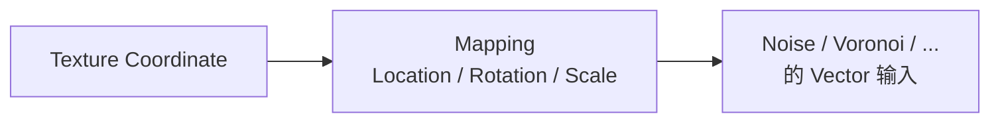
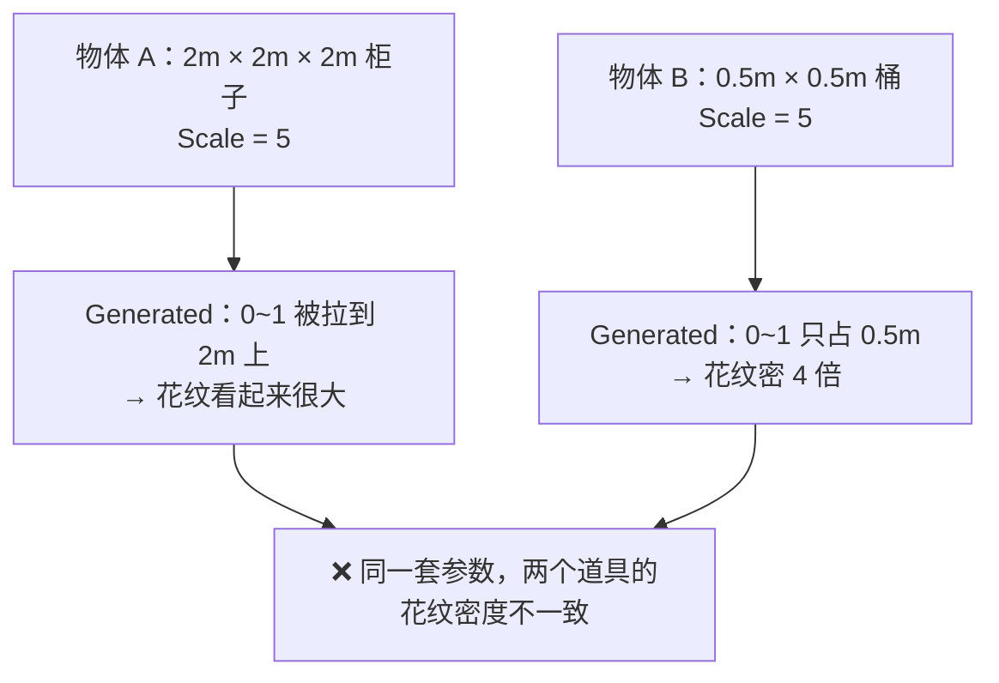
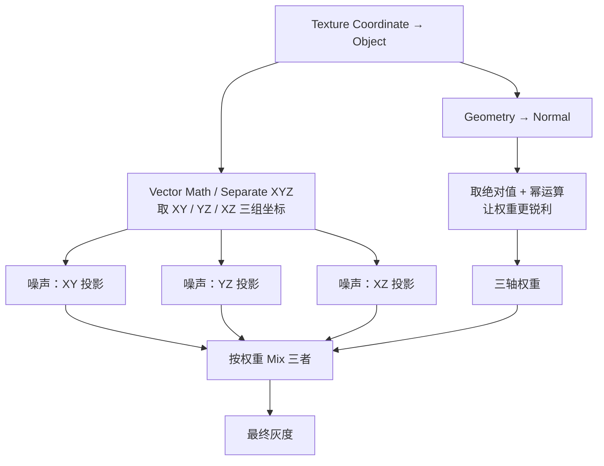

# 06 · 无 UV 投影：Object / Box 与三轴（1–1.5h）

> **一句话**：纹理节点从不挑剔 UV——它们是三维的计算函数；会出错的从来不是「要不要 UV」，而是「你给它的坐标是什么」。
> 依据：[Texture Coordinate 节点](https://docs.blender.org/manual/en/latest/render/shader_nodes/input/texture_coordinate.html) · [Mapping 节点](https://docs.blender.org/manual/en/latest/render/shader_nodes/utilities/vector/mapping.html) · [Radial Tiling 节点](https://docs.blender.org/manual/en/latest/render/shader_nodes/utilities/vector/radial_tiling.html) · [Shader Nodes Introduction](https://docs.blender.org/manual/en/latest/render/shader_nodes/introduction.html)

---

## 一、先记一句手册原文

> The default texture coordinates for all nodes are **Generated** coordinates, except for **Image** textures that use **UV** coordinates by default.

这句话是本节最重要的依据，能解释大量「为什么花纹不对」的现象：

| 节点 | 不接 `Vector` 时的默认坐标 |
| ---- | -------------------------- |
| Noise / Voronoi / Wave / Gabor / White Noise / Brick / Magic / Checker / Gradient | **Generated** |
| Image Texture | **UV** |

**推论（极其重要）**：程序化材质不需要 UV 就能工作。所以你常听到「程序化适合地形 / 岩石 / 不好展 UV 的东西」——这才是它最大的实用价值。

---

## 二、Texture Coordinate 的每个输出

| 输出 | 含义 | 什么时候用 |
| ---- | ---- | ---------- |
| `Generated` | **按物体包围盒归一化**到 0–1 的三维坐标 | 默认。简单场景够用，但有尺度问题（见第三节） |
| `UV` | UV 布局 | 想让程序化结构严格贴合 UV 时用（常见于 Stage 3 已经排好的东西） |
| `Object` | 物体局部坐标系（**真实单位，米**） | ⭐ 想让花纹密度不随物体尺寸变化时优先用 |
| `Normal` | 法线方向 | 「朝上的面」 / 「侧面」这类 **位置+朝向** 的选择 mask（05 篇用过） |
| `Camera` | 相机空间坐标 | 特殊效果（与视野相关的那类） |
| `Window` | 屏幕空间坐标 | 屏幕空间效果（UI 类、直接画在屏幕上那种） |
| `Reflection` | 反射向量 | 环境反射类 Hack |

### 从坐标源到最终花纹，中间还隔着 Mapping



> `Ctrl+T` 就是一键生成上面这条链（01 篇）。**永远显式接 `Mapping`**，好处有两个：一是能快速改 Scale 试密度，二是 Rotate 能解决 02 篇说的「条带/ alias 现象」。

---

## 三、Generated 的尺度陷阱（本节最重要的一节）

Generated 是按**包围盒归一化**的。这意味着同一个 `Scale = 5`，实际密度取决于物体多大：



**解法（推荐优先级）**

| 方案 | 做法 | 优点 | 注意 |
| ---- | ---- | ---- | ---- |
| ⭐ **用 Object 坐标** | `Texture Coordinate → Object` | 单位是米，**密度只由 Scale 决定**，与物体大小无关 | 必须 `Ctrl+A → Apply Scale`（物体缩放会让结果跟着变） |
| 给每个物体单独调 Scale | 手工补偿 | 简单 | 物体一改尺寸就要重调，非破坏性丢失 |
| 接受它 | 只在单个物体里用 | 简单 | 同一场景多个道具必然不一致 |

> **和主线的连接**：`Ctrl+A → Apply Scale` 是 Stage 0 就强调过的老习惯（你自己笔记第 29 节也有）。在这一节它有了新的理由：不只是「修改器不乱」，而是**决定了 Object 坐标稳不稳**。

---

## 四、Box / 三轴投影（Triplanar）

UV 展不出来的时候（岩石、地形、随便切出来的形状），标准答案是：**从三个方向投影，按法线权重混合**。



| 关键点 | 说明 |
| ------ | ---- |
| 权重怎么来 | 对法线的每个分量取绝对值（`(abs(x), abs(y), abs(z))`），再用幂把它锐化（比如 4 次方），得到「这个面主要朝向哪根轴」 |
| 为什么要锐化 | 直接用线性权重，三个投影会在斜面上同时可见 → 糊。锐化之后过渡带变窄 |
| 代价 | 每个像素要采样三次（三个投影），比单坐标投影贵约三倍 |

> **它真正的价值：背景道具、临时替换、以及灰盒阶段的快速铺画面——省掉一整个 UV 阶段。但要注意，一旦目标是把结果烤成贴图（07 篇），你终究还是得有 UV。**

---

## 五、5.x 的两个新东西

| 新节点 / 新能力 | 版本 | 用来干什么 |
| ---------------- | ---- | ---------- |
| **Radial Tiling 节点** | 5.0 新增（`Vector` 分类下） | 手册描述它是「creating shapes and tilings, with rounded corners」的构建块 → 做**有圆角的铺贴/阵列图案**不必手写一堆 Math |
| **Closures & Bundles** | 5.0 新增（shading 层） | Release Notes 原话：可以把一组节点作为参数传进节点组并多次求值，`blended box mapping`、`tiling`、`texture bombing` 这类东西能被包装成通用工具 ⚠️ **进阶，入门阶段不要碰** |

> 判断原则：**Radial Tiling 可以试着用**（它是单个节点）；closures/bundles 是「当你发现自己第三遍写同一个三轴投影时」才需要的能力。

---

## 六、常见坑

- ❌ **同一套参数缩放到不同大小的物体上，密度差 4 倍** → Generated 按包围盒归一化 → 用 Object 坐标
- ❌ **用了 Object 坐标但忘了 Apply Scale** → 缩放一的物体立刻 wrinkles → `Ctrl+A → Scale`
- ❌ **给 Image Texture 也按教程接 Generated** → 手册明说 Image 默认 UV → 接错反而把贴图打乱
- ❌ **以为程序化必须要有 UV** → 纹理节点不认 UV，只有烘焙才需要 UV（03/07 篇）
- ❌ **三轴投影在斜面上糊成一团** → 权重没锐化 → 对法线分量做幂运算
- ❌ **三轴投影 3 倍开销不设防** → 场景里几十个物件都这么做会卡 → 只给「真的展不出 UV」的东西用
- ❌ **用 `Window` 坐标做物体表面的结构** → 它会随着视角移动（那是它的定义） → 表面纹理用 Object / Generated
- ❌ **碰到 Camera 坐标就默认是「相机 uv」** → 它是相机空间坐标，用途很窄
- ❌ **入了 5.0 的 closures 坑** → 现阶段的官方示例和教程都很少 → 入门阶段先用单节点方案

---

## 七、自检

| # | 自检点 | 通过标准 |
| - | ------ | -------- |
| ① | 默认值 | 说出手册那句原文：除 Image 外所有纹理节点的默认坐标是什么 |
| ② | 尺度陷阱 | 给「2m 柜子」和「0.5m 桶」两个物体，解释为什么同一套参数会差 4 倍，并给出解法 |
| ③ | Apply Scale | 说出 Object 坐标为什么依赖 `Ctrl+A → Scale` |
| ④ | 三轴投影 | 说出权重是从什么算出来的，以及不锐化会发生什么 |
| ⑤ | 代价 | 说出三轴投影的采样代价量级，以及什么情况下值得付出 |
| ⑥ | 实操 | **不看教程**：在一块不规则石头上，用 Object 坐标做出「尺寸变了密度不变」的花纹 |

---

## 八、速查

```text
【Texture Coordinate 各输出】
Generated  按包围盒归一化到 0~1（★ 纹理节点默认用这个）
UV         UV 布局（★ Image Texture 默认用这个）
Object     物体局部坐标 · 单位是米（★ 想让密度不随尺寸变就用它）
Normal     法线方向 → 做「朝上/朝侧」的 mask
Camera     相机空间（视角相关效果）
Window     屏幕空间（会跟着视角动）
Reflection 反射向量（环境 Hack）

【密度稳定性】
Generated ❌ 密度随物体大小变（0~1 摊在多大的物体上会不一样）
Object    ✅ 密度只由 Scale 决定 → 但必须 Ctrl+A → Apply Scale！

【最简三轴投影 / Box】
① Texture Coordinate → Object
② 取 XY / YZ / XZ 三组分别投一次（同一个噪声采样 3 次）
③ 权重 = |法线分量| 再做幂（幂让过渡更锐，不锐化会糊）
④ 按权重 Mix
代价：采样 ×3 → 只给「真的展不出 UV」的东西用

【5.x 新东西】
Radial Tiling 节点（5.0，Vector 分类）→ 自带圆角的铺贴/阵列
Closures & Bundles（5.0）→ 能把三轴投影包成通用工具（进阶，先别碰）

【永远显式接 Mapping】
Ctrl+T 一键生成 Texture Coordinate + Mapping
好处：能快速改 Scale 试密度；Rotate 能解条带/重复花纹问题
```

---

## 资源

- [Texture Coordinate 节点 · 官方手册 5.2](https://docs.blender.org/manual/en/latest/render/shader_nodes/input/texture_coordinate.html)
- [Mapping 节点 · 官方手册 5.2](https://docs.blender.org/manual/en/latest/render/shader_nodes/utilities/vector/mapping.html)
- [Radial Tiling 节点 · 官方手册 5.2](https://docs.blender.org/manual/en/latest/render/shader_nodes/utilities/vector/radial_tiling.html)
- [5.0 Release Notes · Radial Tiling / Closures](https://developer.blender.org/docs/release_notes/5.0/rendering/)

---

> **下一步**：[`07-程序化到贴图-烘焙闭环与GLB.md`](07-程序化到贴图-烘焙闭环与GLB.md)。到这里为止，所有产物都只是「Blender 里好看的节点树」。下一节做交付：把它们烤成引擎认得的贴图，并跑一次完整闭环。
