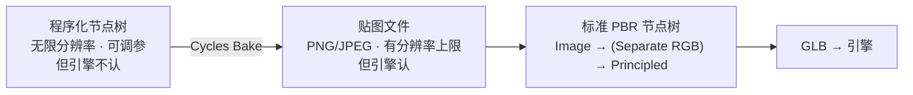
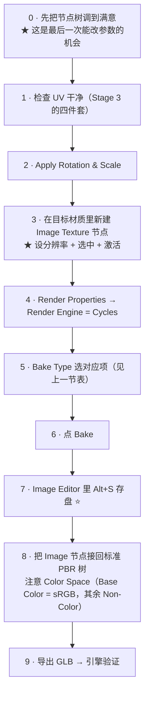
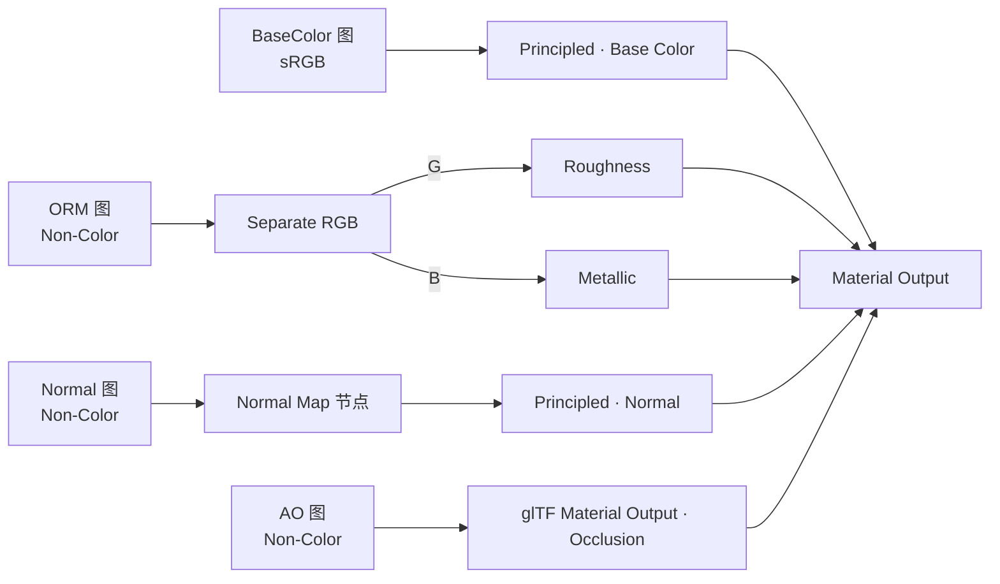

# 07 · 程序化 → 贴图：烘焙闭环与 GLB（2–2.5h）⭐

> **一句话**：程序化只在「还没烤」的那段时间里自由；这一篇讲的就是怎么在最高兴的那次冻结正式交付。
> 依据：[Render Baking · 官方手册 5.2](https://docs.blender.org/manual/en/latest/render/cycles/baking.html) · [05-材质PBR与烘焙/04 篇](../../05-材质PBR与烘焙/04-烘焙原理与Cycles烘焙设置.md) · [05-材质PBR与烘焙/05 篇](../../05-材质PBR与烘焙/05-高模到低模烘焙实战与排错.md)

---

## 一、为什么必须烤：手册自己就是这么写的

> Baking textures like base color or normal maps for export to game engines. **Baking ambient occlusion or procedural textures**, as a base for texture painting or further edits.

手册把「烘焙程序化纹理」直接列为用途之一。原因和你已经在 Stage 4 · 03 学的一样：**glTF 导出器只认 Principled BSDF 的那几个输入**，`Noise` / `Pointiness` / `ColorRamp` / `Mix Color` / AO 节点一个都出不去。



---

## 二、❗ 最重要的一条：Target 的规则

手册原话：

> **Image Textures**: Bake to the image data-block associated with the **active and selected** Image Texture node. If a material does not contain an active and selected image texture node, **nothing will be baked for this material**.

换成必须严格执行的三条：

```text
① 材质里必须有至少一个 Image Texture 节点
② 那个节点必须是「选中」状态（点一下它的边框）
③ 那个节点必须是「激活」状态（最后被点选的那个）
④ 三者缺一 → 什么都不烤，而且没有任何报错
```

**而程序化材质天生没有 Image Texture 节点** —— 所以这一节必做的第一件事就是：

```text
1. 打开目标材质
2. Shift+A → Texture → Image Texture（新建一个空图：New）
3. 给它设置分辨率（1024 / 2048）
4. 点一下它，让它处于「选中且激活」状态
5. 再去点 Bake
```

> 这里的 ✅ 与 Stage 4 · 05 里的一致：**点完了没报错不等于烤了**，一定要打开 Image Editor 看那张图有没有内容。

---

## 三、烤什么、用什么 Bake Type

| 目标贴图 | Bake Type | Influence 怎么设 | 依据 |
| -------- | --------- | ---------------- | ---- |
| **Base Color / Albedo** | ⭐ **Diffuse** | Contributions **只勾 Color**，不勾 Direct / Indirect | 手册原文：(Color only) is the pass color, which is a property of the surface and **independent of sampling refinement** → 不受场景灯光影响 |
| **Roughness** | **Roughness** | — | 手册 Bake Type 表里有独立的 Roughness pass |
| **AO** | **Ambient Occlusion** | — | 手册：ignores all lights in the scene |
| Height / 灰度（用来转 Normal 或做 Bump） | ⭐ **Emit** | — | 手册：Bakes Emission。把你的高度信号临时接进 Emission 再烤（这是 Stage 4 已教过的 Curvature 变通法的同一个套路） |
| Normal（几何法线） | **Normal** | Space: **Tangent**（默认且大多数情况正确） | 手册 Normal 段给出了 Object / Tangent 两种空间 |

> ⚠️ **Bump 强度要不要直接烤进 Normal 图，属于「需实测」的项目**。手册的 Bake Types 表里没有针对「把着色层的 bump 扰动烤成切线空间法线」的明确条目；可靠做法是**先烤 Height 灰度图**，再决定是在 Blender 里转还是交给引擎/外部工具转换。**别默认它对，先看结果。**

---

## 四、完整流程



### 每一步的坑

| 步 | 坑 | 救法 |
| -- | -- | ---- |
| 1 | UV 有重叠 / 没排好 → 烤出来的图会互相污染 | `Select → All by Trait → Overlap` 查一遍（Stage 3） |
| 2 | Scale 不是 1 → 坐标算出来的花纹位置有偏移 | `Ctrl+A → Rotation & Scale` |
| 3 | **没建 Image 节点 / 没选中** → 什么都没烤 | 这就是第二节讲的那条，最高频失败原因 |
| 3 | 分辨率忘了设 → 默认可能不是你想要的 | New 的时候先定 1024 / 2048 |
| 4 | 引擎还停在 EEVEE → Cycles-only 的节点（Pointiness / AO / Bevel）全没值 | ⭐ **必须切 Cycles** |
| 6 | Margin 太小 → UV 接缝在低 mip 下露黑边 | 1024 给 8–16px（Stage 4 · 04） |
| 7 | **烤完不存盘** → 关掉 .blend 全丢且无报错 | `Alt+S`，烤一张存一张 |
| 8 | Base Color 图设成 Non-Color（或反过来）→ 颜色不对 | Stage 4 · 02 的色彩空间铁律 |

---

## 五、多张图要依次烤

一次烘焙不够：Base Color、Roughness、Height 各是一张图，需要**依次**烤：

```text
① 把 Base Color 那一路的输出临时接到 Emission（或者用 Diffuse + 只勾 Color）
② 选中对应的 Image 节点 → Bake → Alt+S 存盘
③ 换成下一路（比如 Roughness → Bake Type 换成 Roughness）
④ 选中另一个 Image 节点（或同一个另行 Save As）→ Bake → 存盘
⑤ 重复到烤完需要的图
```

> **速度技巧**：给每张目标图一个清晰命名（`Prop_Panel_Rust_BaseColor`、`_Roughness`、`_Height`），这样即使中途被打断也不会搞混谁是谁。（命名规范见 Stage 6。）

### ORM 打包

要把 AO / Roughness / Metallic 合成一张 ORM 图（R=AO、G=Rough、B=Metal），需用 Composite 节点或者在外部单独合成——这一步的做法和 Stage 4 · 02 完全一致，详见 [`../../05-材质PBR与烘焙/02-贴图通道-色彩空间与ORM打包.md`](../../05-材质PBR与烘焙/02-贴图通道-色彩空间与ORM打包.md)。

---

## 六、接回标准 PBR 树并导出



> 这张图的每一个环节都是 Stage 4 · 02 / 03 讲过的。区别在于：**Stage 4 是拿现成素材贴图来做，这一篇是贴图你自己烤出来的** —— 通道与色彩空间规则一点没变。

---

## 七、常见坑

- ❌ **没有选中激活的 Image Texture 节点就点 Bake** → 什么都没烤，且无报错 → 本节第二节
- ❌ **渲染引擎没切到 Cycles** → Pointiness / AO / Bevel 全没值 → 烤出来一片死板的灰
- ❌ **拿 Combined 烤 Base Color** → 把灯光也烤进去了 → 用 **Diffuse + 只勾 Color**
- ❌ **烤完不存盘** → 全丢且无报错 → `Alt+S`
- ❌ **BaseColor 设成 Non-Color** → 颜色不对 → 只有 Base Color 是 sRGB
- ❌ **Margin 太小** → 接缝黑边（mipmap 一到就露馅）→ 1024 给 8–16px
- ❌ **UV 有重叠** → 图会互相污染 → 烘焙前必查
- ❌ **没 Apply Scale** → 花纹位置偏移 → `Ctrl+A → Rotation & Scale`
- ❌ **以为程序化 Bump 会自动进贴图** → 属于需实测项 → 先烤 Height 灰度图
- ❌ **直接把程序化节点树导出 GLB** → 引擎里全丢 → 必须烤
- ❌ **贴图不是 PNG/JPEG** → glTF 要求这两种，其他格式导出时会被转换（变慢）→ Stage 4 · 03
- ❌ **烤完就把原来的 .blend 覆盖保存了** → 参数化版本没了 → ⭐ **永远保留烘焙前的 .blend 作为源文件**

---

## 八、自检

| # | 自检点 | 通过标准 |
| - | ------ | -------- |
| ① | Target 规则 | 不看教程背出手册那两句原文的含义（active + selected；没有则不烤） |
| ② | Bake Type 选型 | 给出 Base Color / Roughness / AO / Height 四项目标，报出各自该用的 Bake Type 与 Influence 设置 |
| ③ | Cycles 前提 | 说出为什么必须切 Cycles，以及 EEVEE 下会发生什么 |
| ④ | 存盘 | 说出「烤完之后的下一个动作」是什么，以及忘了它的后果 |
| ⑤ | 色彩空间 | 说出这四张图各自该是 sRGB 还是 Non-Color |
| ⑥ | 实操 | **不看教程**：给一套没有任何 Image 节点的程序化材质，烤出 Base Color 与 Roughness 两张图、正确存盘、接回标准 PBR 树并导出 GLB |

---

## 九、速查

```text
【最重要的一条】
Target = Image Textures → 只烤「选中且激活」的 Image Texture 节点
材质里没有这种节点 → 什么都不烤，且不报错！
程序化材质 → 必须先 Shift+A 新建一个 Image 节点 + 点亮它

【怎么烤不同的图】
Base Color  → Bake Type: Diffuse，Contributions 只勾 Color
              （手册：该通路是表面属性，与采样精化无关 → 不受灯光影响）
Roughness   → Bake Type: Roughness
AO          → Bake Type: Ambient Occlusion（手册：忽略场景所有灯光）
Height/灰度 → Bake Type: Emit（把高度信号临时接进 Emission）
Normal      → Bake Type: Normal，Space: Tangent（默认且多数情况正确）
⚠ 程序化 Bump → 切线空间法线：属于需实测项；稳妥做法是先烤 Height 灰度图

【流程】
调好节点 → 查 UV 干净 → Apply Rotation & Scale
→ 新建 Image 节点(定分辨率+选中+激活)
→ 渲染引擎切 Cycles → 选 Bake Type → Bake
→ Image Editor Alt+S 存盘 ⭐ → 接回标准 PBR 树
→ 色彩空间审计 → 导出 GLB → 引擎验证

【收尾规则】
Base Color = sRGB；其余一律 Non-Color
Margin：1024 给 8~16px
永远保留「烘焙前的 .blend」作为源文件（参数化版本一旦丢就回不去）
```

---

## 资源

- [Render Baking · 官方手册 5.2](https://docs.blender.org/manual/en/latest/render/cycles/baking.html)（烘焙参数的唯一权威）
- [`../../05-材质PBR与烘焙/04-烘焙原理与Cycles烘焙设置.md`](../../05-材质PBR与烘焙/04-烘焙原理与Cycles烘焙设置.md)（Bake Type 全表 + Cage / Ray Distance）
- [`../../05-材质PBR与烘焙/05-高模到低模烘焙实战与排错.md`](../../05-材质PBR与烘焙/05-高模到低模烘焙实战与排错.md)（排错手册）
- [glTF 2.0 导出 · 官方手册](https://docs.blender.org/manual/en/latest/addons/import_export/scene_gltf2.html)

---

> **下一步**：[`08-材质变体-NodeGroup-MenuSwitch-资产化.md`](08-材质变体-NodeGroup-MenuSwitch-资产化.md)。烤完一组之后自然会想：能不能一次烤出三档锈蚀？这就是最后一件事——在「冻结」之前把配方参数化。
