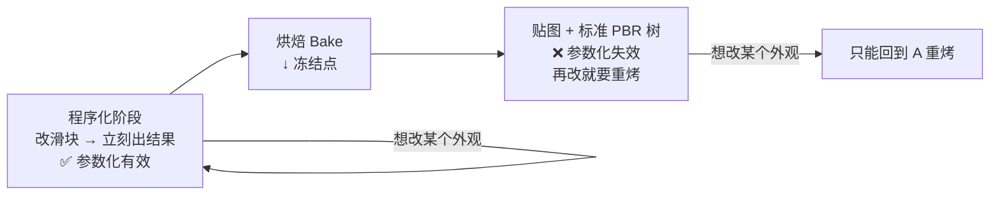
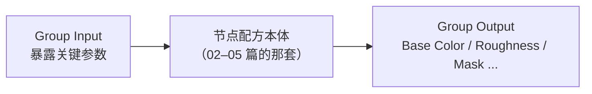
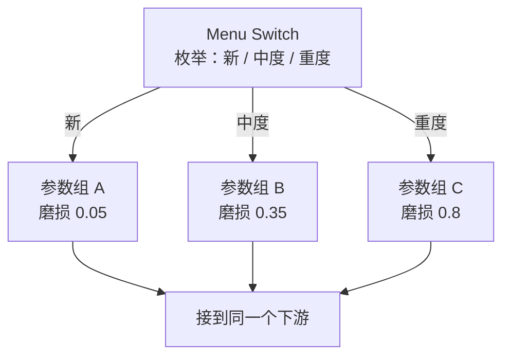
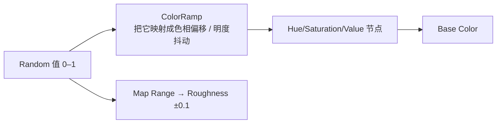

# 08 · 材质变体：Node Group / Menu Switch / 资产化（1h）

> **一句话**：程序化真正省钱的地方不是「做一个表面」，而是「同一套节点出 N 种外观」——但这个能力有明确的有效期，**到烘焙那一刻为止**。
> 依据：[Menu Switch 节点 · 官方手册 5.2](https://docs.blender.org/manual/en/latest/render/shader_nodes/utilities/menu_switch.html) · [Node Groups · 官方手册](https://docs.blender.org/manual/en/latest/render/shader_nodes/groups.html) · [5.0 Release Notes · Menu Switch](https://developer.blender.org/docs/release_notes/5.0/rendering/)

---

## 一、有效期：必须先记住的取舍



| 阶段 | 改一个值 | 成本 |
| ---- | -------- | ---- |
| 程序化（还没烤） | 动一下 Mix Factor | 秒级 |
| 烘焙之后 | 要重新烤全部通道 | 分钟级 × 每次 |

> **所以：变体必须在烘焙之前做。** 这就是为什么把 08 放在 07 之后但属于「完整路径」而不是「可选」——它的作用是让你在第一次烘焙之前把该决定的都决定完。

---

## 二、手段一：Node Group（主力手段）



操作步骤：

```text
① 选中配方那一堆节点 → Ctrl+G 打包
② 在 Group 内部删掉不需要的输入
③ 把希望从外面调的参数拖到 Group Input
④ 给参数改名字（Slider Property → 可顺便设 Min/Max）
⑤ Tab 退出 Group
```

| 该暴露的参数 | 不该暴露的 |
| ------------ | ---------- |
| 颜色（Base Color 色号） | 每个中间节点的全部输入（会变成一堵没人想看的滑块墙） |
| Roughness 上下限 | 纯实现细节（比如某一层 ColorRamp 的中间滑块） |
| 噪声 Scale / Detail | |
| Mask 强度 0–1 | |
| 磨损开关（0/1） | |

> 原则：**暴露 5–8 个参数就够**。暴露 30 个的 group，和没有 group 一样难用。

### 复用：装 Asset / Append

| 用法 | 怎么做 | 适合 |
| ---- | ------ | ---- |
| Asset Browser | 把 Node Group 标记为 Asset | ⭐ 长期复用的通用配方（木纹、锈、混凝土各一个） |
| Append / Link | `File → Append` 从别的 .blend 取 | 项目之间没有统一资产库时 |

---

## 三、手段二：Menu Switch（5.0 起支持 shader）

> 5.0 Rendering 原话：The Menu Switch node is support in shader nodes as well now. It behaves the same as in Geometry Nodes.

它的作用是**用一个枚举项分流**：



| Node Group 里的做法是「改数值」 | Menu Switch 的做法是「换分支」 |
| ------------------------------ | ------------------------------ |
| 输出连续的中间状态 | 输出离散的预设 |
| 适合调的时候 | 适合交付预设清单的时候 |

> 实务上两者经常一起用：**Node Group 负责内部参数化，Menu Switch 负责外部预设切换**。所以新手顺序是先练 Node Group，确认自己真的需要「三档不同的人也不许乱调」时再加 Menu Switch。

---

## 四、手段三：随机化

| 想要的效果 | 用哪个 | EEVEE 可用 | 依据 |
| ---------- | ------ | ---------- | ---- |
| 场景里**每个物体**互不相同的色调/污渍度 | `Object Info → Random` | ✅ | 每个物体一个稳定的随机值 |
| 一块网格里**每个连通块**不同（木板、碎片） | `Geometry → Random per Island` | ❌ **Cycles Only** | 04 篇的手册原文 |



> ⚠️ 做正式交付的时候注意：如果最后要烘焙（一般都要），那么**每个变体等于一轮烘焙**。批量资产里随机的方式通常是「常见 3–5 个变体 × 每个项目 1 张贴图」而不是「每张贴图一个随机值」。

---

## 五、常见坑

- ❌ **烤完之后想改变体** → 参数化已经失效 → 回到烘焙前的 .blend（这就是 07 篇强调「保留源文件」的原因）
- ❌ **Group Input 暴露了三十个参数** → 面板没人看得懂 → 精简到 5–8 个
- ❌ **把 Cycles-only 节点留在 group 里却要在 EEVEE 里预览** → 值为 0 → 至少 Pointiness / AO / Bevel 要在文档里注明「需 Cycles」
- ❌ **在 Group 里还留着连到 Material Output 的东西** → 手册的 5.0 变更：节点组里的 Material Output **不再**优先于组外的了（行为已统一）
- ❌ **指望 Menu Switch 覆盖所有想要的中间状态** → 中间状态应该用连续参数调， Menu Switch 只适合离散预设
- ❌ **以为随机化能省贴图** → 每个不同的随机值都是一份不同的贴图 → 要么接受变体数量，要么在引擎侧做
- ❌ **group 里包含 hard-coded 的 map 路径 / 绝对引用** → 换机器 Appendix 报错 → 尽量让 group 只向外暴露数值

---

## 六、自检

| # | 自检点 | 通过标准 |
| - | ------ | -------- |
| ① | 有效期 | 说出参数化在哪一步截止，以及截止后再改的代价 |
| ② | Node Group | **实操**：把一套 ≥10 个节点的配方打包成 Group，并暴露 5–8 个关键参数（不给退化面板） |
| ③ | Menu Switch | 说出它和「改数值」的适用场景差别，以及 5.x 里它适用于哪些编辑器 |
| ④ | 随机化 | 说出 `Object Info → Random` 与 `Random per Island` 在粒度和 EEVEE 可用性上的区别 |
| ⑤ | 变体成本 | 说出「N 个变体 = N 轮烘焙」的含义，以及它对资产量产的影响 |
| ⑥ | 资产化 | 会把自己觉得能复用的 Group 标记为 Asset 并在新文件里调出来 |

---

## 七、速查

```text
【变体的有效期】
程序化阶段 ✅ 改滑块 = 秒级
烘焙之后  ❌ 改任何东西 = 重烤全部通道
→ 所以变体必须在烘焙之前做完

【Node Group（主力）】
选中配方 → Ctrl+G
把要调的参数拖到 Group Input → 改名字 → 可设 Min/Max
暴露 5~8 个就够（颜色 / Roughness 上下限 / Scale / Detail / mask 强度）
通用配方 → 标记 Asset（或 File → Append 复用）

【Menu Switch（5.0 起 shader 也支持）】
枚举 → 分流到不同的参数分支（预设）
「连续微调」用参数，「离散预设」用 Menu Switch
两者可以叠用：Group 做参数化，Menu Switch 做预设切换

【随机化】
Object Info → Random              每个物体一个值 · EEVEE 可用
Geometry → Random per Island      每个连通块一个值 · Cycles Only（04 篇）

【成本提醒】
N 个变体 ≈ N 轮烘焙 ≠ 一张贴图
量产时的常见做法：3~5 个固定变体各一张图，而不是每张都随机
```

---

## 资源

- [Menu Switch 节点 · 官方手册 5.2](https://docs.blender.org/manual/en/latest/render/shader_nodes/utilities/menu_switch.html)
- [Node Groups · 官方手册 5.2](https://docs.blender.org/manual/en/latest/render/shader_nodes/groups.html)
- [5.0 Release Notes · Menu Switch / Closures](https://developer.blender.org/docs/release_notes/5.0/rendering/)

---

> **下一步**：[`09-练习项目-全天候锈蚀金属板.md`](09-练习项目-全天候锈蚀金属板.md)。把 01–08 全部串起来：参数化一套配方 → 出三个变体 → 烤成贴图 → 导出 GLB 进引擎验证。
