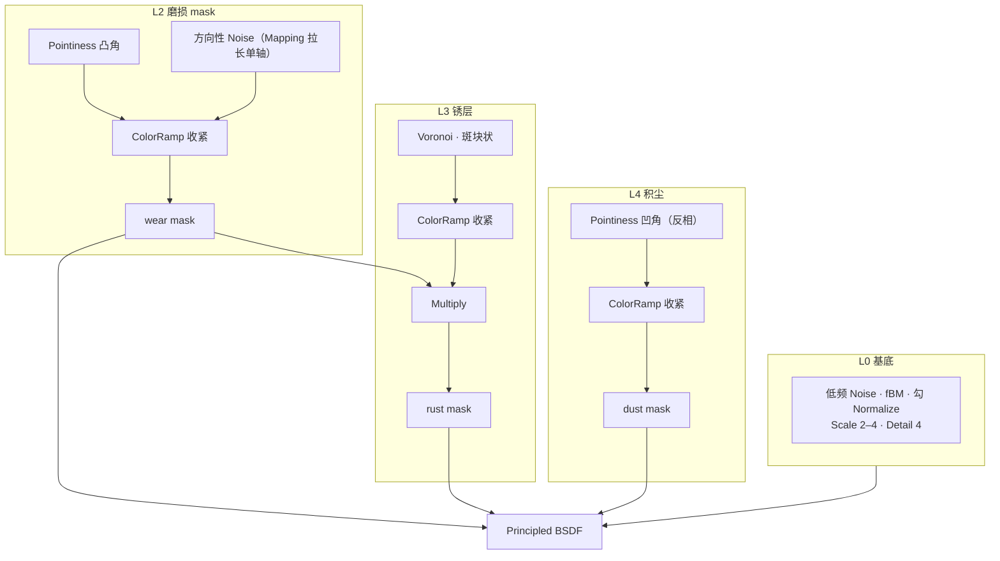

# 09 · 练习项目：全天候锈蚀金属板（2–2.5h）

> **一句话**：把 01–08 全部用一遍。验收不看「好不好看」（那是主观的），看**能不能一次配出三个变体并成功进引擎**。
> 产出目录：`../../资产/练习文件/支线-程序化材质/`

---

## 一、目标与验收标准

| 项 | 目标 |
| -- | ---- |
| 几何 | 一块 1m × 1m × 0.05m 的板（四周已倒角）；面数 ≤200 tri |
| 材质 | 一套参数化的锈蚀金属 Node Group（含 5–8 个暴露参数） |
| 变体 | 三档：**新 / 中度 / 重度**锈蚀 |
| 贴图 | 每个变体 3 张：BaseColor（sRGB）+ ORM（AO/Roughness/Metallic，Non-Color）+ Height/Normal |
| 闭环 | 导出 GLB → 引擎 → 截图，与 Blender 视口并排对比 |
| 文件 | `Prop_Panel_Rust_<变体>_<通道>` 命名，烘焙前的 .blend 单独留档 |

**可判定验收**（六条，全过才算这条支线完成）

- [ ] 三个变体在 Diffuse—same 视角下明显不同，但明显是同一种材料
- [ ] 锈只出现在合理的区域（边缘、面交界），不是均匀铺满
- [ ] 每个变体的 Roughness 图明显不是一张均匀灰（说明确实算出了粗糙度的区域差异）
- [ ] 色彩空间审计通过：只有 BaseColor 是 sRGB
- [ ] GLB 能在 glTF Validator / 目标引擎里打开，无报错
- [ ] 导入引擎后，凸起/凹陷方向、金属感、暗角都与 Blender 里一致

---

## 二、几何准备（15 min）

```text
① Shift+A → Mesh → Plane（1×1m）→ Ctrl+A → Apply Scale
② E 挤出厚度 0.05m（保持只有一个板材；不要做 box——只有一面有细节也行，但 dobge 练习用 plate 更真实）
③ 四周手动倒角（Ctrl+B 或 Bevel 修改器，Limit Method = Angle）
④ 多加几条导线（Loop Cut）（这很重要：Pointiness 是逐顶点插值的，几何太简单做不出边缘 mask）
⑤ U → Unwrap；检查无重叠、已 Pack Islands
⑥ 面数：≤200 tri
```

> ⚠️ 第 ④ 步是很多人都会忽略的一步：**一个只有 4 个顶点的 Plane 上，Pointiness 几乎给不出任何信息**。加 2–3 条导线不是为了好看，是为了让曲率 mask 有数据可用。

---

## 三、配方的节点骨架（60–75 min）

按前面的篇章组装，**每个模块先在 Cycles 视口里孤立地预览一次，确认有值再接下去**：



### 三条 mask 统一驱动四件事

| mask | Base Color | Roughness | Metallic | Bump/Height |
| ---- | ---------- | --------- | -------- | ----------- |
| wear（磨损） | 金属色 → 稍亮 | 0.35 → 0.7 | 保持 1 | 微弱凹 |
| rust（锈） | 金属色 → 锈色（~0.35 明度） | 0.35 → 0.9 | **1 → 0** ⭐ | 锈凸起 |
| dust（积尘） | 往土色偏 | 升高 | **往 0 降** | 极弱 |

> ⭐ **Metallic 往 0 降这一步是最容易漏的**（05 篇强调过）：锈是非金属，`Metallic=1` 的锈会呈现成一块很亮的塑料。

### 建议暴露的 Group Input 参数（6 个）

```text
① Base Color（金属底色）
② Rust Color（锈色）
③ Roughness Base / Roughness Rust（两个数值）
④ Wear Amount（0–1，控制 wear mask 强度）
⑤ Rust Amount（0–1）
⑥ Dust Amount（0–1）
```

---

## 四、三个变体的参数

| 参数 | 新 | 中度 | 重度 |
| ---- | -- | ---- | ---- |
| `Wear Amount` | 0.10 | 0.45 | 0.85 |
| `Rust Amount` | 0.05 | 0.40 | 0.90 |
| `Dust Amount` | 0.10 | 0.25 | 0.35 |
| Roughness（锈处） | 0.75 | 0.85 | 0.95 |

> 三个变体不等于三套 .blend：08 篇的做法是**在同一个文件里用三个材质副本**（或从同一个 Group 出三份），然后分别烘焙。

---

## 五、烘焙（40–60 min）

按 07 篇的流程，对每个变体各烤三张：

| 顺序 | Bake Type | 目标图 | 注意 |
| ---- | --------- | ------ | ---- |
| 1 | **Diffuse**（只勾 Color） | `<名>_BaseColor.png` | 不受灯光影响（手册依据见 07 篇） |
| 2 | **Roughness** | `<名>_Rough.png` | Non-Color |
| 3 | **Ambient Occlusion** 或 **Emit**（做 Height） | `<名>_AO.png` / `<名>_Height.png` | Non-Color |

```text
每一步之前：
✓ 目标材质里有一个 Image Texture 节点
✓ 它是「选中且激活」的（点一下边框）
✓ Render Engine = Cycles
✓ UV 已检查无重叠

每一步之后：
✓ Image Editor → Alt+S 存盘（烤一张存一张）
```

### ORM 打包

把 AO / Roughness / Metallic 合成一张 ORM：R=AO、G=Roughness、B=Metallic（做法见 [`../../05-材质PBR与烘焙/02-贴图通道-色彩空间与ORM打包.md`](../../05-材质PBR与烘焙/02-贴图通道-色彩空间与ORM打包.md)）。

> 关于法线：程序化 Bump 转成切线空间法线属于**需实测**的环节（07 篇已说明）。稳妥路线是先保留一张 Height 灰度图，需要用的时候再决定由谁转。

---

## 六、导出与验证（20–30 min）

```text
① 把三个变体各接回标准 PBR 树（Image → Separate RGB → Principled）
② 色彩空间审计：只有 BaseColor 是 sRGB
③ 每个变体导出为独立 GLB
   Format: glTF Binary (.glb) · Limit to: Selected Objects
   Apply Modifiers: ON · +Y Up: ON
   UVs / Normals: ON · Tangents: OFF
④ Khronos glTF Validator / Babylon Sandbox 打开，无报错
⑤ 导入目标引擎 → 截图
⑥ 与 Blender 视口截图并排对比：明度 / 金属感 / 暗角 / 凹凸方向
```

> 通用铁律（主线 Stage 6）：**在做第 2 个变体之前，先拿第 1 个跑通完整链路。**

---

## 七、做崩了怎么救

| 症状 | 排查顺序 |
| ---- | -------- |
| 锈均匀铺满整个面 | mask 没有乘 Pointiness → 检查 wear/rust mask 的乘法有没有接上（05 篇） |
| 整面都是一个颜色 | Pointiness 全为 0 → **渲染引擎是 EEVEE**（04 篇） |
| Bake 之后图是空的 | ❗ 没有「选中且激活」的 Image 节点（07 篇第二节） |
| 烤出来全黑/全灰 | 灯光被算进去了 → Base Color 应该用 Diffuse + 只勾 Color，而不是 Combined |
| 锈的地方像塑料 | Metallic 没降到 0（05 篇第四节） |
| 两个变体看起来一样 | 烘焙的目标图没有换保存路径，被覆盖了 → 检查每张图的 datablock 是不是同一个 |
| 接缝处露黑边 | Margin 太小 → 1024 给 8–16px |
| 关掉文件后图没了 | 没存盘 → `Alt+S`；这也是 07 篇强调「保留烘焙前 .blend」的原因 |
| 引擎里 viewer 方向和 Blender 相反 | 检查法线的 Swizzle（默认 +X/+Y/+Z 就是 OpenGL 约定，不要动——Stage 4 · 07） |
| 看起来没什么变化 | 你把镜头怼到模型上看区别了 → 判断标准应该用正常游戏镜头距离（05 篇） |

---

## 八、归档清单

```text
资产/练习文件/支线-程序化材质/
├── Prop_Panel_Rust_Source.blend        ← ⭐ 烘焙前的源文件（含完整节点树与 Group）
├── Prop_Panel_Rust_New_BaseColor.png
├── Prop_Panel_Rust_New_ORM.png
├── Prop_Panel_Rust_New_Height.png
├── Prop_Panel_Rust_Mid_*.png  （同上三张）
├── Prop_Panel_Rust_Heavy_*.png（同上三张）
├── Prop_Panel_Rust_New.glb / _Mid.glb / _Heavy.glb
└── verify/  verify_blender.png + verify_engine.png
```

---

## 九、复盘模板

```text
1. 这次卡得最久的是哪一步？（通常为：Target 没选中 / EEVEE 下调 Cycles-only 节点）
2. 三个变体里，哪一个的可信度最高？为什么？
3. 程序化做出来了之后，和直接下 CC0 素材相比，省了还是亏了？（用实际用时回答）
4. 哪些环节下次可以直接复用？（通常 Bake 的参数和 Group 本身）
5. 有没有把烘焙前的 .blend 单独留档？
```

---

> **下一步**：回到 [`笔记.md`](笔记.md) 做「6 条自检」并写阶段复盘。
> 走完这条支线之后，你手上应该多出一个判断：**什么时候值得用程序化（需要参数化 / 没 UV / 没素材），什么时候应该直接用 CC0 素材（一个一次性道具 / 要求写实到令人发指程度的资产）**。这个判断比任何具体的节点配方都值钱。
