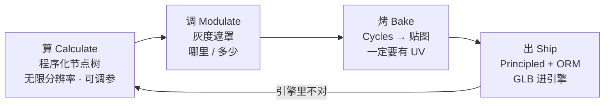
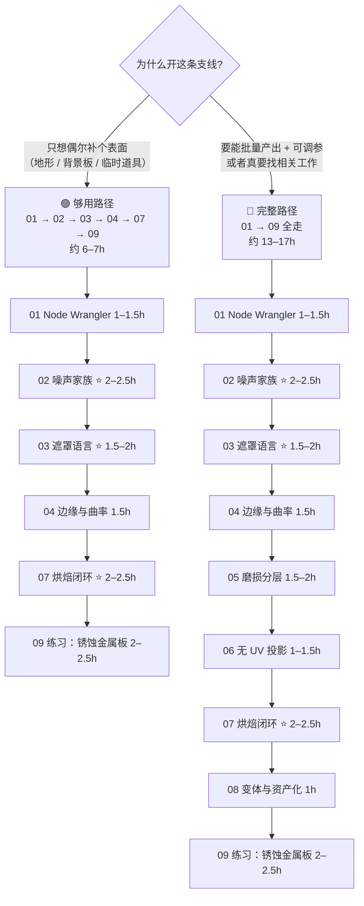
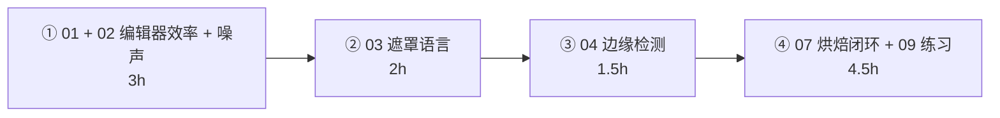
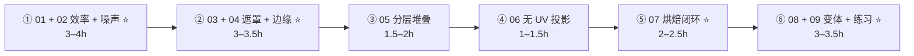

# 支线 · 程序化材质（原 10–15h → 现 6–17h：够用 ≈6–7h / 完整 ≈13–17h）

> **一句话目标**：不依赖任何贴图素材，用节点算出可复用、可调参的表面——并且能在交付前把它变成引擎认得的贴图。
> 状态：⬜ 未开始　|　开工：　　　|　完成：
> 环境：**Blender 5.2 LTS** · macOS　|　前置：[`../../05-材质PBR与烘焙/笔记.md`](../../05-材质PBR与烘焙/笔记.md)（Principled 与色彩空间必须先懂）、[`../../04-UV与贴图坐标/笔记.md`](../../04-UV与贴图坐标/笔记.md)（**烘焙必须有干净 UV**）
> 什么时候开：**Stage 4 之后**。这支线不是「另一种做材质的方法」，而是「什么时候该用节点算、什么时候该烘焙」的决策能力。

---

## 0. ⚠️ 先订正：路线图 / 原清单里关于这条支线的八条说法要更新

| # | 原清单的说法 | **5.2 的实际情况** | 依据 |
| - | ------------ | ------------------ | ---- |
| 1 | 「Node Wrangler 高效操作（`Ctrl+Shift+LMB` 预览节点）」 | 键位没问题，但这是 30 多个操作里的一条，**最省时间的那几条没列出来**：`Ctrl+T`（给选中纹理补 `Texture Coordinate` + `Mapping`）、`Shift+Ctrl+T`（一键 PBR 贴图组）、`Ctrl+=` / `Ctrl+-` / `Ctrl+*` / `Ctrl+/`（按 Math/Mix 语义自动合并所选节点）、`Alt+X`（删掉不影响输出的节点）、`Shift+W`（总菜单，忘了快捷键从这里搜） | [手册 Node Wrangler](https://docs.blender.org/manual/en/latest/addons/node_wrangler.html) |
| 2 | 「程序化噪声：**Noise / Voronoi / Wave** 的组合」 | 漏了两条会直接让人卡住的事实：① **Musgrave 从 4.1 起已被合并进 Noise Texture**（5.2 手册里 `textures/musgrave.html` 已经 404），老教程的「加个 Musgrave」要换成 **Noise 的 `Type` 下拉**（fBM / Multifractal / Hybrid Multifractal / Ridged Multifractal / Hetero Terrain），且换算关系是 **`Roughness = Lacunarity ^ (-Dimension)`、`Detail` 要比老 Musgrave 少 1**；② **Voronoi 的花纹在 5.0 变了**（换更快的哈希），照 5.0 之前教程的参数抄，单元格分布一定对不上 | [4.1 Release Notes · Musgrave Texture](https://developer.blender.org/docs/release_notes/4.1/rendering/) · [5.2 手册 Noise Texture](https://docs.blender.org/manual/en/latest/render/shader_nodes/textures/noise.html) · [5.0 Rendering · Voronoi](https://developer.blender.org/docs/release_notes/5.0/rendering/) |
| 3 | 「磨损与边缘检测：**AO / Curvature / Pointiness** 做蒙版」 | 三处不准：① **Blender 里没有任何叫 Curvature 的节点**（也没有这个烘焙类型，Stage 4 已订正过），曲率信息来源是 `Geometry → Pointiness`；② **`Pointiness`、`Random per Island`、AO 节点、Bevel 节点全部标注 Cycles Only**——在 EEVEE 视口里调这些蒙版会「看着没反应」；③ 边缘检测除了 Pointiness，还有 **Bevel 节点**（按 `Radius` 做选择性倒角式取样，比 Pointiness 更可控但贵，手册明示「可能让渲染慢 20%，建议只用于烘焙或静帧」） | [手册 Geometry 节点](https://docs.blender.org/manual/en/latest/render/shader_nodes/input/geometry.html) · [手册 Bevel 节点](https://docs.blender.org/manual/en/latest/render/shader_nodes/input/bevel.html) · [手册 AO 节点](https://docs.blender.org/manual/en/latest/render/shader_nodes/input/ao.html) |
| 4 | 「程序化 → 烘焙成贴图（引擎不认节点树，必须烘成图）」 | 方向对，但有一条 5.x 的硬规则必须提前知道：烘焙 `Target = Image Textures` 时，**只烤到「选中且激活」的那一个 Image Texture 节点；材质里没有这种节点，这个材质什么都不烤**。而程序化材质天然没有 Image 节点，所以每次烘焙前都得先在目标材质里**新建一个 Image Texture 节点并选中它** | [手册 Render Baking · Output](https://docs.blender.org/manual/en/latest/render/cycles/baking.html) |
| 5 | 「材质变体：同一套节点出多种外观」 | 没说怎么落地。5.x 的正解是：**把配方包进 Node Group，`Ctrl+G` 打包 + Group Input 暴露参数**；5.0 起 **Menu Switch** 节点也支持 shader（可以做「按预设枚举切换分支」）。随机器用 `Object Info → Random`（EEVEE 可用）或 `Geometry → Random per Island`（**Cycles Only**）。还有一个必须写出来的取舍：**一旦烘焙成图，参数化就失效了——变体要在烘焙之前做** | [5.0 Rendering · Menu Switch](https://developer.blender.org/docs/release_notes/5.0/rendering/) · [手册 Menu Switch](https://docs.blender.org/manual/en/latest/render/shader_nodes/utilities/menu_switch.html) |
| 6 | 资源里列 **Poly Haven / ambientCG** | 这两个是**贴图素材站**，不是程序化材质的学习资源。程序化的卖点恰恰是「不依赖素材」，把它们列在这条支线里，会暗示「最后还是要下载贴图」。它们的正确定位是**校准参照**：拿 CC0 真实材质对着调自己节点的 Roughness 量级 | 无（这是逻辑订正） |
| 7 | （完全没提**坐标系**这件事） | 手册 Introduction 原话：除 Image Texture 默认 UV 之外，**所有纹理节点默认用 Generated 坐标**。Generated / Object 是按物体包围盒归一化的 → **同一个 `Scale = 5`，在 2m 柜子和 0.5m 桶上的花纹密度差 4 倍**。这是「按教程参数抄、结果花纹完全不对」的第一号原因 | [手册 Shader Nodes · Introduction](https://docs.blender.org/manual/en/latest/render/shader_nodes/introduction.html) |
| 8 | （没提 Bump / Displacement 的默认距离变了） | **4.5 起 Bump 节点默认距离降到 1mm、Displacement 降到 1cm**。老教程里常见的 `Strength = 1.0` / `Scale = 1.0` 照抄会出现「凹凸过头」——程序化材质几乎每套都会挂 Bump，这条命中率很高 | [4.5 Release Notes · Bump mapping](https://developer.blender.org/docs/release_notes/4.5/rendering/) |

> 📌 **已同步回**：第 2、3、7 条写进了 [`Blender学习路线图.md`](../../../Blender学习路线图.md) 的支线清单与 Stage 4 常见坑；全部 8 条的策略性结论写进了 [`速查/常见坑汇总.md`](../../速查/常见坑汇总.md) 的「程序化材质（支线）」段；Node Wrangler 键位写进了 [`速查/快捷键进阶.md`](../../速查/快捷键进阶.md)；「程序化 → 贴图」的导出自检项写进了 [`速查/导出检查清单.md`](../../速查/导出检查清单.md) 第七节。
>
> 📌 通用兜底：**快捷键按不出来或菜单位置对不上，一律 `F3` 搜命令名**（你自己笔记第 38 节已经这么做了）。Node Wrangler 的操作忘了键位，按 **`Shift+W`** 就是它的总菜单。

---

## 1. 本支线在解决什么问题

Stage 4 教的是「贴图从哪来、怎么安全可靠地进引擎」，所以它默认你有贴图素材可用。程序化材质解决的是另外三种情况：

1. **没有素材可用**（批量做同类道具、临时补一个不重要的表面）；
2. **素材不合用**（UV 没展好、形状不规则很难展 UV、需要跟着物体尺寸自动变密度）；
3. **需要参数化**（甲方/自己会改主意：要 8 级锈蚀、要 4 种配色，改一个滑块就能出结果）。

**这条链的顺序不能换**：程序化只在 A/B 两步自由，到了 C 就冻住了。绝大多数人的错误是「还没想清楚参数就在烘焙」，于是每一次改主意都要重烤一遍。

```mermaid
flowchart TD
    NEW["本支线新增"]
    NEW --> N1["Node Wrangler 效率操作"]
    NEW --> N2["噪声家族：Noise / Voronoi / Wave / Gabor ⭐"]
    NEW --> N3["遮罩语言：灰度即一切 ⭐"]
    NEW --> N4["边缘与曲率：Pointiness / AO / Bevel 节点"]
    NEW --> N5["分层堆叠：磨损 · 污渍 · 积尘"]
    NEW --> N6["无 UV 投影：Object / Box / 三轴"]
    NEW --> N7["程序化 → 贴图的烘焙闭环 ⭐"]
    NEW --> N8["变体：Node Group + Menu Switch + 随机化"]
    OLD["主线已会 · 换个场景用"]
    OLD --> O1["Principled BSDF 的每个输入（Stage 4 · 01）"]
    OLD --> O2["色彩空间 sRGB vs Non-Color（Stage 4 · 02）"]
    OLD --> O3["glTF 只看 Principled 的输入（Stage 4 · 03）"]
    OLD --> O4["Cycles 烘焙设置与 selected+active 规则（Stage 4 · 04/05）"]
    OLD --> O5["干净 UV + Margin（Stage 3）"]
    OLD --> O6["Apply Scale（Generated / Object 坐标的前提）"]
```

> **和主线最大的区别**：Stage 4 训练的是「**正确性**」——发现和修正错误（色彩空间、ORM、GLB 兼容性）。这条支线训练的是「**表达力**」——同样的 Principled 输入，能不能算出可信的表面。**表达力做错不会报错，只会看起来廉价**，所以它的验收必须靠「和真实参考图对比」而不是靠「没报错」。

---

## 2. 学习路径（两条路，按需选）

| # | 文件 | 核心问题 | 预估 | 够用路径 |
| - | ---- | -------- | ---- | -------- |
| 01 | [`01-Node-Wrangler与着色器编辑器效率.md`](01-Node-Wrangler与着色器编辑器效率.md) | 同样的节点树，为什么别人搭得快 5 倍 | 1–1.5h | ✅ |
| 02 | [`02-噪声家族-Noise-Voronoi-Wave-Gabor.md`](02-噪声家族-Noise-Voronoi-Wave-Gabor.md) ⭐ | 五六个噪声节点各自能画出什么、参数怎么读 | 2–2.5h | ✅ |
| 03 | [`03-遮罩语言-灰度即一切.md`](03-遮罩语言-灰度即一切.md) ⭐ | 怎么把一串 0–1 的灰度翻译成「哪里、多少」 | 1.5–2h | ✅ |
| 04 | [`04-边缘与曲率检测-Pointiness-AO-Bevel.md`](04-边缘与曲率检测-Pointiness-AO-Bevel.md) | 边缘在哪里：三种来源怎么选、为什么 EEVEE 下调不出来 | 1.5h | ✅ |
| 05 | [`05-分层堆叠-磨损-污渍-积尘.md`](05-分层堆叠-磨损-污渍-积尘.md) | 「脏」是三层叠出来的，不是一层贴图画出来的 | 1.5–2h | |
| 06 | [`06-无UV投影-Object-Box与三轴.md`](06-无UV投影-Object-Box与三轴.md) | UV 展不出来的时候，怎么让花纹还是对的 | 1–1.5h | |
| 07 | [`07-程序化到贴图-烘焙闭环与GLB.md`](07-程序化到贴图-烘焙闭环与GLB.md) ⭐ | 烤什么、烤到哪、为什么烤了个寂寞 | 2–2.5h | ✅ |
| 08 | [`08-材质变体-NodeGroup-MenuSwitch-资产化.md`](08-材质变体-NodeGroup-MenuSwitch-资产化.md) | 一套配方出 N 种外观，以及参数化的有效期在哪一步截止 | 1h | |
| 09 | [`09-练习项目-全天候锈蚀金属板.md`](09-练习项目-全天候锈蚀金属板.md) | 把 01–08 用一遍并跑通「算 → 烤 → 出」闭环 | 2–2.5h | ✅ |

> **02、03、07 不要压缩**：02 决定素材（信号）质量，03 决定能不能控制，07 决定能不能交付。
> **06 可以只读**：只有做地形/不规则体块才会用到， 其他情况下有 UV 就够了。
> **08 可以跳实操**：但「参数化在烘焙那一刻失效」这个结论必须记住，否则会在错误的时间做变体。

---

## 3. 必学清单

> 判断标准不是「我看过了」，而是「不看教程能当场做出来 / 说出来」。

### 模块 1 · 编辑器效率（[01](01-Node-Wrangler与着色器编辑器效率.md)）

- [ ] 会用 `Ctrl+T`（补 Texture Coordinate + Mapping）和 `Shift+Ctrl+T`（一键 PBR 贴图组）
- [ ] 会用 `Ctrl+Shift+LMB` 预览任意一个节点的输出，知道它是「临时 Viewer」，不影响最终节点树
- [ ] 会用 `Ctrl+=` / `Ctrl+-` / `Ctrl+*` / `Ctrl+/` 按 Math 或 Mix 语义合并所选节点（**不用手动拉线**）
- [ ] 会用 `Alt+X` 清垃圾节点、`Alt+S` 交换连线、`Shift+W` 打开 Node Wrangler 总菜单
- [ ] 说出 macOS 上哪些组合会被系统抢走，以及兜底方案（`F3` / Emulate Numpad）

### 模块 2 · 噪声家族（[02](02-噪声家族-Noise-Voronoi-Wave-Gabor.md)）⭐

- [ ] 说出 Noise 的 5 种 `Type` 各自像什么，**并说出 Musgrave 去哪了**（4.1 并入 Noise）
- [ ] 会给 Noise 加 `Mapping` 并说出 `Scale / Detail / Roughness / Lacunarity / Distortion / Gain` 各自改变什么
- [ ] 说出 `Normalize fBM` 关掉时输出值域为什么不是 0–1，以及什么时候该关
- [ ] 说出 Voronoi 的 5 种 `Feature` 分别提取什么（F1 / F2 / Smooth F1 / Distance to Edge / N-Sphere Radius）
- [ ] 说出 **5.0 之后 Voronoi 的花纹变了**这件事，以及它带来什么后果
- [ ] 说出 Wave 的 `Bands` 与 `Rings` + `Spherical` 方向各像什么（条纹 vs 年轮/靶心）
- [ ] 说出 Gabor 适合什么（定向条纹、沙丘、编织），以及为什么它的三个输出要分开用
- [ ] 说出 White Noise 的正确用途（**每个物体一个随机数**、格状细胞），以及噪声不是 per-object random
- [ ] 见到「一片死板的 0.5」或「规则条带」，能说出来自 Noise 的 Notes 章节的三条解法

### 模块 3 · 遮罩语言（[03](03-遮罩语言-灰度即一切.md)）⭐

- [ ] 说出程序化材质的最小三层结构：**数据源 → 调制器 → 混合器**
- [ ] 能只用 `ColorRamp` 就能把一个噪声切成「只有 10% 面积有值」的遮罩
- [ ] 会用 `Math → Greater Than / Less Than` 做硬边界，知道它和 ColorRamp 的取舍
- [ ] 会用 `Map Range` 把值域收拢到 0–1，说出为什么 Mix Factor 超界会出问题
- [ ] 说出 5.2 里 `Mix Color` 在哪个分类（**Color 分类**，不是 Converter；手册里已经没有 Converter 分类了）
- [ ] 知道所有这些节点 **glTF 都不认**，必须在烘焙前就用完

### 模块 4 · 边缘与曲率（[04](04-边缘与曲率检测-Pointiness-AO-Bevel.md)）

- [ ] 说出 Blender **没有 Curvature 节点**，曲率来自 Pointiness
- [ ] 说出 Pointiness 的极性：**亮 = 凸角、暗 = 凹角**，并能据此分出「磨损」和「积尘」两种 mask
- [ ] 会在同一套材质里同时做出 edge wear 与 grime 两张 mask
- [ ] 说出三个来源的成本排序（Bevel 最贵 → AO 次之 → Pointiness 最省）与各自的适用范围
- [ ] **会因为这些节点是 Cycles Only 而先切到 Cycles 再调**（这是本模块最高频的坑）
- [ ] 会用 AO 节点的 `Distance` / `Only Local` 把「物体自身夹缝」和「场景接触 AO」分开

### 模块 5 · 分层堆叠（[05](05-分层堆叠-磨损-污渍-积尘.md)）

- [ ] 说出「脏」是三层（基础 → 磨损 → 污渍/积尘）而不是一层
- [ ] 改 Base Color 的同时**一定会同步改 Roughness**，并说出为什么只改颜色会显得假
- [ ] 会用一张噪声 + 一张曲率 mask 亿出错落的锈斑（不是均匀的噪点）
- [ ] 能说出 3 种常见配方的最小差异：锈蚀金属 / 脏污塑料 / 混凝土

### 模块 6 · 无 UV 投影（[06](06-无UV投影-Object-Box与三轴.md)）

- [ ] 说出 Generated / Object / UV / Normal / Camera 五种坐标各自的含义
- [ ] 说出「除 Image Texture 默认 UV，其余默认 Generated」这条手册规则
- [ ] 会用 Object 坐标写出「不随物体大小变化」的花纹密度，并说出它依赖 `Ctrl+A → Scale`
- [ ] 会搭一个最简 Box/三轴投影（三向投影按法线权重叠加）
- [ ] 知道 5.0 新增 **Radial Tiling** 节点可以省掉手写圆形铺贴的坐标推导（先会最简三轴即可）
- [ ] 知道 closures / bundles 是 5.0 的新能力，但它属于「进阶，先不碰」

### 模块 7 · 烘焙闭环（[07](07-程序化到贴图-烘焙闭环与GLB.md)）⭐

- [ ] 会走完「程序化节点树 → 存 Selected Image Node → Bake → 存盘 → 换回标准 PBR 树」不看教程
- [ ] 说出 Base Color 应该烤 **Diffuse + 只勾 Color**（而不是 Combined），以及为什么它不受灯光影响
- [ ] 说出 Roughness 有独立的 bake pass
- [ ] 说出 **没有选中激活的 Image Texture 节点 = 什么都不烤**（2 毫克最为重要的一条）
- [ ] 会把烤好的图存盘（`Alt+S`），并按 Stage 4 · 02 的规则设好色彩空间（Base Color = sRGB，其余 = Non-Color）
- [ ] 知道程序化 **Bump 强度**要不要烤进贴图需要实测，别默认它对

### 模块 8 · 变体（[08](08-材质变体-NodeGroup-MenuSwitch-资产化.md)）

- [ ] 会把一套节点 `Ctrl+G` 打包成 Node Group 并把关键参数暴露到 Group Input
- [ ] 会用 5.0 起支持 shader 的 `Menu Switch` 做预设切换
- [ ] 会用 `Object Info → Random` 做「每个物体一个随机数」，说出它和 `Random per Island` 的区别
- [ ] 说出 **参数化的有效期截止在烘焙那一刻**

---

## 4. 时间怎么切

### 🟢 够用路径（约 6–7h 拆成 4 段）

### 🔵 完整路径（约 13–17h 拆成 6 段）

| 段 | 内容 | 产出 |
| - | ---- | ---- |
| ① | 读 01 + 02：先练 Node Wrangler，再把 Noise/Voronoi/Wave/Gabor 逐个看着调一遍 | 一张「噪声 × 参数」对照图：同一个形状用四种噪声各出一版 |
| ② | 读 03 + 04：把上一步的噪声切成遮罩，再做出 edge wear 与 grime | 两张 mask 图 + 一组「堆叠前 vs 堆叠后」的对比图 |
| ③ | 读 05：把堆叠方法武装起来 | 锈蚀金属 / 脏污塑料 / 混凝土三种配方，每种一张图 |
| ④ | 读 06：找一块不规则石头试 Object 坐标 | 同一 Noise 参数在 Generated 与 Object 下的密度对比 |
| ⑤ | 读 07：把一种配方烤成 3 张图 | BaseColor + Roughness + Height(Normal) + 存盘文件列表 |
| ⑥ | 读 08 + 做 09：三个锈蚀等级 + **导出 GLB 验证** | 三个变体 + 引擎截图 |

> 单次动手不超过 **45 分钟**。搭建节点树是「高度依赖即时反馈」的活——和建模一样需要有头有尾，疲劳后搭出来的几乎必然要返工。
> ⚠️ **调参数之前先确保渲染引擎是 Cycles 且 Sample 足够低**（建议 8–16）：EEVEE 下看 Pointiness/AO/Bevel 是看不到结果的。

---

## 5. 练习项目

| # | 项目 | 要点 | 完成度 | 文件 |
| --- | --- | --- | --- | --- |
| 1 | **单表面**（热身） | Noise → ColorRamp → Base Color + Roughness，理解灰度到材质属性的一段映射 | ⬜ | `../../资产/练习文件/支线-程序化材质/` |
| 2 | **噪声对照板** | 同一目标曲面上画四种噪声，体会选型差异 | ⬜ | 同上 |
| 3 | **边缘磨损**（核心） | Pointiness → 两套 ColorRamp → 凸角磨白 + 凹角积灰 | ⬜ | 同上 |
| 4 | **全天候锈蚀金属板**（验收） | 三层堆叠 → 三个变体 → 烘焙 → GLB 进引擎 | ⬜ | 同上 |

> 详细参数、步骤、「做崩了怎么救」见 [`09-练习项目-全天候锈蚀金属板.md`](09-练习项目-全天候锈蚀金属板.md)。
> 命名规范沿用主线：`Prop_<名称>_<变体>_<通道>`（规范见 [`../../07-资产规范与引擎导出/笔记.md`](../../07-资产规范与引擎导出/笔记.md)）。
> 中间产物一定要留：**烘焙前的 .blend（含节点树）和烘焙后的贴图是两个文件，前者才是真正的源文件。**

---

## 6. 验收标准（可判定，不是感觉）

- [ ] 不看教程，20 分钟内在一块板上做出「锈蚀只出现在边缘、积灰只藏在角落」的表面
- [ ] 能用 3 句话解释 Node Wrangler 的 `Ctrl+T` 和 `Shift+Ctrl+T` 什么时候用哪个
- [ ] 能说出 Musgrave 的去向，以及在老教程里看到它时要怎么改
- [ ] 同一套节点能出 3 个明显不同但可信的变体（不是靠改颜色）
- [ ] 烤出来的 BaseColor / Roughness 图的配色正确（BaseColor = sRGB，其余 = Non-Color）
- [ ] **至少一次完整闭环**：程序化 → 烘焙 → 接回标准 PBR 树 → 导出 GLB → 引擎里和参考图并排对比

### 6 条自检（全部通过才算这条支线完成）

| # | 自检点 | 怎么判定 |
| - | ------ | -------- |
| ① | 噪声选型 | 给「木纹 / 铁锈 / 混凝土 / 沙丘」四个目标，各说出该用哪个节点与大致参数，并说出依据 |
| ② | 遮罩表达 | **实操**：给一张任意噪声，90 秒内只用 ColorRamp 把它变成「只覆盖 15% 面积」的遮罩 |
| ③ | 边缘来源 | 说出 Pointiness / AO / Bevel 三种边缘信息的成本与限制，并说出为什么 EEVEE 下调不出来 |
| ④ | 版本感知 | 说出 Musgrave（4.1 并入 Noise）与 Voronoi 花纹（5.0 变了）两件事对「照抄老教程」的影响 |
| ⑤ | 烘焙闭环 | **实操**：给一套没有任何 Image 节点的程序化材质，独立新建目标图像节点、烤出 BaseColor + Roughness 并正确存盘 |
| ⑥ | 变体意识 | 说出「参数化有效到哪一步截止」，以及在该截止点之前必须做完的准备工作 |

---

## 7. 常见坑

> 前四条是高频陷阱；全部足够通用的条目已同步到 [`速查/常见坑汇总.md`](../../速查/常见坑汇总.md)。

- ❌ **在 EEVEE 下调 Pointiness / AO / Bevel 蒙版** → 全是 0 或全黑，以为自己接错了 → 手册明确标 Cycles Only，**先切 Cycles**
- ❌ **找 Curvature 节点 / Curvature 烘焙类型** → 都没有 → 用 `Geometry → Pointiness`（或 Bevel 节点）
- ❌ **照老教程加 Musgrave** → 4.1 起没了 → 用 Noise 的 `Type` 下拉，且 Detail 要 -1
- ❌ **照 5.0 之前教程调 Voronoi 参数** → 花纹分布不一样 → 不要试图复刻，自己调 Scale / Randomness
- ❌ **点了 Bake 什么都没变** → 材质里没有「选中且激活」的 Image Texture 节点 → 先 `Shift+A` 加一个 Image 节点并选中
- ❌ **Noise 出来一片死板的 0.5** → 整数倍位置必然采样到 0.5 → 改 Scale / 加 Offset / 提维度（手册 Notes 三条）
- ❌ **Noise 出来规则条带** → 平面轻微倾斜导致 → 把坐标随便旋转一个角度
- ❌ **不同大小的物体用同一套参数** → Generated 坐标按包围盒归一化 → 改 Object 坐标 + Apply Scale
- ❌ **噪声值没归一化就接 Mix Factor** → 大部分区域都饱和了 → 勾 Normalize fBM 或补一个 Map Range
- ❌ **只在 Base Color 上做磨损** → 看着像贴花 → 同一次调节 Roughness（甚至还有 Bump）
- ❌ **Bump 强度照老教程给 1.0** → 4.5 起默认距离降到 1mm → 先从 0.02–0.1 起调
- ❌ **程序化节点树直接导出 GLB** → 引擎什么都不认 → 必须烘焙
- ❌ **烤完不存盘** → 关掉 .blend 全丢，且**没有任何报错**（Stage 4 已强调过一次，这里再犯率最高）
- ❌ **先把参数调定了才开始想变体** → 烘焙之后就没得改了 → 变体必须在烘焙前做

---

## 8. 资源

> 本支线**只允许 1–2 个主资源**（路线图第 7 节防弃坑规则）。

- **主资源 1**：官方手册 5.2 · [Texture Nodes](https://docs.blender.org/manual/en/latest/render/shader_nodes/textures/index.html) / [Input Nodes](https://docs.blender.org/manual/en/latest/render/shader_nodes/input/index.html) / [Vector Nodes](https://docs.blender.org/manual/en/latest/render/shader_nodes/utilities/vector/index.html) —— 每个节点的参数是唯一权威，**比任何教程都准**
- **主资源 2**：本目录 [`01`](01-Node-Wrangler与着色器编辑器效率.md)–[`09`](09-练习项目-全天候锈蚀金属板.md)
- YouTube · **Erindale**（路线图原推荐，程序化节点讲得最深的频道之一）
- YouTube · **Blender Secrets**（路线图原推荐，短平快技巧；注意筛选 5.x 的）
- YouTube · **Default Cube**（纹理坊 "Nodevember" 系列思路，适合当灵感库）
- 付费：Substance 3D 是工业标准，但**不必为了这条支线买**——先确认你真的需要频繁产出 PBR 材质
- 校准参照：Poly Haven / ambientCG 的 CC0 材质**只用来对比 Roughness 量级**，不要把整套素材搬进来

> ⚠️ 程序化材质是网上教程最容易过时的领域，而且**绝大多数还在用 Musgrave**。判断一个值不值：先在 5.2 里搜它用到的节点名，搜不到就换一篇。

---

## 我的记录

### ____-__-__ · 第 __ 次练习

- **练了什么**：
- **卡点**：
- **怎么解决的**：
- **下次要注意**：

---

## 阶段复盘

1. 学会了什么（3 条以内，用自己的话）：
2. 踩过的坑（≥3 条；够通用的同步到 `速查/常见坑汇总.md`）：
3. 还差什么：
4. 产出物清单（文件路径 + 贴图清单 + 变体数 + 引擎截图）：

---

> **下一步**：回到主线 Stage 5 有机资产（[`../../06-有机资产雕刻与重拓扑/笔记.md`](../../06-有机资产雕刻与重拓扑/笔记.md)），岩石这种没 UV 也能看的东西，正好用得上 06 篇的坐标方案。
> 这条支线留下的最重要的一条习惯是：**先问「这段代码最终要不要烤成图」，再决定要不要写它**。程序化的自由只存在于「还没烤」的那段时间里——所以标准流程永远是：先把配方参数化到满意，最后一次性烤出来、存盘、导出。反过来的顺序，会把一次调整变成一次重烤。
