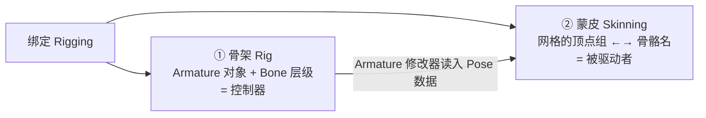
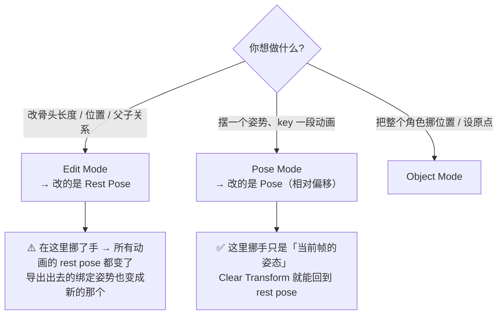
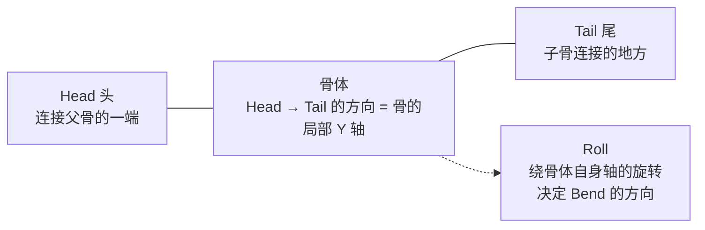
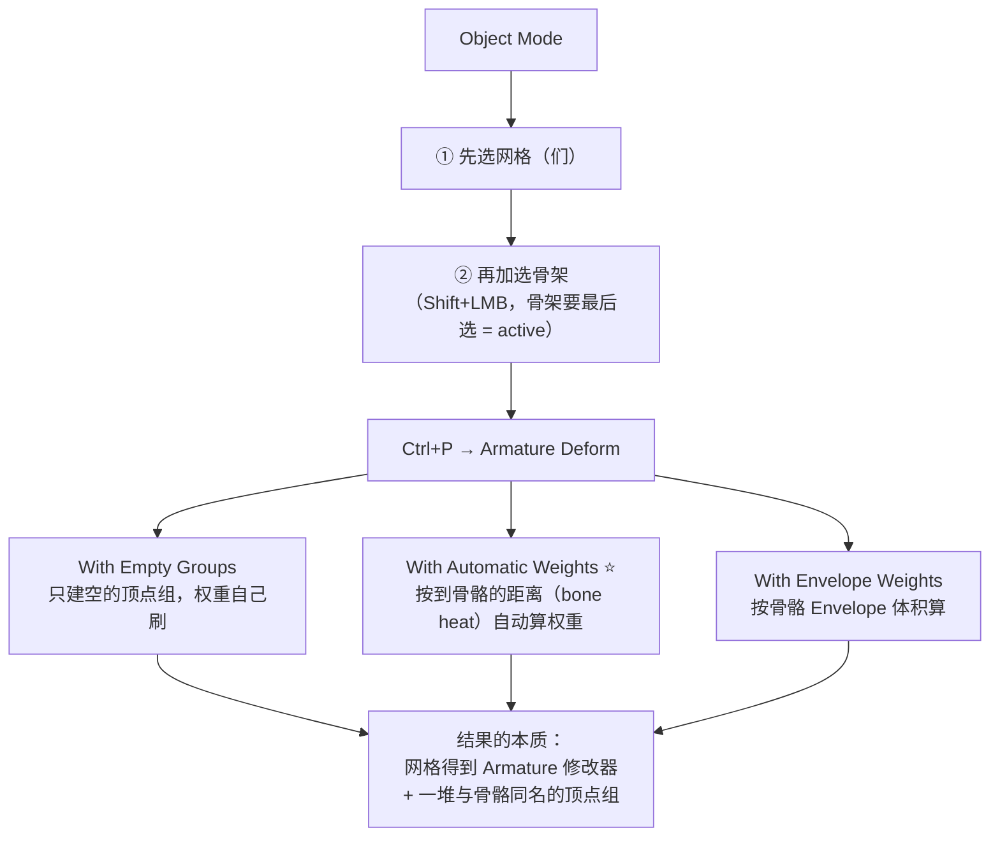

# 01 · 骨骼基础：Armature 与三种模式

> 一句话：**Armature 是个装骨头的容器，Edit Mode 改的是「骨架长什么样」，Pose Mode 改的是「骨架现在摆成什么样」——这两件事绝对不能混。**
> 依据：Blender 5.2 LTS 官方手册 · [Armatures](https://docs.blender.org/manual/en/latest/animation/armatures/index.html) / [Bones](https://docs.blender.org/manual/en/latest/animation/armatures/bones/index.html) / [Skinning](https://docs.blender.org/manual/en/latest/animation/armatures/skinning/index.html) / [Posing](https://docs.blender.org/manual/en/latest/animation/armatures/posing/introduction.html)。

---

## 一、两个数据结构，一次绑定

绑定（rigging）这个词其实涵盖了两件不同的事：



- **骨架**：谁在动。它是控制器，本身不渲染。
- **蒙皮**：谁跟着动。它的载体是顶点组（见 [02](02-蒙皮与权重绘制-自动权重排错.md)）。

> 这两步可以完全分离：同一个模型换一套 rig，或同一个 rig 挂不同的模型。所以**排查问题的第一件事永远是判断是「骨架没摆对」还是「蒙皮没连上」**。

---

## 二、三种模式（本支线最核心的一张表）

| 模式 | 快捷键 | 你在改什么 | 改的结果 | 典型误用 |
| --- | --- | --- | --- | --- |
| **Object Mode** | `Tab` 退出编辑 | 整个 Armature 对象的位置 / 旋转 / 缩放 | 整个角色移动 | 以为旋转这里能让手臂动 |
| **Edit Mode** | `Tab` | **Rest Pose（静止姿势）**：骨骼的 head / tail / roll / 层级 | 骨架的「出厂设定」永久改变 | ⚠️ **在这里摆姿势去做动画** |
| **Pose Mode** | `Ctrl+Tab` 或左上角模式菜单 | **Pose**：每根骨相对 rest pose 的变换偏移 | 可以被关键帧记录的动画 | 在这里改骨头长度（改不了，得去 Edit） |



> 手册的关键句：**Edit Mode 编辑的是 default / base / “rest” position；Pose Mode 里的编辑是从 rest position 出发的 offset**（官方把它类比 Relative Shape Keys 与 Delta Transforms）。

### Rest Position vs Pose Position（显示开关）

骨架属性的 `Viewport Display` 里有 `Pose Position` / `Rest Position` 两个单选：

- **Pose Position**：显示当前 pose（默认）
- **Rest Position**：无视当前 pose，强制把骨架显示成 rest pose

排查神器：**怀疑某个部件「是 rest pose 建歪了」还是「pose 被 key 花了」，切到 Rest Position 看一眼就知道。**

---

## 三、Bone 的结构



| 概念 | 说明 | 影响 |
| --- | --- | --- |
| **Head / Tail** | 骨的两端，两者距离 = 长度 | Tail 也是**子骨的连接点** |
| **Parent / Connected** | Connected = 子骨的头粘在父骨的尾上 | 四肢用 Connected（链条）；独立控件（IK target）不要勾 |
| **Deform** | 骨骼属性里的 `Deform` 开关 | ❌ **没勾的骨头不会产生顶点组**，摆它不动任何网格 —— 这正是控件的常规做法 |
| **Roll** | 绕骨自身轴的旋转 | 决定膝盖往哪个方向弯 → 见 [03](03-骨骼轴向-Roll-左右对称与X轴镜像.md) |

> 💡 关于骨头的局部轴向：**Blender 的骨沿骨骼方向的是 Y 轴**。这条会在导出时反复出现——手册 FBX 章节原话是「FBX bones seem to be **-X** aligned, Blender's are **Y** aligned」。这不是 5.0 修好的东西，而是 Blender 与 FBX 格式之间的**固有差异**，详见 [08](08-骨骼动画导出-GLB与FBX.md)。

---

## 四、让网格跟着骨头走：`Ctrl+P`



| 选项 | 什么时候用 | 代价 |
| --- | --- | --- |
| **With Automatic Weights** ⭐ | 绝大多数情况（道具、简单角色） | 复杂结构会算错，之后要手动修（这一步是常态，不是失败） |
| With Empty Groups | 你已经有一套权重（比如别人给的顶点组），不想被覆盖 | 不自动算权重 → 先 Assign 才会动 |
| With Envelope Weights | 老式流程 / 快速原型 | 改了 envelope 参数不会自动更新，要重新 parent |

> ⚠️ **两个必须知道的注意**：
> 1. 手册明确警告：如果网格上**已经存在与骨骼同名的顶点组**，`Automatic` 和 `Envelope` 会**彻底覆盖**它们。想保留就选 Empty Groups。
> 2. 自动权重**只给勾选了 Deform 的骨**生成顶点组（手册原话：Vertex groups will only be created for bones which are setup as deforming）。控件骨没有顶点组 —— 这是设计，不是 bug。

---

## 五、绑定前必做的检查（省掉 80% 的返工）

```text
【绑定前 checklist】
网格：
[ ] Ctrl+A → Rotation & Scale（Scale 必须 1,1,1）
[ ] M → By Distance 清重叠顶点
[ ] Shift+N 重算法线
[ ] 没有多余物体；该 Apply 的修改器已 Apply
[ ] 原点合理（角色脚下 / 道具底面 / 门铰链）

骨架：
[ ] Ctrl+A → Rotation & Scale（这个最容易忘）
[ ] 所有要参与变形的骨都勾了 Deform
[ ] 命名规范（英文 + .L/.R 后缀，见 03）
[ ] 有且只有一个 root 骨（导出时才能自动移除 Armature 对象）
```

> 最常见的一类事故：**两边都没 Apply Scale**。Blender 里看着一切正常，导出后模型扭曲、权重表现乱套。原因就是非均匀缩放会以变换矩阵的形式混进骨骼的计算里。

---

## 六、`Apply Pose as Rest Pose` 的时机

Pose Mode 里按 `Ctrl+A` → `Apply Pose as Rest Pose`：把当前姿势「烤」成新的 rest pose。

| 场景 | 该不该用 |
| --- | --- |
| 想改模型的绑定姿势（比如改成 A-pose 方便刷权重） | ✅ 用，然后重刷权重 |
| 想把当前动画帧固定成绑定姿势 | ✅ 用（先删掉动画数据） |
| 只是想「暂存一个姿势」 | ❌ 不要 —— 应该存成 Pose Library 的 pose asset |

> 副作用：**这是个不可逆操作**。烤完之后原来的 pose 数据就消失了，之后导出的 rest 是新的姿势。用之前先 `Save Incremental`（`Ctrl+Alt+S`）复制一份。

---

## 七、坑

- ❌ **在 Edit Mode 里摆姿势去做动画** → 改的是 rest pose，导出的绑定姿势已经变了，动画全部错位。用 Rest Position 显示开关自查
- ❌ **摆完 pose 网格完全不动** → 三选一：没加 Armature 修改器、父对象不是骨架、该骨没勾 `Deform`
- ❌ **`Ctrl+P` 选择顺序反了**（先点骨架再点网格）→ active 反了，关系挂错；**最后选的必须是骨架**
- ❌ **忘了 Apply Scale（一边或两边）** → 导出后扭曲、旋转怪异、权重不均
- ❌ **一边开 X-Axis Mirror 一边指望权重自动对称** → 权重仍会不一致；刷完要用 `Weights → Mirror` 处理（见 02）
- ❌ **控件骨勾了 Deform** → 导出后骨骼数变多、多余的存在
- ❌ **多个根骨** → 导出 glTF 时 `Remove Armature Object` 会失效（手册原话：有多个 root bone 时移不掉）
- ❌ **想在 Pose Mode 里把骨头伸长** → 不能，骨长度只能在 Edit Mode 改

---

## 八、自检

| # | 自检点 | 通过标准 |
| - | ------ | -------- |
| ① | 三模式 | 说出 Edit / Pose / Object 各自改什么，并说出「在 Edit Mode 里徒手摆姿势」错在哪 |
| ② | Rest vs Pose | 会切换 Rest Position 显示，并用它判断「歪了」是哪一种原因 |
| ③ | 骨结构 | 说出 head / tail / roll / connected / deform 各自的作用 |
| ④ | 挂载 | 不看教程能把一个网格用 `Ctrl+P → Automatic Weights` 挂到三节骨链上并摆出动作 |
| ⑤ | Apply 礼节 | 说出绑定前两边各要 Apply 什么、不 Apply 的症状是什么 |
| ⑥ | **实操** | 5 分钟内新建 Cube + 两节骨链，让 Cube 的一部分跟着第二节骨转起来 |

---

## 九、速查

```text
【概念】
Armature = 装 Bone 的 Object（容器）  ·  Bone = Armature 里的元素
Rest Pose = Edit Mode 里看到的出厂姿势
Pose      = Pose Mode 里相对 rest 的偏移（这才是动画）
顶点组名 == 骨骼名  且该骨勾了 Deform  →  蒙皮生效

【三种模式】
Object Mode    整个对象移动 / 旋转 / 缩放
Edit   Mode    Tab       改 Rest Pose：长度 / 位置 / 父子 / roll
Pose   Mode    Ctrl+Tab  改 Pose：插关键帧改的就是它

【显示开关】
骨架属性 → Viewport Display → Pose Position / Rest Position
怀疑「是建歪了还是被 key 花了」→ 切到 Rest Position 一看就知道

【Bone 结构】
Head 连父 · Tail 连子 · 两者距离 = 长度
Connected = 子骨的头粘在父骨的尾（做四肢用）
Deform    = 勾了才产生顶点组（控件骨不勾）
Roll      = 绕骨自身轴的旋转，决定 Bend 方向
Blender 的骨：沿骨骼方向的是 **Y 轴**（FBX 是 -X → 导出轴向坑的来源）

【Ctrl+P 挂载】
顺序：先选网格 → 再加选骨架（最后选的必须是骨架）→ Ctrl+P → Armature Deform
├ With Automatic Weights ⭐ 按到骨骼的距离（bone heat）自动分配
├ With Empty Groups        只建空组（已有权重要保留时用）
└ With Envelope Weights    按 Envelope 体积分配
⚠️ Automatic / Envelope 会覆盖同名顶点组
⚠️ 只有勾了 Deform 的骨才会生成顶点组
本质结果：网格得到 Armature 修改器 + 若干与骨同名的顶点组

【绑定前 checklist】
网格 Ctrl+A Rotation & Scale · M By Distance · Shift+N
骨架 Ctrl+A Rotation & Scale · Deform 勾选 · 命名 .L/.R · 唯一 root

【姿势 → rest】
Pose Mode → Ctrl+A → Apply Pose as Rest Pose（把当前姿势烤成 rest）
⚠️ 不可逆：之前先 Save Incremental
```

---

> **下一步**：[`02-蒙皮与权重绘制-自动权重排错.md`](02-蒙皮与权重绘制-自动权重排错.md) —— 骨架会动只是第一步，接下来要决定「每个顶点跟哪根骨头动、动多少」。
