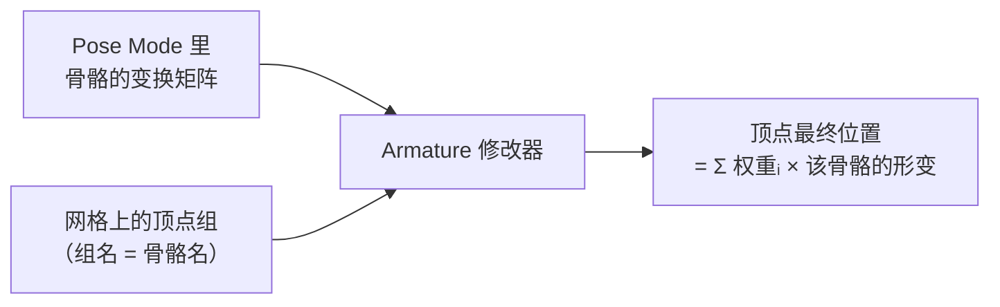
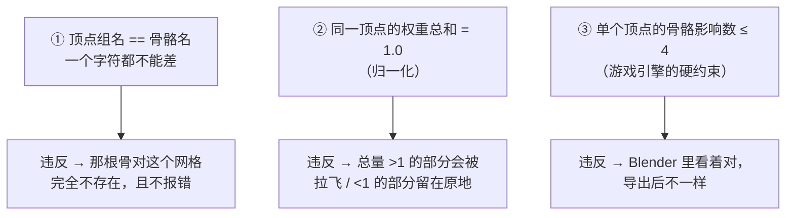
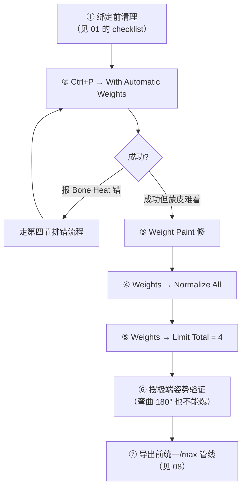
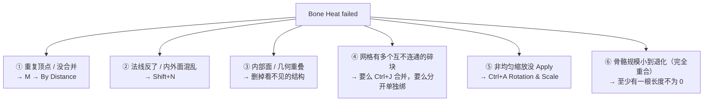

# 02 · 蒙皮与权重绘制（自动权重排错）⭐

> 一句话：**蒙皮就是给每个顶点声明「我跟哪几根骨头、各跟多少」，而引擎只承认「总共 1.0、最多 4 根」的答案。**
> 依据：Blender 5.2 LTS 官方手册 · [Skinning](https://docs.blender.org/manual/en/latest/animation/armatures/skinning/index.html) / [Armature Deform Parent](https://docs.blender.org/manual/en/latest/animation/armatures/skinning/parenting.html) / [Weight Paint](https://docs.blender.org/manual/en/latest/sculpt_paint/weight_paint/index.html) / [glTF 2.0 导出](https://docs.blender.org/manual/en/latest/addons/scene_gltf2.html)。

---

## 一、蒙皮在算什么



一句话版本：**骨骼自己不会带动像素，是顶点组里的那个数字决定的。**所以「模型为什么不动」和「模型为什么动得很恶心」是两个完全不同的排查方向。

---

## 二、三条铁律（引擎端其实比 Blender 端更严格）



| 铁律 | 为什么 | 怎么验证 |
| --- | --- | --- |
| ① 组名 = 骨名 | Armature 修改器靠**名字**配对 | 看网格的 Object Data Properties → Vertex Groups 列表，与骨架的骨骼列表逐个对照 |
| ② 权重和 = 1 | 总权重 >1 时顶点被多根骨同时拉；<1 时有一部分位移丢失（顶点「跟不上」） | `Weights → Normalize All` |
| ③ ≤4 影响 | glTF 手册原话：`Bone influences` 不为 4 或 8 时，很多查看器/引擎会显示不正确。多数引擎的 skinning 是按每顶点 4 根骨做优化的 | `Weights → Limit Total`（填 4）+ 导出时 `Bone influences = 4` |

> 💡 第 ③ 条是本支线**最值钱的一句话**：Blender 允许一个顶点受任意多根骨影响，但**引擎不一定认**。这条差异不会在 Blender 里报错，只会在导出后进引擎时才炸，所以必须**在 Blender 里主动收口**。

---

## 三、标准流程



` Ctrl+P ` 的三个选项再强调一次选 Fox 的顺序：

| 步骤 | 操作 |
| --- | --- |
| 1 | **先选**网格（多个可以多选） |
| 2 | **再加选**骨架（`Shift+LMB`）—— 骨架必须是最后选的（active） |
| 3 | `Ctrl+P` → `Armature Deform` → `With Automatic Weights` |

> Automatic Weights 的算法在 Blender 里叫 **bone heat**：按顶点到各骨骼的距离（以及骨骼体积）解一个热扩散方程。它很聪明，但**对脏几何零容忍**。

---

## 四、排错：`Bone Heat Weighting: failed to find solution for N bone(s)`

这是 Blender 里最著名的一条绑定错误，而且它的成因**非常固定**：



| # | 排查动作 | 怎么发现 |
| - | -------- | -------- |
| ① | `M → By Distance` | 之前布尔切割 / 挤出过的地方最容易留下重叠顶点 |
| ② | `Shift+N` 重算法线 | 打开 Face Orientation 叠加项（ Face Orient. ）看有没有蓝面朝外 |
| ③ | 删内部面 | X-Ray 下看不见但是存在的面（尤其 Boolean 之后） |
| ④ | 检查连通 | Edit Mode 下 `L`（选连通）能把模型刷一下，看是不是一下全选中 |
| ⑤ | `Ctrl+A → Rotation & Scale` | 属性面板里 Scale 不是 1,1,1 |
| ⑥ | 检查骨长 | 某根骨 head 与 tail 完全重合，长度为 0 |

> 90% 的情况是 **① + ⑤**。不要去删骨骼、也不要急着换 Envelope —— 那是绕开问题，不是解决问题。

### 不是报错，但同样致命：「有一部分顶点完全不动」

**成因**：那些顶点在**任何顶点组里都没有权重**（= 没有 >0 的值）。
**检查**：Weight Paint 模式下，一片**纯蓝**区域 = 权重 0 = 这些点不会被任何骨头带动。
**修法**：选中这些面 → 选中对应顶点组 → `Weights → Assign`（或直接刷）。

---

## 五、Weight Paint 模式实操

```text
【进入】
选中网格 → 模式菜单切 Weight Paint（或 Ctrl+Tab 里选）
⚠️ 网格必须已经有 Armature 修改器，否则刷出来的顶点组没有对应的骨

【选骨】
Ctrl+LMB 点到骨上 = 选中并激活该骨骼对应的顶点组 ⭐
    看不见骨头？勾 Display → Wireframe，或到 Pose Mode 选好再回来

【颜色 = 权重】
蓝 0 ┈ 青 ┈ 绿 0.5 ┈ 黄 ┈ 橙 ┈ 红 1.0
看不到权重色？检查：视图着色模式是不是 Solid、对象是否在 3D 视口的叠加项里开了 Vertex Group 显示
```

| 工具设置 | 建议 |
| --- | --- |
| **Weight** | 刷的目标值（0–1）。0 表示橡皮擦效果（把权重刷走） |
| **Strength** | 每笔的强度，汉诺塔式刷而不是一把推到 1 更好控 |
| **Radius** | `F` 调大小 |
| **Auto Normalize** ⭐ | **打开**。它会在你把一个组刷高时，自动压低其他组补到总和 1 |
| **X Mirror** | 对称刷（前提是骨骼命名有 `.L/.R`，见 03） |
| **Falloff** | 笔刷边缘曲线；处理关节过渡时配 Smooth 更好 |

---

## 六、`Weights` 菜单全表（按使用频率排）

| 算子 | 作用 | 什么时候用 |
| --- | --- | --- |
| **Normalize All** ⭐ | 所有顶点组的权重和归一到 1.0 | **每次刷完权重必跑** |
| **Limit Total** ⭐ | 限制每顶点的影响骨骼数（填 **4**） | **导出前必跑**（第 ③ 铁律） |
| **Mirror** | 把右侧权重镜像到左侧（反之亦然） | 只刷了一边，想对称复制 |
| **Smooth** | 平滑相邻顶点的权重差 | 关节处过渡太生硬 |
| **Clean** | 清掉极小值（比如 <0.01 的权重），减少影响数 | Limit Total 之前先 Clean，效果更好 |
| **Transfer Weights** | 从另一个网格把权重按距离传过来 | 换模型不换 rig 时省大事 |
| **Assign Automatic from Bone** | 对当前选中的面重新自动权重 | 一片区域刷坏了，局部重来 |
| **Assign from Bone Envelopes** | 按 Envelope 体积给权重 | 快速粗分配 |
| **Normalize** | 只处理当前激活的那个组 | 局部调整 |
| **Invert** | 反相 | 特殊状况 |
| **Levels / Gradient / Quantize** | 按坐标轴渐变 / 量化 | 给机械结构做线性渐变权重（比如布流水线一端固定一端摆动） |
| **Sample Weight / Sample Group** | 取样某个点的权重 / 组 | 对齐相邻部件的权重基准 |
| **Locks** | 锁住某些组不被误刷 | Rigify rig 上防止刷到 DEF 以外的组 |

---

## 七、症状诊断表（先查表，再动手）

| 症状 | 最可能的原因 | 第一动作 |
| --- | --- | --- |
| 完全不动 | 没挂 Armature 修改器 / 父搞错 / 骨没勾 Deform | 回到 01 第四节 |
| 一部分顶点留在原地 | 这些点在任何组里都没权重（纯蓝） | `Weights → Assign` 补权重 |
| 弯曲时表面塌陷（像被挤瘪） | 关节附近权重过度集中于单一骨、缺少过渡 | 过渡到相邻骨：`Smooth` + 两骨之间 50/50 |
| 关节处拉出尖刺 | 某个顶点被一个远距离的骨影响到了 | `Clean` + `Limit Total 4` |
| ② 表面出现凹陷褶皱 | 权重和 ≠ 1 | `Normalize All` |
| Blender 里正常，进引擎炸了 | 每顶点影响数 > 4 / 骨骼层级多了 leaf bone / 单位没 Apply | `Limit Total 4` → 看 08 |
| 换了 mask 模型后蒙皮全丢 | 新建的模型没有做 `Ctrl+P` | 用 `Transfer Weights` 或直接重绑 |
| 报 Bone Heat 错 | 见第四节六个成因 | `M → By Distance` + `Ctrl+A` |

---

## 八、导出前的「收口」流程

```text
刷完权重以后的标准收尾（每次都一样，不要省略）：
1. Weights → Clean            （清掉 <0.01 的噪声）
2. Weights → Normalize All    （权重和 = 1）
3. Weights → Limit Total      （填 4）
4. 摆三个极端姿势检查：最大弯曲 / 最大伸展 / 扭转 90°
5. 导出 GLB，勾选 Bone influences = 4、Export Deformation Bones Only
6. 回引擎确认：皮肤变形和 Blender 里一致
```

---

## 九、坑

- ❌ **以为自动权重能一次搞定** → 它是「起手第一个猜测」，不是成品。所有认真做的资产都要手刷
- ❌ **忘 Normalize All** → 权重和 ≠ 1，顶点移动量偏小/偏大，动画幅度「手感不对」却找不到原因
- ❌ **忘 Limit Total** → Blender 里 8 根骨影响一个顶点，导出后引擎只认前 4 根，表现不一致
- ❌ **一边开 X-Axis Mirror 一边手动只刷一侧** → 权重左右不一致；对称请用 `Weights → Mirror`，而且它依赖 `.L/.R` 命名（见 03）
- ❌ **Bone Heat 报错就去删骨头 / 加更多的 Steps** → 先清几何（重复顶点 + Apply Scale）
- ❌ **网格里有孤立的碎块（比如没 Join 的一颗螺丝）就 `Ctrl+P`** → 直接失败，或绑定成功但那个碎块没有权重
- ❌ **刷完权重又回头改了几何，却不再跑一遍收口流程** → 新顶点的骨骼影响数可能重新超过 4；**只要动了几何，Clean / Normalize / Limit Total 就要重跑**
- ❌ **在 Rigify rig 上把权重刷到控制骨（`CTRL-`）上** → 应该刷到对应的 `DEF-` 组（详见 05）

---

## 十、自检

| # | 自检点 | 通过标准 |
| - | ------ | -------- |
| ① | 铁律 | 说出「组名=骨名 / 权重和=1 / ≤4 影响」三条，并说出违反每一条的**症状** |
| ② | 排错 | 给一个报 Bone Heat 的模型，10 分钟内找出原因并完成绑定 |
| ③ | 补权重 | 能在 Weight Paint 里找出「纯蓝的死顶点」并补上权重 |
| ④ | 收尾流程 | 能背出 Clean → Normalize All → Limit Total 4 的收尾顺序并解释每一步在防什么 |
| ⑤ | 极端姿势 | 给角色弯曲 180°，没有顶点被拉爆或塌陷成针状 |
| ⑥ | **实操** | 给一个两段式道具（如箱盖 / 门 / 手电筒）完成绑定并刷好权重，摆到最大角度时形状正常、表面不撕裂 |

---

## 十一、速查

```text
【三条铁律】
组名 = 骨骼名   |   Σ权重 = 1.0   |   单顶点 ≤ 4 根骨

【Ctrl+P】
先网格 → 再加选骨架 → Ctrl+P → Armature Deform → With Automatic Weights
Automatic = bone heat 算法（按距离解热扩散）

【Bone Heat failed 的六个成因】
① 重复顶点 M→By Distance  ② 法线反了 Shift+N
③ 内部面 / 几何重叠       ④ 网格有多个不连通碎块
⑤ 非均匀缩放 Ctrl+A       ⑥ 长度为 0 的骨

【Weight Paint】
Ctrl+LMB 点骨 = 选中该顶点组 ⭐
颜色：蓝 0 ┈ 青 ┈ 绿 0.5 ┈ 黄 ┈ 橙 ┈ 红 1.0（纯蓝 = 没权重 = 不动）
Weight = 目标值（0=擦） · Strength = 每笔强度 · F = 笔刷大小
Auto Normalize 开（自动补到总和 1） · X Mirror 开（需 .L/.R）

【Weights 菜单】
Normalize All ⭐ 归一化到 1
Limit Total ⭐ 限制每顶点影响数 → 填 4
Clean          清掉极小权重（Limit 之前先跑）
Mirror         左右对称（需 .L/.R）
Smooth         关节过渡变柔和
Transfer Weights  换模型不换 rig 时传权重
Assign Automatic from Bone  局部重算

【导出前收口】
Clean → Normalize All → Limit Total(4) → 摆极端姿势验证 → 导出（Bone influences=4）

【诊断】
不动           → 没 Armature 修改器 / 没 Deform
一部分不动      → 那些点没权重（纯蓝）
Bend 处塌陷     → 权重太集中 → Smooth + 50/50 过渡
拉出尖刺        → 被远处的骨影响 → Clean + Limit Total
Blender 对、引擎炸 → 影响数 >4 / leaf bone / 单位没 Apply
```

---

> **下一步**：[`03-骨骼轴向-Roll-左右对称与X轴镜像.md`](03-骨骼轴向-Roll-左右对称与X轴镜像.md) —— 权重会刷了之后，回头处理骨骼本身的朝向：为什么膝盖弯向了奇怪的方向。
