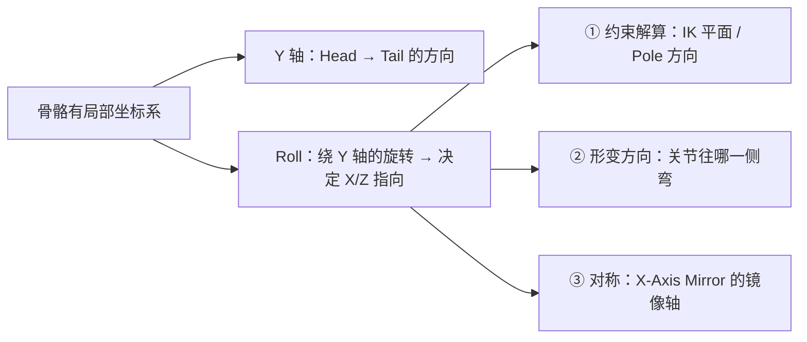
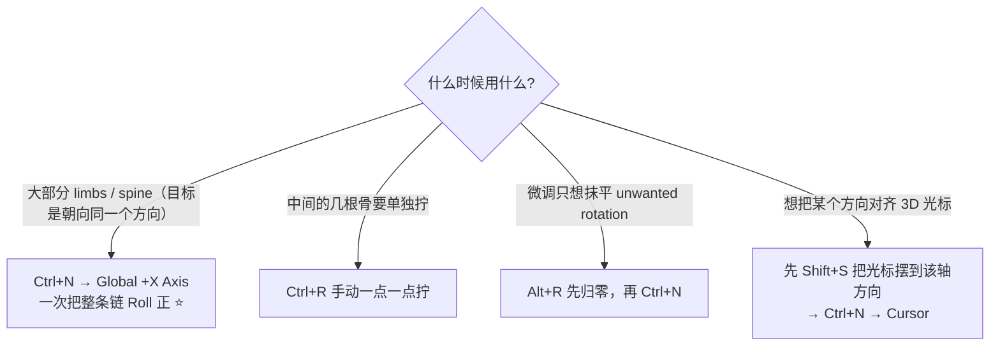
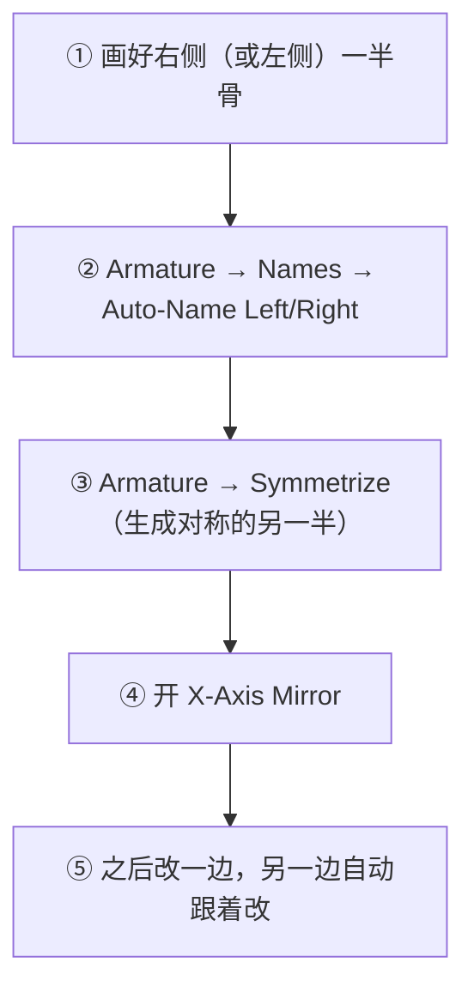
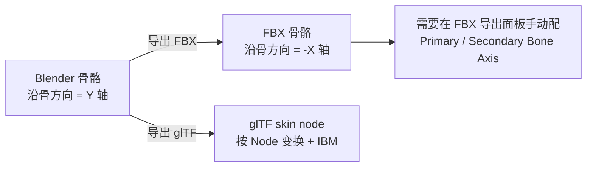

# 03 · 骨骼轴向、Roll、左右对称与 X 轴镜像

> 一句话：**Roll 决定骨头的 X/Z 轴指向哪，也就决定膝盖往哪个方向弯；`.L / .R` 后缀则决定 Blender 能不能自动帮你对齐左右两边。**
> 依据：Blender 5.2 LTS 官方手册 · [Bones Structure](https://docs.blender.org/manual/en/latest/animation/armatures/bones/structure.html) / [Editing](https://docs.blender.org/manual/en/latest/animation/armatures/bones/editing/index.html) / [Weight Paint](https://docs.blender.org/manual/en/latest/sculpt_paint/weight_paint/index.html)；5.2 Release Notes（Animation & Rigging）。

---

## 一、为什么「看起来只是躺在那儿的骨」也需要被转正



肉眼看到的只是一根线，但 Blender 内部每根骨都有一个自己的三轴坐标系。**Roll 不对，会连锁出错**：

| 症状 | 实际原因 |
| --- | --- |
| 膝盖往侧面（甚至反方向）弯 | Roll 歪了，屈膝方向不看你的意志 |
| 摆姿势时某些骨绕意料之外的轴转 | X/Z 轴指向与预期不一致 |
| IK 到某个角度时整条骨链突然翻转 180° | Pole 平面基于骨骼的 X 轴，Roll 决定极点在哪 |
| X-Axis Mirror 改右侧却动到了左侧 | `.L/.R` 命名没配对 |

---

## 二、Roll 的三种操作

| 操作 | 用途 |
| --- | --- |
| `Ctrl+R` | 手动 Roll（鼠标移动 adjusting 数值，配合 alt 微调） |
| `Alt+R` | 清除 Roll（归零） |
| `Ctrl+N` | **Recalculate Roll**（菜单给选项：Global ±X / ±Z 轴 · Active Bone · View · Cursor） ⭐ |



> 💡 实操口诀：**先 `Ctrl+N` 整批正一次（通常选 `Global +X Axis`），看哪里还歪，剩下的用 `Ctrl+R` 拧。** 一根一根手动拧是浪费时间。

### 「线的预想 vs 实际」怎么验

1. Edit Mode → Overlays → Axes 打开（显示每根骨的局部坐标系）
2. 所有 spine / limbs 的 **X 轴应该指向同一个方向**（通常是角色的正前方）
3. 上下肢的 X 轴方向统一了，屈膝方向就统一了

---

## 三、`.L` / `.R` 命名与左右对称

Blender 用**后缀**（不是前缀）来识别左右：

```text
upper_arm.L    ↔    upper_arm.R
thigh.L        ↔    thigh.R
# 常见变体都能识别：_L/_R · .L/.R · .l/.r · -L/-R
```

| 命令 | 位置 | 用途 |
| --- | --- | --- |
| **Auto-Name Left/Right** | Edit Mode → `Armature → Names →` | 按 X 坐标自动给左右加后缀 ⭐ 建完骨第一时间跑 |
| **Flip Names** | 同上 | 把选中骨的 `.L ↔ .R` 互换 |
| **Duplicate and Rename** | 5.2 新增（3D 视口 Armature 菜单） | 复制的同时做查找替换，**不会冒出 `Bone.001`** ⭐ |

> 📌 引用 5.2 Release Notes：新增 `Duplicate and Rename` 算子，duplicate 选中的骨并对名字做 search/replace，用于避免 dup 出来的 `.001` 后缀。以前靠 Flip Names + 手动改名的流程，现在一步到位。



**X-Axis Mirror 的位置**：属性编辑器 → Armature（人物图标）→ Options → `X-Axis Mirror`（Edit Mode 下生效）。
它的前提是：**必须有正确配对的 `.L / .R` 命名**，否则 Blender 不知道「另一侧」是谁。

---

## 四、对称工作流（做左右对称资产的标准做法）

```text
【骨架】
1. 只画左（或右）半边的骨 ── 含中间的 spine / root 保持在中轴上
2. Auto-Name Left/Right（按 X 坐标自动补后缀）
3. Armature → Symmetrize → 另一侧自动生成
4. 开 X-Axis Mirror，之后所有编辑自动对称

【权重】（这是自动化带来的最大收益）
5. 只刷半边权重
6. Weights → Mirror → 对称到另一边
⚠️ Mirror 的前提同样是 .L/.R 配对，否则会报错「没有对称的组」
```

> 💡 如果能确定模型完全对称，这条路能把刷权重的工作**直接减半**。先花 10 分钟把命名和对称配好，比后面刷双倍权重划算得多。

---

## 五、导出层面的「轴向」：Blender Y vs FBX -X（进阶但必须知道）

这一节不是 Roll 的问题，而是**格式之间的固有差异**，在导出时会再来一次：



手册的原文提醒：「Bones would need to get a correction to their orientation (FBX bones seem to be -X aligned, Blender's are Y aligned), this does not affect skinning or animation, but imported bones in other applications will look wrong.」

→ **导出后的表现为：动画和蒙皮是对的，但骨骼本身旋转指标看着歪。**这是 FBX 的老问题，见 [08](08-骨骼动画导出-GLB与FBX.md)。

> ⚠️ 这条也是本支线对路线图的一处订正：路线图 Stage 6 写的「5.0 重做了骨骼轴向处理」查无此事，5.0/5.2 Release Notes 里都没有相关条目，轴向仍需手动配置。

---

## 六、坑

- ❌ **不跑 `Ctrl+N` 就开始刷权重** → 关节弯向事后才发现不对，改 Roll 会让已经刷完的权重再次需要检查
- ❌ **左右后缀的写法自创（比如写成 `L_upper_arm`）** → X-Axis Mirror 与 `Weights → Mirror` 全部失效，还以为是插件 bug
- ❌ **用名字 `upperarm_L` 自己以为能识别** → 规则统一是 `.L` / `.R`（或 `_L` / `_R`），不要自创写法
- ❌ **Symmetrize 之后还手动拉一侧** → 关掉 X-Axis Mirror 就不会自动对称，容易忘
- ❌ **以为 X-Axis Mirror 对已有的骨也是万能的** → 只对新做的编辑有效，已有的不对称要手动改或重做一侧 Symmetrize
- ❌ **以为导出后骨骼方向不一致的问题 Blender 会自己修** → 不会。FBX 靠导出面板的 `Primary / Secondary Bone Axis` 手动配；GLB 走 glTF 的节点变换，不需要配这项

---

## 七、自检

| # | 自检点 | 通过标准 |
| - | ------ | -------- |
| ① | Roll 概念 | 说出 Roll 决定什么，并说出「膝盖弯错方向」的根因 |
| ② | 修正手法 | 会用 `Ctrl+N` 整批正 Roll，并对个别持续歪的骨用 `Ctrl+R` |
| ③ | 命名 | 说出 `.L/.R` 的作用，会给一排刚画好的骨自动加后缀 |
| ④ | 对称流程 | 说出 Symmetrize → X-Axis Mirror → Weights Mirror 这条链条 |
| ⑤ | 轴向差异 | 说出 Blender 与 FBX 的轴向差异是什么、表现为什么症状 |
| ⑥ | **实操** | 10 分钟内建好一条对称的双臂骨链（含 Auto-Name + Symmetrize），且两侧的 Roll 方向对称一致 |

---

## 八、速查

```text
【Roll】
Ctrl+R   手动 Roll（鼠标移动调数值）
Alt+R    清除 Roll（归零）
Ctrl+N   Recalculate Roll ⭐ 整批正：
         Global ±X / ±Z Axis · Active Bone · View · Cursor
口诀：先 Ctrl+N（一般选 Global +X Axis），剩下的 Ctrl+R 拧
验证：Overlays → Axes，看所有 limb/spine 的 X 轴是否同向

【命名】
后缀规则：upper_arm.L ↔ upper_arm.R（_L/_R · .l/.r · -L/-R 也能识别）
Auto-Name Left/Right   按 X 坐标自动补后缀（建完骨马上跑）
Flip Names             .L ↔ .R 互换
Duplicate and Rename   5.2 新增：复制同时改名，避免 Bone.001 ⭐

【对称】
X-Axis Mirror 位置：属性 → Armature → Options（Edit Mode 下生效）
⚠️ 前提是有配对的 .L/.R，否则不知道另一侧是谁
流程：画半边 → Auto-Name → Symmetrize → 开 X-Axis Mirror
权重：只刷半边 → Weights → Mirror → 对称过去

【导出轴向】
Blender 骨沿骨骼方向 = Y 轴
FBX    骨沿骨骼方向 = -X 轴（手册原话）
→ 两者差一个 correction，需要在 FBX 导出面板配 Primary/Secondary Bone Axis
→ 表现为：蒙皮和动画是对的，骨骼看着歪
```

---

> **下一步**：[`04-约束与IK-FK.md`](04-约束与IK-FK.md) —— 骨骼朝向正了以后，让骨骼「自动满足接触点」：手臂追手、脚踩地面。
