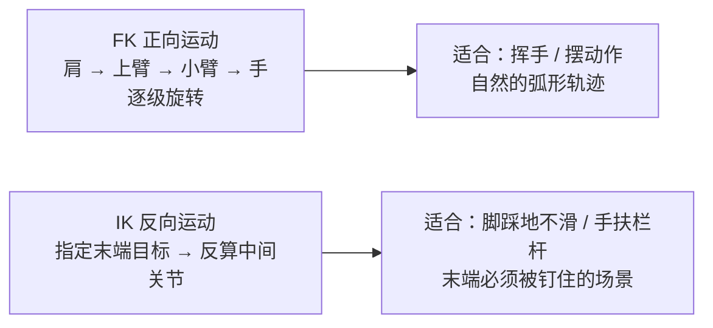
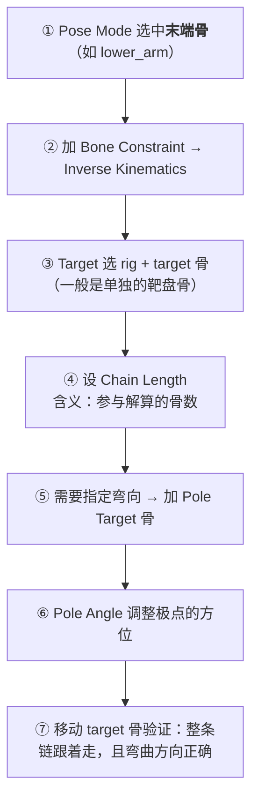
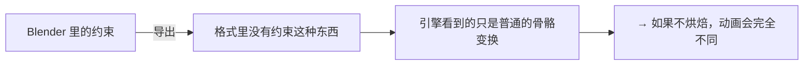

# 04 · 约束与 IK / FK

> 一句话：**FK 是「从肩膀往下拧」，IK 是「手放在哪儿，胳膊自己跟着算」——约束让摆姿势变成解数学题，代价是它们不会被导出，必须在导出前烘成关键帧。**
> 依据：Blender 5.2 LTS 官方手册 · [Constraints](https://docs.blender.org/manual/en/latest/animation/constraints/index.html) / [IK Solver](https://docs.blender.org/manual/en/latest/animation/constraints/tracking/ik_solver.html)；5.2 Release Notes（Animation & Rigging）。

---

## 一、先分清 FK 与 IK



| | FK | IK |
| --- | --- | --- |
| 控制方式 | 直接旋转每根骨 | 移动一根 target 骨，链自动解算 |
| 轨迹 | 自然的弧线，适合动态动作 | 末端的位置精准，但插值可能偏直 |
| 典型场景 | 挥手臂、抬腿、大部分摆姿势 | 触地、手扶固定物、爬行 |

> 游戏角色的标准做法是 **IK/FK 切换 + Snapping**：大部分动画用 FK 写（曲线好看），需要 foot lock 时切到 IK 并对齐（snap）。Rigify 自带这套按钮（见 05）。

---

## 二、骨骼有约束时的颜色（快速自检）

Pose Mode 里骨头的颜色会告诉你它挂了什么（这是免费的自查工具）：

| 颜色 | 含义 |
| --- | --- |
| 灰 | 默认（无约束） |
| 蓝线框 | Pose Mode 选中状态 |
| **绿** | 有约束 |
| **黄** | 有 IK Solver 约束 |
| 橙 | 有 targetless solver 约束 |

> 如果你开了自定义的骨配色（Bone Collections 的颜色），这些状态色会被覆盖——排查时先临时关掉配色。

---

## 三、会用到的约束清单（按优先级）

| 约束 | 作用 | 什么时候用 |
| --- | --- | --- |
| **Inverse Kinematics** ⭐ | 末端追踪一个 target，反算链条 | 脚踩地、手把住物体 |
| **Copy Rotation** | 复制另一根骨的旋转（可用 Offset + Influence） | 简单的 FK/IK 混合切换 |
| **Copy Location** | 复制位置（常配合地面的支点控制器） | 手 / 脚控制器 |
| **Limit Rotation / Location / Scale** | 限制活动范围 | 防止关节反向弯折（护栏） |
| **Track To / Damped Track** | 让骨始终看向目标 | 眼球、武器瞄准 |
| **Copy Transform** | 完整复制变换 | 两级 rig 之间的桥 |
| **Child Of** | 可动画开关的父子关系（带 Influence） | 「中途拿起道具」这类需要关键帧的挂接 |
| **Shrinkwrap** | 吸附到目标表面 | 贴合地面/衣物 |
| **Transformation** | 源的一段范围 → 目标的一段范围 | 驱动控件的高级用法 |
| **Spline IK** | 链条沿曲线变形 | 尾巴、触手、绳索 |
| **Geometry Attribute**（5.0 新增） | 直接从几何属性里读 vector / quaternion / 4x4 矩阵，应用到物体或骨的变换 | 高手向；绑定到程序化几何上时才用得上 |

> 📌 引用 5.0 Release Notes：新增 Geometry Attribute 约束；Custom Shape 区新增 `Affect Gizmo` 与 `Use As Pivot` 两个选项。
> 📌 引用 5.2 Release Notes：`Copy Constraints` 加进了 `Ctrl+L` 菜单 —— **批量复制约束到多根骨**现在一步到位。

---

## 四、加一条 IK 的标准流程



| 参数 | 怎么给 |
| --- | --- |
| **Chain Length** | 参与解算的骨数量。手臂一般 2（upper + lower）；链多算了会把潜力带入 Torso |
| **Target** | Rig + 一根**不带 Deform** 的控制/目标骨 |
| **Pole Target** | 一根标明「凸出方向」的骨（放在肘 / 膝的前侧或后侧） |
| **Pole Angle** | 极点在约束平面上的角度；**翻转 / 出现异常时先调这里** |
| **Iterations** | 解算迭代次数；不够会抖，一般默认够用 |

> 💡 **Pole Target 的直觉**：它像插在关节上的一面小旗，IK 会向旗的方向弯。所以旗放在「关节该凸出的那一侧」。

---

## 五、IK / FK 切换怎么自己做（不用 Rigify 也能用）

简易手动方案（到处都能见到的做法）：

```text
1. 准备好同样的一根骨的两套「控制骨」：IK_ctrl 与 FK_ctrl
2. 给 DEF 骨挂两条 Copy Rotation 约束，分别读 IK_ctrl 与 FK_ctrl
3. 用两个约束的 Influence 做互斥：
   IK-FK switch 自定义属性 = 0 → FK 的 Influence 1，IK 的 0
   IK-FK switch 自定义属性 = 1 → 反过来
4. 切换前把 IK target snap 到 FK 的末端位置（否则会跳）
```

> Rigify 生成的 rig 自带这套（含 Snapping 按钮），所以真正做人形时别手写（见 05）。但**理解原理**有助于排查「为什么切换瞬间跳了一下」——答案通常是忘记 snap。

---

## 六、⭐ 约束不会被导出：必须烘焙

这是本次支线最容易在「导出—进引擎」环节翻车的地方：



**烘焙动作**（导出前必做，除非导出器明确会 bake）：

```text
① Pose Mode 下全选骨骼（A）——注意别误按 Ctrl+A，那是 Apply
② Pose → Animation → Bake Action…
③ 关键选项：
   - Visual Keying: ON      ← 必开，把约束的结果写进曲线
   - Clear Constraints: ON  ← 顺手清掉约束
   - Clear Parents: OFF
   - Bake Data: Pose
   - Frame Step: 1          ← 逐帧烘焙，结果最稳
④ 烘完滚动时间轴：约束已清除，但动画表现应与原来一致
```

> FBX 手册的原话佐证：Constraints —— The result of using constraints is exported as a keyframe animation, however the constraints themselves are not saved in the FBX.
> glTF 侧同理；如果 Blender 里某物是靠约束动的而不是靠关键帧动的，导出前勾选 `Bake All Objects Animations`（手册原文：Useful when some objects are constrained without being animated themselves）。

---

## 七、坑

- ❌ **以为约束会跟着导出** → 引擎里看到 bones 完全不动 / 只播了一部分。导出前先 `Bake Action`（Visual Keying 必开）
- ❌ **Pole Angle 不调，却怪 IK 不稳定** → IK「翻转 / 抖动」九成是 Pole Target 与 Pole Angle 没设对
- ❌ **Chain Length 给太大** → 连脊柱一起被拉过去
- ❌ **忘了 target 骨关闭 Deform** → 导出多出一堆没有意义的骨骼
- ❌ **5.2 起 `Only Insert Available` 默认开启，给 Influence 打关键帧没反应** → 去 `Preferences → Animation → Keyframes` 关掉（详见 hub 第 0 节订正第 5 条）
- ❌ **多个约束叠在一起不检查顺序** → 约束栈自上而下依次执行，顺序错了结果就错了
- ❌ **用 Copy Rotation 做 FK/IK 混合，但忘了关 Offset** → 动画整体偏转一个常量角度
- ❌ **在中间骨上遗留了多余的约束** → 奇怪的现象可能很久之后才暴露；养成定期看一遍 Constraint 面板的习惯

---

## 八、自检

| # | 自检点 | 通过标准 |
| - | ------ | -------- |
| ① | FK vs IK | 说出两者的差别与各自的典型场景 |
| ② | 骨色 | 说出绿 / 黄 / 橙三种颜色代表什么，以及骨头颜色开启时会覆盖它们 |
| ③ | IK 流程 | 不看教程能给一条两节链加上可用的 IK（含 Pole Target 与 Pole Angle） |
| ④ | 约束清单 | 能说出 5 个常用约束的用途（IK / Copy Rotation / Limit / Track To / Child Of） |
| ⑤ | 烘焙 | 说出为什么要 bake，以及 `Bake Action` 里必须打开哪两个开关 |
| ⑥ | **实操** | 给一条腿加 IK + Pole，移动 target 时膝盖朝正确的方向弯，并成功烘焙成纯关键帧 |

---

## 九、速查

```text
【FK vs IK】
FK 逐级旋转 → 弧形轨迹自然 → 挥手 / 摆动作
IK 末端牵引 → 位置精准     → 脚踩地 / 手扶固定物

【骨骼颜色（Pose Mode）】
灰 无约束 · 绿 有约束 · 黄 有 IK Solver · 橙 targetless solver
⚠️ 自定义骨配色会覆盖这些状态色

【常用约束】
Inverse Kinematics ⭐ 末端追踪
Copy Rotation / Location / Transform   复制（配合 Influence 做混合）
Limit Rotation / Location / Scale      护栏（防反关节）
Track To / Damped Track                看向目标（眼球 / 瞄准）
Child Of                              可动画的父子（能 key 开关）
Spline IK                             沿曲线：尾巴 / 触手
5.2 新增 Ctrl+L → Copy Constraints：批量复制约束 ⭐

【IK 三件套】
Chain Length  参与解算的骨数（手臂一般 2）
Pole Target   指向「关节该凸出」那一侧的旗子骨
Pole Angle    Pole 在平面上的角度 → 翻转时先调它
⚠️ target / pole 骨都要关 Deform

【必须烘焙 ⭐】
约束不会被任何格式导出（FBX 手册原话亦然）
Pose → Animation → Bake Action…
  Visual Keying: ON      ← 把约束结果写进曲线
  Clear Constraints: ON  ← 顺手清掉
  Frame Step: 1
glTF 侧：勾 Bake All Objects Animations

【5.2 坑】
给 Influence 打关键帧没反应 → Preferences → Animation → Keyframes
                              关掉 Only Insert Available（5.2 起默认开）
```

---

> **下一步**：[`05-Rigify快速绑定.md`](05-Rigify快速绑定.md) —— 手写 rig 理解了原理就够了，真正做人形角色时，用生成器。
