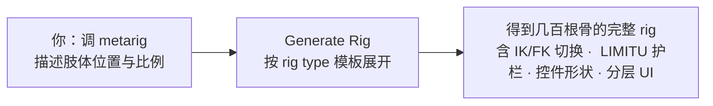
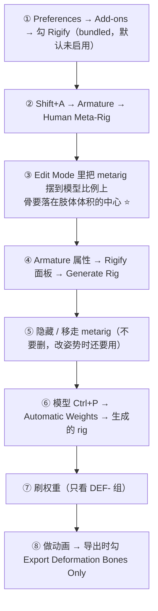

# 05 · Rigify 快速绑定

> 一句话：**Rigify 让你只负责描述「肢体在多高、多长」（metarig），剩下的骨骼层级、IK/FK 切换、控件形状由它按模板生成。**
> 依据：Blender 5.2 LTS 官方手册 · [Rigify](https://docs.blender.org/manual/en/latest/addons/rigify/index.html)（手册标注：**This add-on is bundled with Blender**，作者 Nathan Vegdahl 等）。

---

## 一、Rigify 帮你做了什么



手工搭一套能用的角色 rig 需要几小时到几天；Rigify 把它压缩成「摆 metarig + 按一个按钮」。代价是：**要按它的规矩来。**

> ⚠️ Rigify **不是**模型解释器。它不会读你的 mesh，你需要自己把 metarig 的骨骼摆到与模型对应的位置。这一步偷懒，后面所有关节都会歪。

---

## 二、标准流程



| 步骤 | 关键点 | 常见失误 |
| --- | --- | --- |
| ③ 调 metarig | 骨 Our 位于肢体的**中心**，关节位置对准生理弯曲点 | 偷懒缩放整个 metarig 而不逐节对准，导致关节位置偏移 |
| ④ Generate | 在 **Armature 属性**里找 Rigify 面板 | 在 metarig 的对象模式外找了半天找不到按钮 |
| ⑥ 绑定 | 选 mesh → 加选 **生成的 rig** → `Ctrl+P → Automatic Weights` | 选成了 metarig（metarig 只是模板，不该被绑定） |
| ⑧ 导出 | glTF 勾 `Export Deformation Bones Only` | 不勾 → 导出几百根骨，引擎里灾难 |

---

## 三、生成的 rig 里那些前缀都在干什么

Rigify 生成的骨骼按前缀分四类（这也是排查「哪里该刷权重 / 哪里不该」的依据）：

| 前缀 | 含义 | Deform | 你会动它吗 |
| --- | --- | --- | --- |
| **`DEF-`** ⭐ | 形变骨，真正带动网格的那批 | ✅ 勾了 | ❌ 不直接动（由 MCH/CTRL 驱动），但**刷权重就是刷这些组** |
| `CTRL-` | 控制骨（能看到的那些 Widget 圆环/方块） | ❌ | ✅ **日常安放就看它们** |
| `MCH-` | 机械骨，传递/换算的中间层 | ❌ | ❌ 一般隐藏 |
| `ORG-` | metarig 骨的副本（保留原始比例信息） | ❌ | ❌ |


> 💡 由此推出的几条实用结论：
> 1. **刷权重只认 `DEF-` 开头的顶点组**（因为只有它们勾了 Deform，`Ctrl+P` 自动权重只会生成这些组）。
> 2. **导出只留 `DEF-`**（glTF 的 `Export Deformation Bones Only` 就是干这个的）。
> 3. 做了某段 IK 动画、导出前没烘焙 —— 引擎里会丢，**因为 CTRL→MCH→DEF 是靠约束与驱动的，而约束不导出**（见 04 第六节）。

---

## 四、侧边栏面板与 Python 脚本

Rigify UI（骨骼层显示/隐藏、IK-FK 开关、Snapping 按钮）通常在：

- **3D 视口侧边栏 → Item 标签**（选中 rig 后出现 Rigify Layers / Rig Main Properties 面板）
- 骨骼按 **Bone Collections** 分组显示

> ⚠️ 这套 UI 是由生成的一段 Python 脚本（Text 数据块）提供的。换机器或重开文件后面板不出现时，按顺序排查：
> 1. `Preferences → Save & Load → Auto Run Python Scripts` 是否允许
> 2. 该文件是否被 Trusted（重开时的提示）
> 3. 还不行就在 Text Editor 里找到 rig UI 脚本手动 Run Script
>
> **面板不存在不影响导出**，只是不好操作。所以别因为没面板就以为 rig 坏了。

---

## 五、metarig 的取舍

| 该做 | 不该做 |
| --- | --- |
| ✅ 在 Edit Mode 里逐节把骨对准模型（尤其肩膀、肘、膝、踝） | ❌ 整体缩放 metarig 后就用 |
| ✅ 手指、脚趾按需要增删（metarig 有对应 rig type 可加） | ❌ 改 scale 到模型完全套进去就行 |
| ✅ 改完 metarig 重新 Generate 之前 `Save Incremental` | ❌ 直接编辑生成的 rig（下一次 Generate 会**覆盖**你的修改） |
| ✅ 保留 metarig 在场景里（移到别的集合、隐藏） | ❌ 把 metarig 删了（以后改比例要重画） |

> 关键心智：**metarig = 源文件，生成的 rig = 编译产物。**改需求改源文件，不要改产物。

---

## 六、导出清单（Rigify rig 专用）

```text
[ ] 骨骼动画已烘焙？—— CTRL/MCH/DEF 之间靠约束，必须 Pose → Animation → Bake Action
    （Visual Keying ON · Clear Constraints ON · Frame Step 1）
[ ] 角色的 Ctrl+A Rotation & Scale 已 Apply（mesh 与 armature 两边都要）
[ ] 权重已收口：Clean → Normalize All → Limit Total(4)
[ ] glTF 导出：
    Data - Armature → Export Deformation Bones Only: ON  ⭐
    Data - Armature → Use Rest Position Armature: ON
    Data - Skinning → Bone influences: 4
    Animation → 需要的一组多动作时勾 Export all Armature Actions + Reset pose bones between actions
[ ] 导入引擎后核对骨骼数量：应该 ≈ rigify DEF 骨的数量，而不是几百根
```

---

## 七、坑

- ❌ **直接编辑生成的 rig** → 下次 Generate 全部覆盖。要改就改 metarig
- ❌ **metarig 没对准就 Generate** → 关节位置与模型不符，后面刷的权重全白费
- ❌ **把 mesh 绑到 metarig 上** → metarig 只是模板，它自己没有 IK/FK 与控件
- ❌ **导出不勾 Deformation Bones Only** → 引擎里多出几百根骨，性能与表现都受影响
- ❌ **没烘焙就导出，发现动画在引擎里不动** → `CTRL → MCH → DEF` 是约束链路，必须 bake
- ❌ **以为 Rigify rig 不用管 ≤4 影响** → 自动权重照样可能给一个顶点太多骨；导出前必须 `Limit Total`
- ❌ **删了 metarig** → 需要调整比例时要重新摆一遍，别删，移到一个隐藏集合里
- ❌ **看不到 Rigify 面板就以为 rig 坏了** → 大概率是 Python 自动执行没开；导出不受影响

---

## 八、自检

| # | 自检点 | 通过标准 |
| - | ------ | -------- |
| ① | 原理 | 说出 metarig 与生成 rig 的关系，以及为什么不能改生成 rig |
| ② | 前缀 | 说出 `DEF- / CTRL- / MCH- / ORG-` 的含义，指出刷权重和导出分别针对哪一类 |
| ③ | 绑定 | 能把一个模型绑到生成的 rig 上，且顶点组里只出现 `DEF-` 开头的组 |
| ④ | 面板 | 面板不出现时知道三条排查路径（Auto Run / Trust / 手动 Run Script） |
| ⑤ | 导出 | 能背出 Rigify rig 的导出清单（含两项 Armature 开关） |
| ⑥ | **实操** | 30 分钟内给一个低模人形完成 metarig 对齐 → Generate → 绑定 → 导出 GLB，并在引擎里骨骼数正常 |

---

## 九、速查

```text
【启用】Preferences → Add-ons → Rigging → Rigify（bundled，默认未启用）

【流程】
Shift+A → Armature → Human Meta-Rig
 → Edit Mode 把 metarig 对准模型（骨要在肢体中心）
 → Armature 属性 → Rigify 面板 → Generate Rig
 → 隐藏 metarig（别删）
 → 选 mesh → 加选生成的 rig → Ctrl+P → With Automatic Weights
 → 刷 DEF 组权重 → Limit Total 4
 → 导出勾 Export Deformation Bones Only

【四类前缀】
DEF-  形变骨 ✅Deform → 刷权重 / 导出都认它
CTRL- 控制骨（看到的 Widget） → 日常只看它
MCH-  机械骨（中间层）
ORG-  metarig 的副本
关系：CTRL → MCH → DEF → 网格（靠约束驱动）

【面板】
3D 视口侧边栏 Item 标签：Rigify Layers / Rig Main Properties
看不到面板（不是 rig 坏了）：
  ① Preferences → Save & Load → Auto Run Python Scripts
  ② 文件是否 Trusted
  ③ Text Editor 里手动 Run Script

【导出】
必须先烘焙：Pose → Animation → Bake Action
  Visual Keying ON · Clear Constraints ON · Frame Step 1
glTF：Export Deformation Bones Only ON · Use Rest Position Armature ON
      Bone influences = 4
引擎里骨骼数应 ≈ DEF 骨数量，而不是几百根

【心法】
metarig = 源文件 · 生成的 rig = 编译产物
改需求改源文件，不要改产物
```

---

## 十、资源

- **Nathan Vegdahl · Humane Rigging**（Rigify 作者本人的免费教程）——理解骨骼原理最經典的一条
- YouTube · **CGDive** Rigify 系列（免费，跟着做一遍基本够用）
- 官方手册 · [Rigify](https://docs.blender.org/manual/en/latest/addons/rigify/index.html)：metarig rig type 清单、骨位摆放指南（Face / Torso / Limbs / Fingers）
- 开发者文档 · [Blender Developer Docs → Rigify](https://developer.blender.org/docs/features/animation/rigify/)

---

> **下一步**：[`06-关键帧与动画编辑-DopeSheet-GraphEditor-NLA.md`](06-关键帧与动画编辑-DopeSheet-GraphEditor-NLA.md) —— rig 有了，接下来让它在时间轴上动起来。
