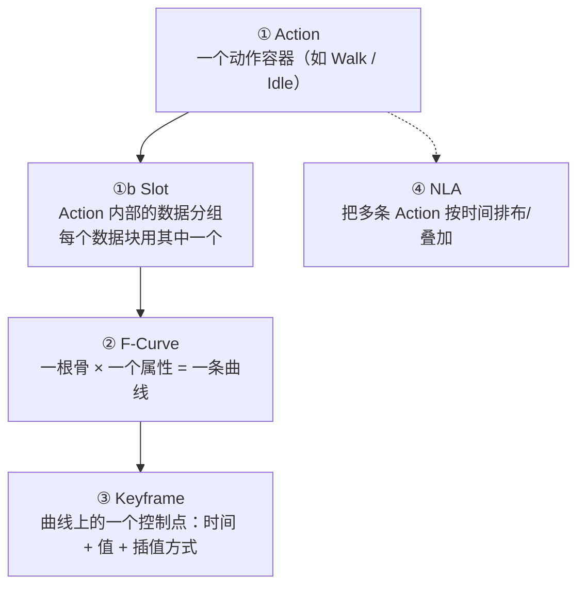
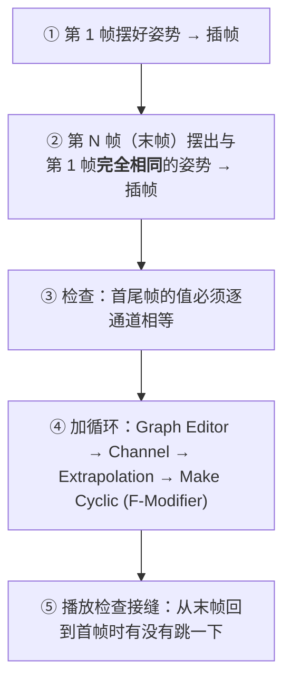
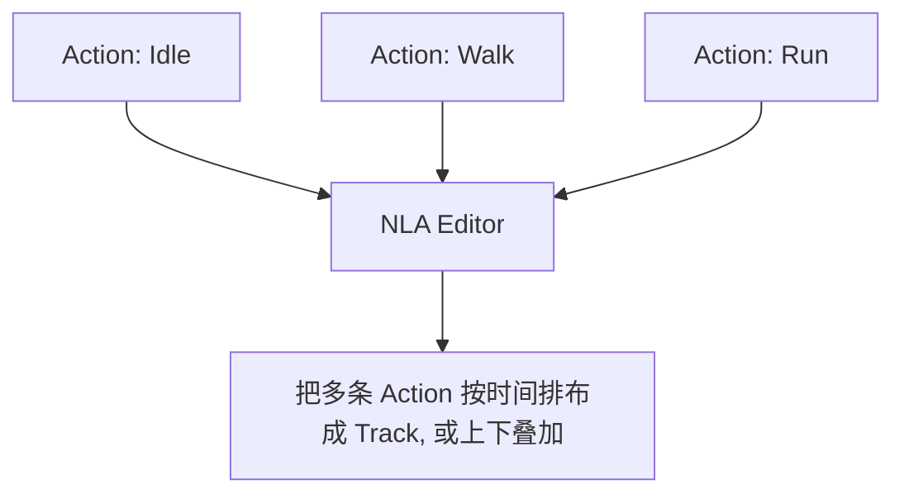

# 06 · 关键帧与动画编辑（Dope Sheet / Graph Editor / NLA）⭐

> 一句话：**关键帧只是「某个时间点上的一个值」；让它看起来像动画的是插值曲线；让它能循环、能叠动作的是 NLA。**
> 依据：Blender 5.2 LTS 官方手册 · [Animation](https://docs.blender.org/manual/en/latest/animation/index.html) / [Keyframes](https://docs.blender.org/manual/en/latest/animation/keyframes/index.html) / [Graph Editor](https://docs.blender.org/manual/en/latest/editors/graph_editor/index.html) / [Dope Sheet](https://docs.blender.org/manual/en/latest/editors/dope_sheet/index.html)；5.2 Release Notes（Animation & Rigging）。

---

## 一、动画的四层结构

搞不清这几层，就会出现「我明明插了关键帧但动画不对」：



| 层 | 看着像 | 在哪编辑 | 管什么 |
| --- | --- | --- | --- |
| **Keyframe** | 小菱形 | Timeline / Dope Sheet | 「第几帧、值是多少」 |
| **F-Curve** | 一条曲线 | Graph Editor | 关键帧之间的**怎么过渡**（插值 / 手柄） |
| **Slot** | 频道列表里带类型图标的一行 | Action Editor 频道列表 | Action 内部的**数据分组**：一个 Action 可以给多个数据块存各自的动画 |
| **Action** | 一整个动作块 | Dope Sheet（Action Editor 模式） | 一组曲线的合集，可命名、可复用 |
| **NLA** | 一层层的色块 | NLA Editor | 多条 Action 谁压谁、谁循环、谁淡入淡出 |

> 这四层是**容器关系**：Action 装 Slot，Slot 装 F-Curve，F-Curve 装 Keyframe，NLA 装 Action。混了就靠这张图对号入座。

### 关于 Slot（5.x 的 Action 组织方式）

手册原话：**「Action 里的动画数据被进一步组织成 Slots……一个被动画的数据块同时指定一个 action 和一个 slot，这决定了它由哪份动画数据驱动。」**

| 要点 | 说明 |
| --- | --- |
| **为什么有 Slot** | 让**一个 Action 存多个数据块的动画**。例：一个弹跳球的「位置动画」和它材质的「变色动画」可以放进同一个 Action，各用各的 slot；100 个弹跳球的烘焙结果也能塞进一个 Action 的 100 个 slot |
| **Slot 不「属于」任何数据块** | 任何数据块都能用任何 slot —— 两个角色可以共用同一个 Action 里的同一个 slot，得到同一份动画 |
| **名字 + 类型必须唯一** | 一个 slot 有名字和「关联的数据块类型」（object / material / …）；同名但类型不同是允许的，同名同类型则会变成 `Cube` / `Cube.001` |
| **日常要不要管它** | 单一对象 + 单一 Action 时基本无感。但你**总会至少有一个 slot** —— 没有 slot 就没法给任何东西做动画 |
| **怎么手动指定** | 属性编辑器 → Animation 面板有 action 选择器 + slot 选择器；Action Editor 头部也有（针对活动对象） |

> ⚠️ 手册还提到：Action 内部更细的 **layers / strips** 目前**不在 UI 里暴露**，只是为将来的动画特性做准备，日常可以完全忽略（但写 Python 脚本时要知道）。

### Action 的两个属性，会影响导出 ⭐

Dope Sheet / NLA Editor 里选中通道或 NLA 轨道，就能看到 **Action Properties** 面板：

| 属性 | 原文要点 | 为什么你要管它 |
| --- | --- | --- |
| **Manual Frame Range** | 手动指定这个 Action 的**预期帧范围**（不影响动画求值）；当它被设置时，**加 NLA 轨道时会用它而不是实际关键帧范围**；「**导出器也可以用它来决定导出哪些帧**」 | ⭐ 一个 Action 里混进了零散测试帧时，手动划定范围能避免导出多余帧 |
| **Cyclic Animation** | 声明这个 Action 在指定范围内是循环的；首尾帧应该表示同一姿势、相隔一个循环；**注意：这个选项只表达意图，并不会让 Action 自己循环**（配合 Cycle-Aware Keying 才会给新曲线启用循环外推） | ⭐ 它只是「声明」，**别指望它替你保证循环** —— 循环仍然靠首尾帧一致 |

> 📌 依据：5.2 手册 [Actions](https://docs.blender.org/manual/en/latest/animation/actions.html)（Action Slots / Action Properties 两节）。

---

## 二、插关键帧（`I`）与 5.2 的那个坑

```text
【最常用】
Pose Mode → 选中骨 → 摆好姿势 → I → 选要 key 的属性
   Location / Rotation / Scale / LocRotScale
   （有 LocRot 之类的组合项，视版本）

【想省事】
Timeline 头部的 ●（Auto Key）打开 → 移动骨就自动插帧
   ⚠️ 只在你「已经有一个关键帧的通道」上才会自动补
```

> ⚠️ **5.2 起 `Only Insert Available` 默认开启**（Preferences → Animation → Keyframes）：
> 它让「插入关键帧」只作用于**已经存在的通道**。于是新手最常见的困惑出现了——**按了 `I` 或者开了自动关键帧，但时间轴上什么都没有。**
> **解决**：`Preferences → Animation → Keyframes` → 关掉 `Only Insert Available`，再用 `I` 就能给任意属性插帧。
> 这条在 hub 第 0 节订正里也提过，是这条支线「软件看着坏了」的头号来源。

### 关于 Auto Key 的纪律

| 建议 | 原因 |
| --- | --- |
| 只在**确认要写动画**时打开 Auto Key | 它会默默改你的曲线，误碰一下就多出一堆帧 |
| 打开时看住 Timeline 的红色 ● 提示 | 它亮着代表正在记录 |
| 写完后**关掉**再回去调模型 / 权重 | 否则调骨骼会污染动画 |

---

## 三、Dope Sheet：看时间

Dope Sheet 是**时间线上的表格视图**，每行一根骨，横轴是帧。

| 用法 | 操作 |
| --- | --- |
| 切换模式 | 编辑器头部下拉：Dope Sheet / **Action Editor** / Shape Key Editor / Grease Pencil |
| 摘要视图 | 打开 `View → Show Summary`，把所有骨的关键帧汇总到最上行，方便整体拖动 |
| 选/移帧 | 框选菱形 → `G` 前后挪，`G X` 沿时间轴挪 |
| 缩放时间 | 对应区域滚轮，或 `View → Frame Selected`（`Numpad .`） |
| 复制整段 | 选帧 `Shift+D`，再 `G` 挪到目标位置 |

> 💡 **做循环动画时，Dope Sheet 是检查「首尾帧是否一致」的地方**——直接看首帧和末帧的关键帧是否落在同一组骨、同一数值上。这件事在 3D 视图里看不出来，在 Dope Sheet 里一目了然。

---

## 四、Graph Editor：看形状 ⭐

Dope Sheet 告诉你「第几帧有什么」，Graph Editor 才告诉你「这两帧之间是快是慢、是直是弯」。**动画的「手感」几乎全在这一层。**


### 关键帧的两种插值

| 类型 | 快捷键（`T` 菜单） | 效果 | 什么时候用 |
| --- | --- | --- | --- |
| **Bezier**（默认） | `T → Bezier` | 平滑的缓入缓出 | 大多数自然动作（抬手、转头） |
| **Linear** | `T → Linear` | 匀速直线 | 机械运动、需要绝对线性时 |
| **Constant** | `T → Constant` | 保持上一帧的值到下一帧才跳 | 「啪」一下的开关（灯亮灭、道具突然出现） |
| **Ease In / Out** | `T → Ease In/Out` 系 | 预设的缓动 | 快速做出缓动感 |

### 手柄类型（`V` 菜单）

每根关键帧左右各有一个手柄，手柄决定曲线怎么弯：

| 手柄类型 | 快捷键 | 特点 |
| --- | --- | --- |
| **Auto Clamped**（默认） | `V → Auto Clamped` | 自动，且在极值处不会过冲（**最安全**） |
| **Auto** | `V → Auto` | 自动，但允许过冲（可能甩出去） |
| **Vector** | `V → Vector` | 手柄指向相邻帧 → 该段变直线 |
| **Aligned** | `V → Aligned` | 两侧手柄共线（平滑但你可控方向） |
| **Free** | `V → Free` | 两侧完全独立，想怎么拖怎么拖 |
| **Aligned / Free 的差别** | — | Aligned 保持连续；Free 可以做出「折角」 |

> 💡 **实战顺序**：先在 Graph Editor 里全选关键帧 → `T → Bezier` 保证是平滑的 → 再单独调需要「急停 / 回弹」的点改 `Vector` 或拖手柄。

### 曲线操作速查

```text
F 框选时会缩放视图；选中曲线点后：
G     移动（G X 沿时间，G Y 沿值）
S     缩放（S Y 压扁 = 幅度变小）
T     插值类型菜单
V     手柄类型菜单
Shift+E  Ease 系（缓动预设）
Alt+A  取消选择全部
```

---

## 五、做循环动画（游戏资产的关键）

循环断不断，全部取决于**首尾帧**。



| 要点 | 说明 |
| --- | --- |
| **首尾一致 ≠ 复制末帧** | 要做的是「末帧 = 首帧」；如果做 24 帧循环，通常第 1 帧和第 25 帧相同，导出时按 1–24 或 1–25 截取（取决于引擎是否算末帧） |
| **循环 F-Modifier** | Graph Editor → `Channel → Extrapolation → Make Cyclic`，让曲线在时间上无限重复（**但导出时引擎不认这个 modifier**，它只是 Blender 里的预览辅助） |
| **导出前的自查** | 引擎里循环靠的是「末帧 = 首帧」这一事实，不是 Blender 的 modifier |

> ⚠️ **常见坑**：加了 Cyclic F-Modifier 以为导出后引擎会自己循环 —— 不会。**导出的是关键帧值**，你得保证首尾帧本身一致；modifier 只是帮你在 Blender 里预览。

### 循环动画的自检口诀

```text
① 首帧与末帧的每一个通道值都相等？
② 播放时循环接缝处没有「跳一下 / 卡一下」？
③ 在 Graph Editor 里，首尾关键帧的斜率是否也接近？（斜率差太多会看出「顿一下」）
```

---

## 六、NLA：多个动作怎么共存

一个角色通常有多个动作：`Idle` / `Walk` / `Run` / `Attack`。它们的关系由 NLA 管理。



| 概念 | 含义 |
| --- | --- |
| **NLA Track** | 一条轨道，可以放多个 Action 片段（strip） |
| **Strip** | 轨道上的一段 Action，可设 start / end / repeat / blend |
| **Blending** | 上下轨道的合成方式（Replace / Combine / Add…） |
| **Solo / Mute** | 单独播放某轨 / 静音某轨（调试用） |
| **Push Down** | 把当前 Action「压」到一条 NLA 轨道（`Action Editor → Push Down`） |

### NLA 对导出的意义（重要）

这是「一个角色多个动画」导不出去的根因：

| 情况 | Blender 里 | 导出时 |
| --- | --- | --- |
| 只有一个 Action 挂在对象上 | 正常播放 | 通常能导出这**一个** |
| 多个 Action 存在但没排进 NLA | 你手动切换着看 | **常常只导出最后一个 / 当前激活的那个** |
| 多个 Action 已 Push Down 进 NLA 轨道 | 可以按轨道播放 | glTF 勾 `Export all Armature Actions` 才能都带出去 |

> ✅ **推荐做法**：每个动作做完就 `Push Down` 到独立的 NLA 轨道并命名（`Idle` / `Walk`…），导出时 glTF 开 `Export all Armature Actions` + `Reset pose bones between actions`。这样引擎里就有一组动作可选。
> 详见 [08](08-骨骼动画导出-GLB与FBX.md)。

---

## 七、一个动作从零到能用的完整流程

```text
【准备】
0. Save Incremental（动画阶段特别容易改乱）

【写】
1. 第 1 帧摆起始姿势 → 全选骨 → I → LocRotScale（或需要的属性）
2. 拖到第 N 帧 → 摆好 → I
3. Dope Sheet 里检查关键帧落点对不对

【修手感】
4. Graph Editor → 全选 → T → Bezier
5. 需要急停/回弹的点：V → Vector 或手动拖手柄
6. 曲线太乱就 S Y 压幅度、G Y 调数值

【做循环（如果是循环动作）】
7. 末帧 = 首帧的姿势，逐通道核对
8. 播放检查接缝

【收纳】
9. Action 改名（Walk / Idle…）→ Push Down 到 NLA 轨道
10. 回到第 1 帧（导出起点对齐）

【导出】
11. 见 08：烘焙（如有约束）→ glTF 勾 Export all Armature Actions
```

---

## 八、坑

- ❌ **5.2 按了 `I` / 开着自动关键帧却什么都没发生** → `Only Insert Available` 默认开了，去 `Preferences → Animation → Keyframes` 关掉
- ❌ **只在 Dope Sheet 里看，从不进 Graph Editor** → 动画永远「机械 / 生涩」，因为手感全在曲线里
- ❌ **所有关键帧都用默认 Bezier 却希望有「啪」的开关感** → 该用 `Constant` 插值的地方要显式改
- ❌ **Auto Key 一直开着** → 回去调模型时顺手污染了动画曲线
- ❌ **循环动画靠 Cyclic F-Modifier 而不改首尾帧** → Blender 里看着循环，导出后引擎里跳一下
- ❌ **多个 Action 堆在文件里但没进 NLA** → 导出只有一条，其他全丢
- ❌ **改了骨骼名 / 删了骨之后动画曲线变成孤儿** → 曲线还在但找不到目标；改骨名前先规划好命名
- ❌ **导出前忘了把时间轴拨回第 1 帧** → 某些导出器从当前帧开始取样，动画起始点偏了
- ❌ **一个 Action 里混了多个动作**（走完接着跳） → 引擎里没法单独调；每个逻辑动作一个 Action

---

## 九、自检

| # | 自检点 | 通过标准 |
| - | ------ | -------- |
| ① | 层次结构 | 说清 Keyframe / F-Curve / Slot / Action / NLA 的包含关系，并说出 Slot 用来解决什么 |
| ② | 插帧 | 会 `I` 插帧，并说出 5.2 `Only Insert Available` 坑的表现与解法 |
| ③ | 曲线 | 会在 Graph Editor 里改插值（Bezier / Linear / Constant）与手柄（`V`） |
| ④ | 循环 | 能做一段 24 帧循环，首尾逐通道一致，且知道 Cyclic modifier 不参与导出 |
| ⑤ | NLA | 会 `Push Down` 多条 Action 到 NLA 轨道并命名 |
| ⑥ | **实操** | 做一个 2 秒的箱盖开合（缓入缓出），再做一个 24 帧走路循环，两条都排进 NLA |

---

## 十、速查

```text
【三层结构 → 四层】
Action（动作容器） > Slot（Action 内的数据分组） > F-Curve（一根骨×一个属性） > Keyframe（时间+值）
NLA（多条 Action 的排布层）
Slot 要点：一个 Action 可存多个数据块的动画（object + material 各用一个 slot）
         任何数据块都能用任何 slot；至少需要一个 slot 才能动画
         属性编辑器 Animation 面板 / Action Editor 头部可手动指定 action + slot

【Action 属性（会影响导出）⭐】
Manual Frame Range  手动划定该 Action 的帧范围；设了之后加 NLA 轨用它、导出器也用它决定导哪些帧
Cyclic Animation    只声明「意图」，不会让 Action 自己循环（仍需首尾帧一致）

【插帧】
I                        选中骨后插帧
Timeline ● Auto Key       移动即自动插（有通道才补）
⚠️ 5.2 起 Only Insert Available 默认开 → 按 I 没反应
   → Preferences → Animation → Keyframes 关掉它

【Dope Sheet】
View → Show Summary      所有骨的关键帧汇总
G / Shift+D / G X        挪帧 / 复制 / 沿时间挪

【Graph Editor ⭐ 手感在这】
T   插值：Bezier（缓入缓出）/ Linear（匀速）/ Constant（保持跳变）
V   手柄：Auto Clamped（默认安全）/ Auto / Vector（直）/ Aligned / Free
S Y  压幅度 · G Y 调值 · Alt+A 取消选择

【循环】
首帧 = 末帧（逐通道一致）才是循环的本质
Graph Editor → Channel → Extrapolation → Make Cyclic
⚠️ Cyclic 是预览辅助，导出不认 → 必须自己保证首尾帧相同
自检：接缝不跳 · 首尾斜率接近

【NLA】
Action Editor → Push Down   把当前 Action 压进 NLA 轨道
每条轨道改名（Idle / Walk / Run）
导出 glTF 勾 Export all Armature Actions 才能都带出去

【完整流程】
起始帧插帧 → 末帧插帧 → Graph Editor 调曲线 → 做循环 → Action 改名
→ Push Down → 回到第 1 帧 → 导出（有约束先烘焙）
```

---

> **下一步**：[`07-形状键ShapeKeys与驱动器Drivers.md`](07-形状键ShapeKeys与驱动器Drivers.md) —— 有些形变用骨骼做很难（换脸、挤压），那就用形状键。
