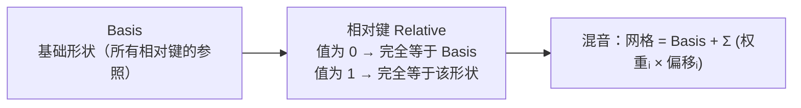
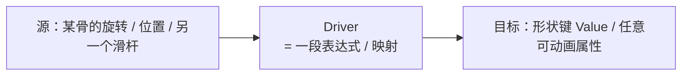

# 07 · 形状键 Shape Keys 与驱动器 Drivers

> 一句话：**形状键是「同一套网格的多个版本」，用 0–1 的滑杆在它们之间做插值；驱动器则是让别的数据（旋转、位置、另一个滑杆）自动去拨这根滑杆。**
> 依据：Blender 5.2 LTS 官方手册 · [Shape Keys](https://docs.blender.org/manual/en/latest/animation/shape_keys/index.html) [包括 Workflows](https://docs.blender.org/manual/en/latest/animation/shape_keys/workflows.html) / [Drivers](https://docs.blender.org/manual/en/latest/animation/drivers/index.html)；5.0 Release Notes（Shape Keys 段）。

---

## 一、形状键是什么，和骨骼有什么区别

| | 骨骼（Armature） | 形状键（Shape Key / morph target） |
| --- | --- | --- |
| 数据在哪 | 骨骼（独立对象） | **网格自己的一份顶点位置副本** |
| 怎么驱动 | 关键帧 / 约束 | 0–1 的滑杆（可被 driver 拨） |
| 擅长的形变 | 旋转、位移（四肢摆动） | **局部形状变化**：表情、挤压、鼓胀、开合 |
| 典型用途 | 走路、挥手 | 眨眼、微笑、肌肉鼓起、布料鼓起 |
| 导出支持 | 骨骼动画（GLB/FBX 都行） | glTF ✅ morph target / **FBX 导出器 ❌ 不支持** |

> 💡 **判断标准**：如果这个形变是「绕某个关节转」，用骨骼；如果是「这块面整体鼓起来 / 塌下去 / 换一种形状」，用形状键。两者经常共存于同一个角色。

---

## 二、三种 Key 的关系（最重要的概念）

形状键有一个 **Basis**（基），其余都是「相对 Basis 的偏移」：



| 概念 | 含义 |
| --- | --- |
| **Basis** | 栈里的第一个键。代表顶点的原始位置；**没有权值、不能打关键帧**，是新键的默认参照 |
| **Relative（相对）** | 值 0.0 = 完全等于参照键、1.0 = 完全等于本键；可多个同时生效并插值混合，**还能外推（>1 或 <0 放大 / 反转）** —— 游戏里用的就是这种 |
| **Absolute（绝对）** | 每个键对应一个 **Evaluation Time（求值时间，单位＝帧）**，按当前时间在前后两键之间插值；**不互相混合**，适合「随时间顺序演变」的形变 |
| **Value** | 相对键 = 与参照键的混合比例；绝对键 = 该键生效的时间（帧） |
| **Mute** | 临时关掉某个键（排查时有用） |

> ⚠️ **Basis 千万不要乱动**。它是所有相对键的坐标系原点。改了 Basis，所有表情 / 形变都会整体偏掉。要修基础形状，正确做法是回到建模阶段改，或者新建一个键来做修正。

### 5.0 的 UI 大修与新增算子

5.0 给 Shape Keys 面板做了一次清理，并新增了几个算子（这一条是 hub 里提醒过要补的）：

| 算子 | 干什么 |
| --- | --- |
| **Make Basis** | 把某个形状键设为新的 Basis |
| **Copy to Selected** | 把一个键的值复制到所有选中对象的同一个键（多对象同步表情） |
| **Join as Shapes** | 把选中的**其他网格对象**作为形状键合并进来（配合 Flipped 版本做左右镜像） |
| **New Shape From Mix** | 把当前所有键的混合结果固化成一个新的形状键 |

> 📌 依据：5.0 Release Notes 的 Shape Keys 段。这些算子的实际价值是：**以前要写脚本 / 手工对齐的同名顶点才能做的「多对象同步表情」「从外部网格导入形变」，现在是一键。**

---

## 三、建一个形状键（标准流程）

```text
【前提】
选中的是 Mesh（不是骨架）→ Object Data Properties → Shape Keys 面板

【步骤】
1. 面板里点 + / "New Shape Key" 一下：先建出 Basis
   ⚠️ 第一次点会自动建 Basis（此时列表里只有它，值为 0，不可改）
2. 再点 + 建第二个键 → 改名（如 smile）
3. 选中该键 → 进入 Edit Mode → 移动顶点做出形变
   ⚠️ 只能在 Edit Mode 里改顶点，Object Mode 下改不了形状键的顶点
4. 回到 Object Mode → 拖动该键的 Value 滑杆 0↔1 检查形变
5. 需要多个形变就重复 2–4
```

| 步骤 | 关键点 | 常见失误 |
| --- | --- | --- |
| 建 Basis | 第一次会自动建 | 以为要先手动建 Basis |
| 编辑键 | **必须在 Edit Mode 下改顶点** | 在 Object Mode 里拖滑杆以为在编辑形状 |
| 验证 | 拖 Value 0↔1 | 拖了没反应 → 拖错键 / 该键被 Mute |

### 编辑形状键时的几条纪律

- ✅ **只改要动的那些顶点**，其他顶点保持不动（否则会牵连整体）
- ✅ **移动量小一点**，滑杆本身就是用来做插值的
- ❌ 不要改变顶点**数量 / 顺序 / 拓扑**（形状键靠顶点索引对应，删点加点会让所有键错位）
- ❌ 不要在已经有形状键的网格上做「会导致顶点数变化」的操作（如 Boolean、Subdivide、Merge），**除非先意识到所有键都会失效**

> ⚠️ **形状键与拓扑是一对死死绑定的东西**。这就是为什么「先建模定稿，再做表情」是标准顺序。中途改拓扑 = 所有形状键白做。

---

## 四、Shape Key Lock（少见但很有用）

面板里每个键有一个 **锁形图标**（Shape Key Lock）：

- 锁定后，切到 **Edit Mode 时默认编辑的是 Basis**，而不是当前选中的键
- 用途：你想「看着某个表情的同时调整基础形状」，不用来回切键

> 详情见手册 [Shape Keys → Workflows](https://docs.blender.org/manual/en/latest/animation/shape_keys/workflows.html)。日常用得不多，但排查「为什么我在 Edit Mode 里改的是 Basis 不是表情」时，先看这个锁。

---

## 五、驱动器 Drivers：让别的数据自动拨滑杆

一个形状键的 Value 可以被**关键帧**驱动，也可以被**驱动器**驱动。驱动器的意义是：**不需要你手动插帧，它跟着别的数据自动变。**



### 加一个 Driver 的方式

```text
① 找到目标属性（如形状键 smile 的 Value）
② 右键该数值框 → "Add Driver"
③ 切到 Graph Editor → 头部下拉切到 "Drivers" 模式
④ 设：
   - Type: Scripted Expression（最常用）
   - Variable: 加一个变量，指向源（如 Pose Bone 的 rotation）
   - Expression: 用变量拼表达式（如 var > 0.5 ? (var-0.5)*2 : 0）
```

| 部件 | 含义 |
| --- | --- |
| **Variable（变量）** | 从别处取值。类型有 Transform Channel（骨的变换）/ Single Property（任意属性）/ Distance 等 |
| **Transform Channel** | 最常用：读某根骨的 X/Y/Z Rotation / Location / Scale |
| **Expression** | 用变量写公式。支持简单条件、数学函数（sin/cos/radians 等） |
| **Driver Type** | Scripted（表达式）/ Average Value / Sum Values / Minimum / Maximum |
| **Influence / Mute** | 调试时临时关掉 |

### 一个实战例子：下巴张开 → 嘴形变

```text
目标：jaw.Open 骨向下旋转时，嘴部形状键（jaw_open）自动从 0 变到 1

① 选中形状键 jaw_open 的 Value → Add Driver
② Graph Editor → Drivers → 加变量 var
   Type = Transform Channel
   Object = 角色 Armature
   Bone   = jaw.Open
   Type   = Y Rotation（或实际张嘴的那个轴）
   Space  = Local Space（一般用 Local）
③ Expression = radians(...) 之类做角度归一化，或 clamp：
   clamp(-var / 0.4, 0, 1)     ← 转 0.4 弧度内线性映射到 0–1
④ 拖动下巴骨验证：滑杆跟着动
```

> 💡 用 driver 而不是关键帧的好处：**张嘴的角度和嘴形的程度永远同步**，不会出现「角度对但嘴形忘了 key」的错位。

---

## 六、Shape Key 与修改器栈的顺序（进阶但会咬人）

**形状键属于网格数据层，它在修改器（Modifier）栈之前就被求值。**所以：

```text
网格数据 = Basis + Σ(键值 × 偏移)     ← 先算这个
        ↓
修改器栈：Armature → 其他修改器        ← 再算这些
        ↓
最终形变后的网格
```

| 推论 | 说明 |
| --- | --- |
| **Armature 修改器会形变「形状键的结果」** | 所以表情（形状键）能跟着身体的骨骼动，两者不冲突 |
| **形状键看不到修改器的结果** | 你在 Edit Mode 改形状键时看到的是**原始网格**，不是被 Armature 变形后的样子 —— 这就是「脱离姿势做表情」的原理 |
| **修改器顺序错乱会出怪事** | 例如 Subdivision 在 Armature 前后，形变表现不同；但 Shape Key 永远在最前面 |

> ⚠️ 手册里有一节专门讲 Shape Keys 与修改器 / 与骨架的先后（[Workflows](https://docs.blender.org/manual/en/latest/animation/shape_keys/workflows.html)）。记住一句就够：**形状键是最里层，任何修改器都在它外面。**

---

## 七、导出：glTF 支持，FBX 别想

这是**格式选型**的一个硬约束：

| 格式 | 形状键（morph target） | 说明 |
| --- | --- | --- |
| **glTF (.glb)** ✅ | 支持，并且支持**形状键动画**（morph target weights 的关键帧） | 手册里有 Data - Shape Keys 相关选项；引擎（Godot/Unity/Unreal/three.js）普遍支持 morph target |
| **FBX** ❌ | **5.2 的 FBX 导出器不写 shape keys** | 手册 Missing 列表里明确写着 Vertex shape keys 不被导出 |

> ⚠️ **这条直接决定格式**：如果你的资产依赖表情 / 形状键，**必须走 glTF**。走 FBX 时形状键会消失，而且**不会报错**——它只是静默丢掉。参见 [08](08-骨骼动画导出-GLB与FBX.md) 的格式选型表。

### 导出前的形状键检查

```text
[ ] 形状键的 Value 导出前要归零（除了作为「基准形变」的——但要小心）
    → glTF 导出的 morph target 是「形状偏移」，Value 会作为初始权重导出
    → 不想让某个键默认生效就把它设回 0
[ ] 会动的形状键，其动画也要在时间轴上有关键帧（否则只导出静态偏移）
[ ] 检查有没有 Mute 掉的键 —— 确认是有意为之
[ ] 拓扑定稿后再做（中途改过拓扑的话，键可能已经失效）
```

---

## 八、坑

- ❌ **在 Object Mode 里拖滑杆以为在编辑形状** → 只在 Edit Mode 里改顶点，滑杆只是调插值
- ❌ **乱动 Basis** → 所有相对键整体偏掉；要修基础形状回建模阶段改
- ❌ **做表情后又去改拓扑（加点 / 删点 / Boolean）** → 形状键全部错位失效，且常常不立刻报错
- ❌ **以为 FBX 能带形状键** → 5.2 的 FBX 导出器**静默丢弃** shape keys；要用 morph target 就走 glTF
- ❌ **形状键做太多太细** → 每个键都是一份顶点数据，导出后文件体积和显存开销线性增长；游戏里 20–60 个表情键是常见上限
- ❌ **driver 写得太复杂 / 循环引用**（A 驱动 B，B 又驱动 A）→ 解算不出来或抖动；保持驱动方向单一
- ❌ **driver 依赖的骨被改名 / 删除** → 表达式里的变量失效，形变卡住不动
- ❌ **忘了给「会动的形状键」插关键帧** → 导出后只有一个静态偏移，动画没了
- ❌ **导出前没把测试用的键值归零** → 模型在引擎里一出生就带着某个表情

---

## 九、自检

| # | 自检点 | 通过标准 |
| - | ------ | -------- |
| ① | 概念 | 说清 Basis / 相对键 / 绝对键的差别，以及为什么相对键能混合 |
| ② | 建模 | 能在 5 分钟内给一个方块做一个「鼓起来」的形状键并拖滑杆验证 |
| ③ | 纪律 | 说出「为什么做完形状键后不能再改拓扑」 |
| ④ | Driver | 能给一个形状键加 driver，让它跟随某根骨的旋转自动变化 |
| ⑤ | 顺序 | 说出形状键与修改器栈的先后关系，并解释「为什么表情能跟身体一起动」 |
| ⑥ | **实操** | 给一个模型做 2 个形状键（如张开 / 鼓起）+ 1 个 driver，导出 GLB 并在引擎里验证 morph target 可用 |

---

## 十、速查

```text
【是什么】
形状键 = 网格的多个「形状版本」，用 0–1 滑杆插值
擅长：局部形变 / 表情 / 鼓胀        骨骼擅长：旋转位移
判断：绕关节转 → 骨骼；整块变形 → 形状键

【三种 Key】
Basis          基准（栈里第一个，无权值/不能打帧，别乱动）
Relative       0=参照·1=本键，可混合、可外推（游戏里用的）
Absolute       每个键对应一个求值时间（帧），按时间插值、不混合

【建键步骤】
Object Data Properties → Shape Keys
+ 第一次 → 自动建 Basis
+ 再点 → 新键，改名
选中键 → 【Edit Mode】移动顶点（只能在 Edit Mode 改）
Object Mode → 拖 Value 0↔1 验证

【5.0 新增算子】
Make Basis · Copy to Selected · Join as Shapes（+ Flipped）· New Shape From Mix

【拓扑警告 ⚠️】
形状键靠顶点索引对应 → 改拓扑（加点/删点/Boolean）会让所有键失效

【Driver】
右键 Value → Add Driver
Graph Editor → Drivers 模式
Variable: Transform Channel（读骨的变换）
Expression: clamp(var, 0, 1) 之类
用途：下巴角度 → 嘴形自动同步

【修改器顺序】
形状键在最里层（先算），所有修改器（含 Armature）在它外面
→ 表情能跟身体一起动；编辑键时看到的是未变形的原始网格

【导出】
glTF ✅ morph target（含形状键动画）
FBX  ❌ 5.2 导出器不写 shape keys（静默丢弃）
→ 依赖表情/形状键的资产必须走 GLB
导出前：测试键值归零 · 会动的键要有关键帧
```

---

> **下一步**：[`08-骨骼动画导出-GLB与FBX.md`](08-骨骼动画导出-GLB与FBX.md) —— 骨骼会动、表情会变了，最后一关是让它们原样进引擎。
