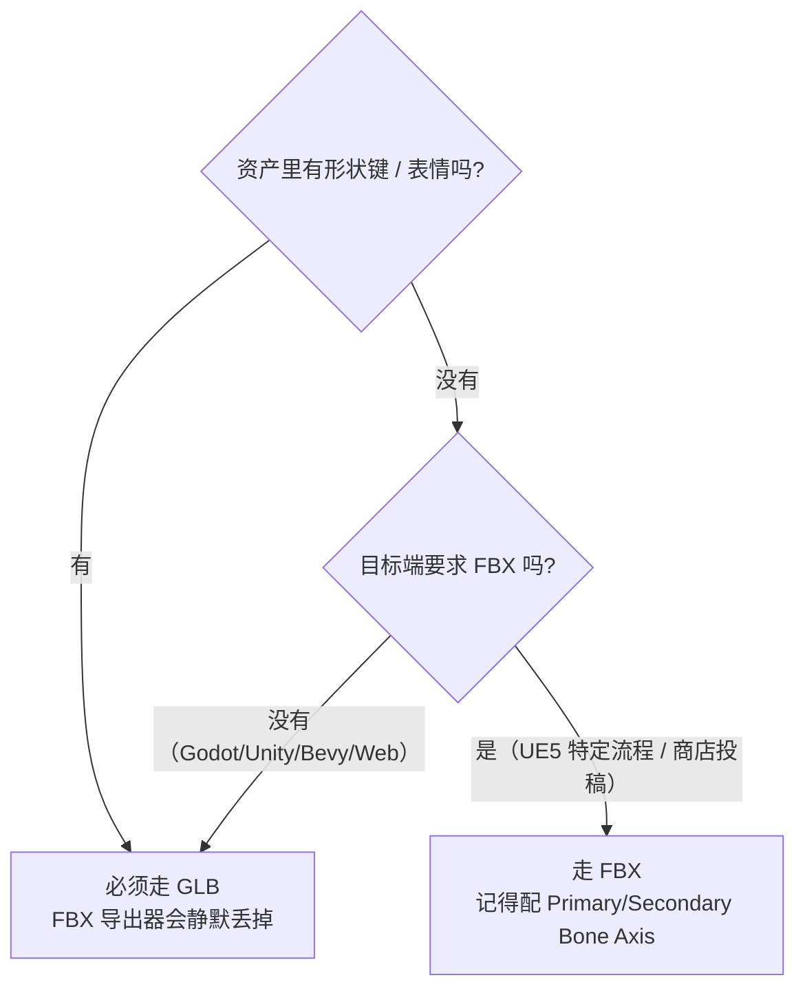

# 08 · 骨骼动画导出：GLB 与 FBX ⭐

> 一句话：**带骨骼的资产导出，本质是回答三个问题——骨骼留几根（Deform 裁剪）？rest pose 用哪个？动画怎么装（bake / 多动作 / 采样）？**
> 依据：Blender 5.2 LTS 官方手册 · [glTF 2.0](https://docs.blender.org/manual/en/latest/addons/scene_gltf2.html) / [FBX (Legacy)](https://docs.blender.org/manual/en/latest/files/import_export/fbx_legacy.html)；5.0 / 5.2 Release Notes（Pipeline & I/O）。

---

## 一、先选格式（这一步错了，后面全白干）

| 维度 | **glTF 2.0 (.glb)** | **FBX** |
| --- | --- | --- |
| 骨骼动画 | ✅ 完整 | ✅ 完整 |
| **形状键 / morph target** | ✅ **支持**（含动画） | ❌ **5.2 导出器不写 shape keys**（FBX 格式本身支持，是这个导出器没做） |
| 约束 | 导出前需烘焙 | 导出的只是烘焙结果，约束本身不写入 |
| Armature 实例 | — | ❌ 不支持 |
| 单位 | 米（1 unit = 1 m） | 导出面板 `Scale` 默认 **10**（为迎合多数软件的导入习惯） |
| 骨骼轴向 | 走 glTF 节点变换，不需要你配 | ⚠️ 手册原话：「FBX bones seem to be **-X** aligned, Blender's are **Y** aligned … imported bones in other applications will look wrong」→ 要在 `Primary / Secondary Bone Axis` 手动配 |
| 目标端 | Godot / Unity / Bevy / three.js — **首选** | UE5 部分流程、资产商店要求、需要给 3ds Max / Maya 的场合 |



> ✅ **默认结论：优先 GLB。** 除非目标端明确要 FBX。这条也是 hub 第 0 节订正的第 2 条 —— 路线图原来那句「骨骼动画资产用 FBX 更稳」在 5.2 已经站不住了。

---

## 二、导出前 checklist（骨架动画版）

顺序很重要：**先收口，再烘焙，最后导出。** 顺序错了要重来。

```text
【① 几何与变换】
[ ] 网格 + 骨架两边都 Ctrl+A → Rotation & Scale（Scale = 1,1,1）
[ ] 骨架是网格的父级（或网格带 Armature 修改器指向它）
[ ] 场景里没有多余的辅助物（或导出时勾 Selected Objects 排除）

【② 权重收口】（详见 02 第八节）
[ ] Weights → Clean
[ ] Weights → Normalize All
[ ] Weights → Limit Total = 4
[ ] Mute 掉测试用的形状键、形状键 Value 归零

【③ 骨骼裁剪】
[ ] 所有要参与的骨勾了 Deform；控制骨 / IK target 没勾
[ ] 有且只有一个 root 骨（否则 glTF 的 Remove Armature Object 会失效）

【④ 烘焙（有约束就必做）】
[ ] Pose → Animation → Bake Action
      Visual Keying ON · Clear Constraints ON · Frame Step 1
[ ] 多动作已 Push Down 到 NLA 轨道并命名

【⑤ 时间轴】
[ ] 拨回动画起始帧
[ ] 活动 Action 就是你要导的那条

【⑥ 导出】
[ ] GLB 或 FBX 的选项按下面第三节 / 第四节设好
```

---

## 三、GLB 导出清单（带骨骼 + 动画）

### 关键选项原文对照

**Data - Armature**

| 选项 | 原文 | 怎么设 |
| --- | --- | --- |
| **Export Deformation Bones only** | Export Deformation bones only, not other bones. Animation for deformation bones are baked. | ✅ **开**。Rigify rig 只导出 `DEF-`，去掉几百根辅助骨 |
| **Use Rest Position Armature** | Export Armatures using rest position as joint rest pose. When Off, the current frame pose is used as rest pose. | ✅ **开**（常规）。关掉会用当前帧姿态当 rest，容易出意外 |
| **Remove Armature Object** | Remove Armature Objects if possible. If some armature(s) have multiple root bones, we can't remove them. | 按需。只有单个 root 骨时才能移除 |
| **Flatten Bone Hierarchy** | Useful in case of non-decomposable TRS matrix. | 一般关。遇到矩阵分解报错才开 |

**Data - Skinning**

| 选项 | 原文 | 怎么设 |
| --- | --- | --- |
| **Bone influences** | How many joint vertex influences will be exported. Models may appear incorrectly in many viewers with value different to **4 or 8**. | **填 4**（安全值） |
| **Include All Bone Influences** | Export all joint vertex influences. Models may appear incorrectly in many viewers. | ❌ 关。开了等于放弃收口 |

**Data - Shape Keys**

| 选项 | 说明 |
| --- | --- |
| 分区主体 | Export shape keys (morph targets). |
| Shape Key Normals / Tangents | 随形态键一起导出法线 / 切线 |

**Animation - Armature**

| 选项 | 原文 | 怎么设 |
| --- | --- | --- |
| **Export all Armature Actions** | Export all actions, bound to a single armature. Warning: Option does not support exports including multiple armatures. | 多动作资产 ✅ 开（**只能有单个骨架**） |
| **Reset pose bones between actions** | Reset pose bones between each action exported. This is needed when some bones are not keyed on some animations. | ✅ 开。否则动作之间会互相污染 |

**Animation - Bake & Merge**

| 选项 | 说明 |
| --- | --- |
| **Bake All Objects Animations** | 适用于「物体被约束但自身没被打关键帧」的情况 |
| **Merge Animation** | 按 Action / 按 NLA Track Name / 不合并 |

**Animation - Sampling**

| 选项 | 说明 |
| --- | --- |
| 采样默认开启 | 原文：Do not sample animation can lead to wrong animation export |
| **Sampling Rate** | 每隔几帧求值一次 |

**Animation - Rest & Ranges**

| 选项 | 说明 |
| --- | --- |
| **Use Current Frame as Object Rest Transformations** | 用当前帧作为物体的 rest 变换；关掉则用第 0 帧 |
| **Limit to Playback Range** | 把动画裁到播放范围内 |
| **Set all glTF Animation starting at 0** | 让所有动画从 0 开始（做循环有用） |

> 💡 **导出范围还可以在 Action 侧先划好**：Dope Sheet / NLA 选中通道或轨道 → **Action Properties → Manual Frame Range**。手册明确说这个范围会被**导出器用来决定导出哪些帧**。当一个 Action 里混了零散的测试帧时，先划范围比在导出面板里凑 `Limit to Playback Range` 更干净（详见 [06](06-关键帧与动画编辑-DopeSheet-GraphEditor-NLA.md)）。

### 懒人清单

```text
【GLB 导出 · 带骨骼动画】
Data - Armature
  Export Deformation Bones only      ✅ ON   ⭐
  Use Rest Position Armature         ✅ ON
  Remove Armature Object             （单 root 时可开）
  Flatten Bone Hierarchy             ❌ OFF
Data - Skinning
  Bone influences                    = 4      ⭐
  Include All Bone Influences        ❌ OFF
Animation - Armature
  Export all Armature Actions        ✅ ON（多动作时）
  Reset pose bones between actions   ✅ ON（多动作时） ⭐
Animation - Bake & Merge
  Bake All Objects Animations        ✅ ON（有约束时）
Animation
  Sampling                           保持开启
```

---

## 四、FBX 导出清单（只有目标端要 FBX 时才走）

### 关键选项原文对照

**Include**

| 选项 | 说明 |
| --- | --- |
| Selected Objects | 只导出选中物体 |
| Active Collection | 只导出活动集合 |
| Object Types | 按类型开关 |
| Custom Properties | 自定义属性 |

**Transform**

| 选项 | 原文 | 怎么设 |
| --- | --- | --- |
| **Scale** | Scale the exported data by this value. **10 is the default** because this fits best with the scale most applications import FBX to. | 默认 10，一般不动 |
| **Forward / Up** | 轴向转换。Blender 用 Y Forward、Z Up | 按目标端设（UE5 常用 -Z Forward / Y Up） |
| **Apply Unit** | 应用单位 | 按需 |
| Apply Transform | Applies object Location/Rotation/Scale to the mesh before export, writing vertices in world space. | ⚠️ 开关前先备份，官方把相关行为标为实验性 |

**Geometry**

| 选项 | 说明 |
| --- | --- |
| Smoothing | Normals Only / Face / Edge / Smoothing Groups |
| Apply Modifiers | 用求值后的网格导出（所有修改器已计算） |
| Loose Edges / Triangulate Faces | 松散边 / 三角化（共享网格会变独立副本） |

**Armatures** ⭐ 这几项是 FBX 骨骼的关键

| 选项 | 怎么设 |
| --- | --- |
| **Primary / Secondary Bone Axis** | ⚠️ **必配**。决定导出后骨骼朝向，配错在 Maya / UE 里骨骼全歪 |
| Armature FBXNode Type | Null / LimbNode 等，按目标端 |
| **Only Deform Bones** | ✅ **开**（等价于 glTF 的 Export Deformation Bones only） |
| **Add Leaf Bones** | ✅ **关**。手册里它用于「标记骨长」，开了引擎里会多出一堆末端小骨 |

**Bake Animation**

| 选项 | 说明 |
| --- | --- |
| Key All Bones | 给所有骨打帧 |
| NLA Strips | 导出 NLA 条 |
| **All Actions** | 原文：Export all actions compatible with the selected armatures… When disabled only the currently assigned action is exported. → 多动作要开 |
| Force Start/End Keying | 强制首尾打帧 |
| Sampling Rate | 采样率 |
| Simplify | 简化曲线 |

> ⚠️ FBX 导出会用的仍是**旧 Python 导出器**（手册里叫 `FBX (Legacy)`；新的 C++ 实现目前只在**导入**侧成为默认）。所以「FBX 导出不支持 shape keys」这条短期内不会变。

### FBX 的 Missing 列表（手册原文，必须知道）

```text
FBX 导出不支持 / 不写出的东西：
- Object instancing（实例对象会被各自写成独立数据）
- Material textures
- Vertex shape keys   ← FBX 格式支持，但这个导出器还没写 ⭐
- Animated fluid simulation
- Constraints         ← 只导出「用约束得到的烘焙结果」，约束本身不写 ⭐
- Instanced objects（动画场景下）
```

---

## 五、导入引擎后的验证（导出只算做了一半）

```text
【必查 5 项】
[ ] 骨骼数量 ≈ DEF 骨数量（不是几百根）→ 说明 Deform 裁剪生效
[ ] 骨骼层级里没有 leaf bone 垃圾（FBX 的话）
[ ] 播放动画：变形方向、幅度与 Blender 一致
[ ] 循环动画：接缝处不跳
[ ] 比例正确（不是小 100 倍或大 100 倍）
```

| 引擎 | 常见注意点 |
| --- | --- |
| **Godot** | 直接拖 .glb；骨骼挂在 `Skeleton3D` 下；动画会成为 `AnimationPlayer` 的动作 |
| **Unity** | glTF 需装 UniGLTF / glTFast；动画导入后要设 Rig 为 Humanoid 或 Generic |
| **UE5** | 导入 GLB 时 **Import Uniform Scale = 100**（GLB 用米，UE 用厘米）；FBX 走默认 Scale 10 的链路 |
| **three.js / Web** | GLTFLoader；骨骼动画在 `gltf.animations` 里；morph target 通过 `morphTargetInfluences` 驱动 |

> ⚠️ **导入引擎后动画「幅度不对 / 朝向不对 / 骨骼歪」的排查顺序**：
> ① 在 Blender 里 Rest Position / Pose Position 切换看骨骼本身正不正 → ② 看是不是 FBX 的 `Primary/Secondary Bone Axis` 没配 → ③ 看是不是忘了 Apply Scale → ④ 看是不是 glTF 的 `Use Rest Position Armature` 设反了。

---

## 六、坑

- ❌ **以为 FBX 能带形状键** → 5.2 的 FBX 导出器**静默不写** `Vertex shape keys`；要 morph target 就走 GLB
- ❌ **导出前忘了烘焙约束** → 引擎里骨骼完全不动，或者只播了一小段
- ❌ **Rigify rig 不勾 `Export Deformation Bones only`** → 引擎里多出几百根 `MCH-` / `ORG-` / `CTRL-` 骨
- ❌ **`Bone influences` 填了 2 / 3 / 6** → 手册明说除 4 或 8 外很多查看器显示异常
- ❌ **多动作没进 NLA、也没开 `Export all Armature Actions`** → 只导出一条动作
- ❌ **多动作开了 `Export all Armature Actions` 却忘了 `Reset pose bones between actions`** → 后一条动作继承前一条的残留 pose
- ❌ **`Export all Armature Actions` 用在多骨架场景** → 手册警告：**不支持多骨架导出**
- ❌ **FBX 开了 `Add Leaf Bones`** → 引擎骨骼列表末尾一堆小骨
- ❌ **FBX 不配 `Primary / Secondary Bone Axis`** → 在 Maya / UE 里骨骼朝向全歪（动画和蒙皮其实是对的，但骨骼看着歪）
- ❌ **两边忘 Apply Scale** → 导出后整个角色缩放 / 扭曲异常，权重表现也乱
- ❌ **UE5 导入 GLB 忘了 Import Uniform Scale = 100** → 角色小 100 倍
- ❌ **导出时时间轴停在中间某帧** → 某些导出器从当前帧取样，动画起点偏掉
- ❌ **以为导出成功 = 能用** → 必须回引擎播一遍；绑定的「沉默失败」在导出环节同样成立

---

## 七、自检

| # | 自检点 | 通过标准 |
| - | ------ | -------- |
| ① | 格式选型 | 能说出 GLB 与 FBX 在「形状键 / 约束 / 轴向 / 单位」上的差异，并给出选择依据 |
| ② | glTF Armature | 说出 `Export Deformation Bones only` 与 `Use Rest Position Armature` 各解决什么问题 |
| ③ | Skinning | 说出 `Bone influences` 为什么是 4 或 8，其他值会怎样 |
| ④ | 多动作 | 说出 `Export all Armature Actions` 与 `Reset pose bones between actions` 的配合关系及其限制（单骨架） |
| ⑤ | FBX | 说出 `Add Leaf Bones` 该关、`Only Deform Bones` 该开、`Primary/Secondary Bone Axis` 要配 |
| ⑥ | **实操** | 把一条走路循环导出 GLB，进引擎里播放、循环正确、骨骼数正常、比例正确 |

---

## 八、速查

```text
【格式选型】
默认 GLB。 只有目标端明确要 FBX 才走 FBX。
形状键 / 表情 → 必须 GLB（FBX 导出器不写 shape keys）

【导出前三问】
① 骨骼留几根？→ Deform 裁剪（Export Deformation Bones only / Only Deform Bones）
② rest pose 用哪个？→ Use Rest Position Armature
③ 动画怎么装？→ 烘焙 / All Actions / Sampling

【GLB 懒人清单】
Data - Armature
  Export Deformation Bones only     ON  ⭐
  Use Rest Position Armature        ON
Data - Skinning
  Bone influences                   = 4 ⭐
  Include All Bone Influences       OFF
Animation - Armature
  Export all Armature Actions       ON（多动作）
  Reset pose bones between actions  ON（多动作）⭐
  ⚠️ Export all Armature Actions 不支持多骨架
Animation - Bake & Merge
  Bake All Objects Animations       ON（有约束时）

【FBX 懒人清单】
Transform
  Scale                             默认 10
  Forward / Up                      按目标端（UE5 常用 -Z Forward / Y Up）
Armatures
  Primary / Secondary Bone Axis     必配 ⚠️
  Only Deform Bones                 ON
  Add Leaf Bones                    OFF
Bake Animation
  All Actions                       ON（多动作）
  Sampling Rate                     ／
FBX Missing（手册原文）：
  Vertex shape keys · Constraints · Object instancing · Material textures

【导入引擎必查】
骨骼数 ≈ DEF 数 · 无 leaf bone · 动画方向对 · 循环不跳 · 比例对
UE5 导入 GLB：Import Uniform Scale = 100

【排错顺序】
骨骼歪 → ① Blender 里看 rest 正不正 ② FBX 的 Bone Axis ③ Apply Scale ④ glTF Rest Position 选项
```

---

> **下一步**：[`09-练习项目-箱盖到走路循环.md`](09-练习项目-箱盖到走路循环.md) —— 把 01–08 串成一个完整闭环。
