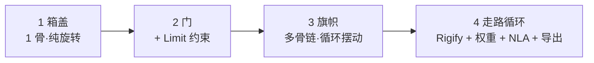

# 09 · 练习项目：从箱盖到走路循环

> 一句话：**这条笔记不是教程，是「拿着 01–08 的知识，把四个项目做出来」的施工单。每个项目都给参数、给验收点、给「做崩了怎么救」。**
> 前置：至少读完 [`01`](01-骨骼基础-Armature与三种模式.md) + [`02`](02-蒙皮与权重绘制-自动权重排错.md) + [`06`](06-关键帧与动画编辑-DopeSheet-GraphEditor-NLA.md) + [`08`](08-骨骼动画导出-GLB与FBX.md)。
> 文件存放：`../资产/练习文件/支线-绑定与动画/`（命名规范见 [`../07-资产规范与引擎导出/笔记.md`](../../07-资产规范与引擎导出/笔记.md)）。

---

## 项目总览

| # | 项目 | 用到的知识 | 难度 | 产出 | 路径 |
| - | ---- | ---------- | ---- | ---- | ---- |
| 1 | **箱盖开合** | 01 · 02 · 06 · 08 | ★ | `Prop_Crate_Lid_Open.glb`（约 60 帧） | 🟢 最小路径首选 |
| 2 | 门 / 舱门 | 01 · 02 · 04 · 06 | ★★ | `Prop_Door_Open.glb`（含 Limit 约束护栏） | 🟢 |
| 3 | 旗帜 / 布料条 | 01 · 02 · 06 | ★★ | `Prop_Flag_Wave.glb`（骨链摆动） | 🟢 |
| 4 | **走路循环** | 全部 01–08 | ★★★★ | `Char_Hero_Walk.glb`（24 帧循环） | 🔵 完整路径验收 |



> **顺序不能跳**：1 → 2 → 3 是「道具动画」的难度爬坡，做完这三个你才具备做角色循环的手感。

---

## 通用纪律（每个项目开工前读一遍）

```text
① 每次改骨骼之前：Save Incremental（Ctrl+Alt+S）
   —— 绑定是关联状态，改错了回不去
② 绑定前：网格和骨架两边都 Ctrl+A → Rotation & Scale
③ 绑定后：Clean → Normalize All → Limit Total(4)
④ 导出前：如果用了约束 → Pose → Animation → Bake Action（Visual Keying ON）
⑤ 每个资产导出后：一定要进引擎播一遍，不要只看 Blender
```

> ⚠️ 遇到「按了快捷键没反应」→ `F3` 搜命令名。这一步在本支线会反复用到，因为绑定相关的面板藏得比建模深。

---

## 练习 1 · 箱盖开合 🟢（约 1h）

**目标**：一个木箱，盖子能绕后沿打开 100°，导出 GLB 在引擎里播放。

### 为什么从它开始

只有 **1 根骨 + 1 个旋转通道**，是「绑定」这个概念的最小完整样本。做崩了也一眼看得出哪里错。

### 施工步骤

```text
【① 准备模型】
- 箱子 = 箱体 + 盖子，可以两个独立物体，也可以一个物体里的两组面
- 盖子的原点放在「后沿铰链」上：选中盖子 → Set Origin → 手动把原点拖到铰链位置
  （原点就是旋转中心，这一步错了后面全错）
- 两边 Ctrl+A → Rotation & Scale

【② 建骨】
- Shift+A → Armature → Single Bone
- 改名 Base（底部不动的那根，或干脆留一根 Root）
- Edit Mode：选中这根骨 → E 挤出第二根 → 改名 Lid
- 把 Lid 骨摆到盖子上：head 在铰链、tail 指向盖子前沿
  ⭐ head 的位置 = 旋转中心，必须与铰链重合

【③ 蒙皮】
- 选中箱体 → 加选骨架 → Ctrl+P → With Automatic Weights
  （也可以 Empty Groups 手动分配：箱体全给 Base、盖子全给 Lid，各 1.0）
- 检查：箱体和盖子确实是「各跟一根骨」，没有串权重

【④ 收口】
- Weight Paint → Weights → Clean → Normalize All → Limit Total(4)

【⑤ 动画（Pose Mode）】
- 第 1 帧：Lid 骨不动 → A 全选 → I → Rotation
- 第 30 帧：Lid 骨绕铰链转 −100°（R → 输入 −100）→ I → Rotation
- 第 60 帧：转回 0° → I → Rotation（做成往返，方便看循环）
- Graph Editor → 全选关键帧 → T → Bezier（缓入缓出）
  → 想更「有重量感」：给打开的瞬间改成 T → Vector（快到最后减速）

【⑥ 导出】
- 见 08 的 GLB 懒人清单
- Data - Armature: Export Deformation Bones only ON / Use Rest Position Armature ON
- Data - Skinning: Bone influences = 4
```

### 参数建议

| 项 | 建议值 | 理由 |
| --- | --- | --- |
| 开启角度 | 95°–110° | 太开会穿帮（盖子翻到箱体后面），太小没动感 |
| 时长 | 30 帧（约 1.25s @24fps） | 道具开合的自然节奏；60 帧做成往返用于验证循环 |
| 插值 | 打开用 Bezier，撞击瞬间可带一点过冲 | 「有重量」的关键 |
| 骨骼数 | 2（Base + Lid） | 超过 3 根说明你在过度设计 |

### 验收点

- [ ] 盖子绕**铰链**转，而不是绕自己的中心打转
- [ ] 箱体在盖子打开时**纹丝不动**
- [ ] 导出 GLB 后引擎里骨骼数 = 2（不是一堆 leaf bone）
- [ ] 引擎里播放，逐帧位置与 Blender 一致

### 做崩了怎么救

| 症状 | 原因 | 救法 |
| --- | --- | --- |
| 盖子绕自己中心转 | 骨骼 head 不在铰链上 | 回 Edit Mode 把骨 head 移到铰链；或改网格原点 |
| 箱体跟着盖子一起动 | 箱体的顶点被分到了 `Lid` 组 | Weight Paint 里把箱体在 Lid 组的权重刷成 0，或直接 Assign 到 Base = 1 |
| 转的方向不对 | 局部轴不对 | 看 03：先 `Ctrl+N` 正 Roll，再绕正确的轴转 |
| 导出后盖子和箱体分离 | 两个物体没 Join，导出时只导了一个 | 要么 Join 成一个物体再绑，要么导出时全选 |

---

## 练习 2 · 门 / 舱门 ⭐（约 1.5h）

**目标**：一扇门，能开、能关，且**在打开/关闭的两个极端不会穿墙**。

### 比练习 1 多了什么

**约束**。这次用 `Limit Rotation` 给「门的活动范围」加一道护栏 —— 这是 04 的第一处实战，也是理解「约束是护栏不是驱动」的最好例子。

### 施工步骤

```text
【① 模型与原点】
- 门 + 门框（可以是两个物体）
- 门体原点 → 移到门轴（合页）位置 ⭐
- 两边 Ctrl+A → Rotation & Scale

【② 建骨】
- Base 骨（门框 / 世界锚点）
- Door 骨：head 在门轴，tail 沿门宽方向

【③ 蒙皮】
- 门体 → Door 骨（权重 1.0）；门框 → Base 骨
- 收口：Clean → Normalize All → Limit Total(4)

【④ 加约束（本次重点）】
- Pose Mode 选中 Door 骨 → Bone Constraint → Limit Rotation
- 勾 Z（假设绕 Z 转）→ Min / Max 设成门的合理范围（如 0° ~ −110°）
- 效果：无论怎么拖，门都不会转到墙里
  ⭐ Owner Space 一般用 Local Space（按骨的局部轴限制）

【⑤ 动画】
- 第 1 帧：门关（0°）→ I → Rotation
- 第 20 帧：门开（−110°）→ I → Rotation
- 第 40 帧：门关 → I → Rotation（往返）
- 想更像真门：开门前加 2–3 帧的「预热」，关门末段减速

【⑥ 烘焙 + 导出 ⭐】
- ⚠️ 约束不会被导出！导出前必须：
  Pose Mode → A 全选 → Pose → Animation → Bake Action
    Visual Keying ON · Clear Constraints ON · Frame Step 1
- 然后按 08 的 GLB 清单导出
```

### 参数建议

| 项 | 建议值 |
| --- | --- |
| 开门角度 | 90°–110°（住宅门 ~100°，舱门可到 120°） |
| Limit Rotation 范围 | Min/Max = 实际机械范围，**留 2–3° 余量**（贴死会看起来卡住） |
| 关门前停留 | 2–5 帧（有「犹豫」的感觉） |

### 验收点

- [ ] 门绕**门轴**旋转
- [ ] 门框在门的整个行程中不动
- [ ] Limit Rotation 生效：手动拖到极限之外会自动弹回
- [ ] **烘焙后**滚动时间轴，动画表现与烘焙前完全一致
- [ ] 导出的 GLB 里没有约束（只有关键帧），引擎里播放正确

### 做崩了怎么救

| 症状 | 原因 | 救法 |
| --- | --- | --- |
| 门转到墙里 | 没加 Limit / Owner Space 选错 | 检查约束的 Space（一般 Local）+ Min/Max 方向 |
| 烘焙后动画乱掉 | 忘了 Visual Keying / Frame Step 不是 1 | 重烘，检查两个开关 |
| 烘焙后门完全不动 | Clear Constraints 开了但曲线没写进去 | 重烘，确认 Visual Keying ON |
| 引擎里门不动 | 导出时约束还在（没烘） | 重烘 → 再导出 |

---

## 练习 3 · 旗帜 / 布料条摆动 ⭐⭐（约 1.5h）

**目标**：一面旗帜 / 一条布料，用一根**多节骨链**做出「末端摆幅大、根部不动」的波浪循环。

### 比前两个多了什么

**骨链 + 循环动画**。这次要处理「根不动、末端动」的权重渐变 —— 是理解「权重是一条渐变」的最好练习。

### 施工步骤

```text
【① 模型】
- 一个 Plane（旗帜）或长条（布料），沿长度方向多切几段（至少 6–8 段）
  ⚠️ 段数太少，摆动会是一折一折的折线
- 原点放「挂杆那一侧」
- Ctrl+A → Rotation & Scale

【② 建骨链】
- Shift+A → Armature → Single Bone，改名 Flag_01
- Edit Mode 选中它 → E 挤出下一节 → 重复，做出 6–8 节的链 ⭐
- 骨骼沿旗帜长度方向排列，每节长度大致均匀

【③ 蒙皮（本次的关键）】
- 旗帜 → 加选骨架 → Ctrl+P → With Automatic Weights
- 检查权重：**根部（靠杆）几乎全给 Flag_01，越往末端越偏向后几节**
- 手动微调：
  - `Weights → Levels / Gradient` 或直接刷，让权重**沿长度平滑过渡**
  - 目标：没有任何一个顶点权重和 ≠ 1，且每顶点 ≤4 根骨
- 收口：Clean → Normalize All → Limit Total(4)

【④ 循环动画（手工错相位）】
这是旗帜的灵魂 —— 每节骨的旋转要有「时间差」：
- 第 1 帧：全部骨 0 → 全选 → I → Rotation
- 第 6 帧：Flag_01 转 +10°（其他 0）→ I
- 第 12 帧：Flag_02 转 +18°（Flag_01 回 0）→ I
- 第 18 帧：Flag_03 转 +25° → I
- ……依次往后错开 6 帧，末端摆幅最大
- 一圈下来（约 48 帧）回到初始 → 首尾帧必须完全一致
- Graph Editor → 全选 → T → Bezier

**更省事的替代方案**：给骨链加 Spline IK（04 里提过），末端挂到一个沿曲线运动的空物体上，让曲线自己动。
```

### 参数建议

| 项 | 建议值 | 理由 |
| --- | --- | --- |
| 骨节数 | 6–8 | 少于 6 摆动生硬；多于 8 权重难调且没必要 |
| 循环长度 | 48 帧（2s @24fps） | 旗帜波动一个完整周期 |
| 相位差 | 每节错开 4–6 帧 | 太小看不出波，太大像脱节 |
| 末端摆幅 | 根 5° → 末端 35° | 越靠末端越大 |
| 网格分段 | ≥ 骨节数 × 2 | 段数不足会有折角 |

### 验收点

- [ ] 根部完全不动，末端摆幅最大
- [ ] 权重沿长度**平滑渐变**，没有硬边（摆起来不出现折角）
- [ ] 循环首尾帧一致，播放时接缝不跳
- [ ] 每顶点 ≤4 根骨
- [ ] 导出后引擎里循环播放自然

### 做崩了怎么救

| 症状 | 原因 | 救法 |
| --- | --- | --- |
| 整面旗一起动 | 根部权重没做（Flag_01 没占主导） | 手动把根部顶点 Assign 给 Flag_01 = 1 |
| 摆起来有折痕 | 网格段数不够 / 权重过渡太陡 | 加分段；`Weights → Smooth` 柔化过渡 |
| 循环接缝跳一下 | 首尾帧不一致 / 曲线斜率差太多 | 逐通道核对首尾值；把末帧斜率调成与首帧接近 |
| 末端抖 / 尖刺 | 末端顶点被远处骨影响 | Clean + Limit Total(4) |

---

## 练习 4 · 走路循环（验收项目）⭐⭐⭐⭐（约 3h）

**目标**：一个人形角色，做一段 **24 帧走路循环**，导出 GLB 在引擎里播放，循环无缝。

### 这是本支线的总验收

它会把 01–08 全部串一遍：Rigify 生成 rig（05）→ 对齐 metarig（03 的轴向知识）→ 蒙皮权重（02）→ IK 腿（04）→ 24 帧循环 + NLA（06）→ 导出（08）。

### 施工步骤

```text
【① 准备模型】
- 一个人形（自己做的或下载的开放资产都可以）
- 站位：面朝 −Y（Blender 正视图方向），脚在原点平面上
- Ctrl+A → Rotation & Scale

【② Rigify 绑定（见 05）】
- Preferences → Add-ons → 勾 Rigify
- Shift+A → Armature → Human Meta-Rig
- Edit Mode：逐节把 metarig 骨骼对准模型（肩/肘/膝/踝 ⭐ 别偷懒）
- Armature 属性 → Rigify 面板 → Generate Rig
- 隐藏 metarig（别删）
- 模型 → 加选生成的 rig → Ctrl+P → With Automatic Weights

【③ 权重收口】
- Weight Paint：只刷 DEF- 组的权重
- Clean → Normalize All → Limit Total(4)
- ⚠️ 别刷到 CTRL- 组上

【④ 走路循环（核心）】
24 帧 = 2 步（左脚 1 步 + 右脚 1 步），标准节奏：
  第 1 帧  ：接触（双脚着地，前后分开）
  第 7 帧  ：过渡（重心抬起，一腿支撑一腿抬起通过）
  第 13 帧 ：接触（与第 1 帧左右镜像）
  第 19 帧 ：过渡（与第 7 帧左右镜像）
  第 25 帧 ：= 第 1 帧 ⭐（循环点，导出时取 1–24）

要点：
- 用脚部 IK 控制骨把脚「钉」在地面上，别让脚滑（这就是 04 学 IK 的原因）
- 骨盆 / 胸腔要有轻微的上下起伏与左右摆动（这是「走路」不像「僵尸」的关键）
- 手臂反相摆动（左腿前时右臂前）
- 头部保持相对稳定

【⑤ 循环自检】
- Dope Sheet 里核对：第 1 帧与第 25 帧的关键帧逐通道相等
- 播放从第 24 帧回到第 1 帧，没有「一顿」
- Graph Editor 里首帧与末帧的斜率接近

【⑥ 收纳到 NLA（06）】
- Action Editor 把这条动作改名 Walk
- Push Down 到 NLA 轨道
- 回到第 1 帧

【⑦ 烘焙 + 导出（08）】
- 用了 IK → 先 Pose → Animation → Bake Action（Visual Keying ON / Clear Constraints ON / Frame Step 1）
- GLB 导出清单：
    Export Deformation Bones only     ON  ⭐
    Use Rest Position Armature        ON
    Bone influences                   = 4
    Export all Armature Actions       ON（如果有多个动作）
    Reset pose bones between actions  ON
- 引擎里播放 → 循环不跳 → 骨骼数 ≈ DEF 骨数量 → 比例正确
```

### 走路循环的关键帧速查（8 帧一拍的节奏）

| 帧 | 左脚 | 右脚 | 骨盆 |
| --- | --- | --- | --- |
| 1 | 前·着地 | 后·着地 | 最低点 |
| 7 | 支撑 | 抬起·通过 | 最高点 |
| 13 | 后·着地 | 前·着地 | 最低点 |
| 19 | 抬起·通过 | 支撑 | 最高点 |
| 25 | = 帧 1 | = 帧 1 | = 帧 1 |

### 验收点

- [ ] 脚在着地阶段**不滑步**（IK 生效）
- [ ] 第 1 帧与第 25 帧逐通道一致，引擎里循环无缝
- [ ] 导出后骨骼数 ≈ Rigify 的 `DEF-` 骨数量（不是几百根）
- [ ] 引擎里播放：变形方向、幅度、比例都对
- [ ] 角色在引擎里**不穿地、不悬空**

### 做崩了怎么救

| 症状 | 原因 | 救法 |
| --- | --- | --- |
| 脚滑步 | IK 没生效 / 脚没被钉住 | 检查脚部 IK 的 Chain Length 与 target |
| 膝盖弯反 | Roll 不对 / Pole Target 位置错 | 见 03 的 `Ctrl+N`，见 04 的 Pole Angle |
| 循环处顿一下 | 首尾帧不一致 / 斜率差 | 逐通道核对；把末帧手柄调成与首帧一致 |
| 导出后骨骼几百根 | 没勾 Export Deformation Bones only | 重导，勾上 |
| 引擎里角色扭曲 | Use Rest Position Armature 没开 / 忘 Apply Scale | 检查两个开关 + Apply |
| 动画在引擎里播放不全 | 约束没烘 / 多动作没进 NLA | 重烘；检查 Export all Armature Actions |
| 角色在引擎里小 100 倍 | 单位没处理 | UE5 导入时 Import Uniform Scale = 100 |

---

## 完整闭环自检（做完 4 个练习后）

```text
【闭环流程】
模型 → 骨骼 → 蒙皮 → 权重收口 → （约束/IK）→ 烘焙 → 关键帧/NLA
   → 导出 GLB → 引擎导入 → 播放 → 与 Blender 对比

【必须能回答】
[ ] 我这次导出选的是 GLB 还是 FBX？为什么？
[ ] 骨骼数最终是多少？为什么是这个数字？（Deform 裁剪的结果）
[ ] 每个顶点最多几根骨影响？我在哪一步保证的？
[ ] 如果有形状键，我走的是哪个格式？为什么？
[ ] 循环动画的首尾帧一致，我是怎么核对出来的？
[ ] 约束烘焙了吗？Visual Keying 和 Clear Constraints 分别解决什么？
```

---

## 产出物清单（做完填这里）

| # | 项目 | 文件路径 | 骨骼数 | 动画名 / 帧数 | 引擎验证 |
| - | ---- | -------- | ------ | ------------- | -------- |
| 1 | 箱盖开合 | | | | ⬜ |
| 2 | 门 / 舱门 | | | | ⬜ |
| 3 | 旗帜摆动 | | | | ⬜ |
| 4 | 走路循环 | | | | ⬜ |

---

## 阶段复盘

1. 最反直觉的一个知识点是什么（用一句话说）：
2. 踩过的坑（≥3 条；够通用的同步到 [`../速查/常见坑汇总.md`](../../速查/常见坑汇总.md)）：
3. 哪个练习花的时间最长，为什么：
4. 如果重做一遍，流程上会先做什么不同的事：

---

> **完成后回到** [`笔记.md`](笔记.md) 做「6 条自检」，再回主线 [`../07-资产规范与引擎导出/笔记.md`](../../07-资产规范与引擎导出/笔记.md) 把动画资产的检查项并进导出清单。
> 这条支线留下最值钱的一条习惯：**每个资产都要「在引擎里播一遍」才算完成**——绑定是所有 3D 工作里沉默失败最多的一块，它不报错，它只是不动。
