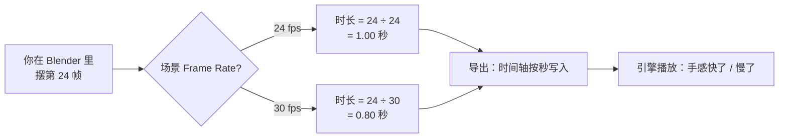
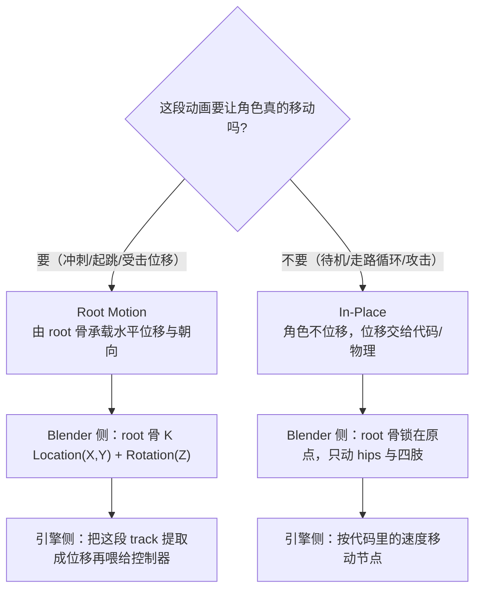
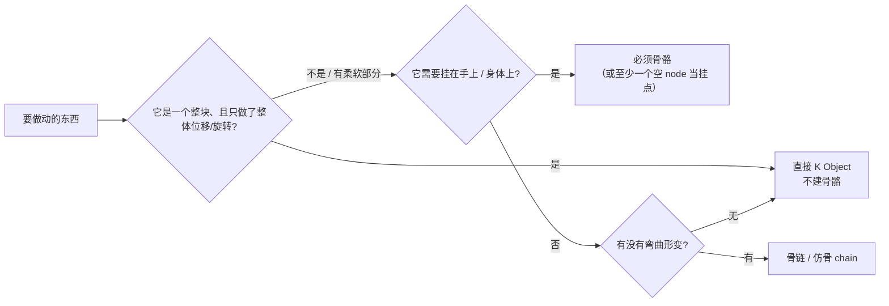

# 10 · 工程实务补充：帧率 / 根运动 / 外部动画源 🔧（补充篇）

> 一句话：**01–09 解决「怎么做出动画」，这一篇解决三个只在真实项目里才咬人的问题——节奏为什么在引擎里变了、角色为什么走不出位移、别人的动画为什么用不上。**
> 依据：Blender 5.2 LTS 手册 · [Format（Frame Rate）](https://docs.blender.org/manual/en/latest/render/output/properties/format.html) / [Frame Range](https://docs.blender.org/manual/en/latest/render/output/properties/frame_range.html) / [FBX（新导入器）](https://docs.blender.org/manual/en/latest/files/import_export/fbx.html) / [FBX (Legacy)](https://docs.blender.org/manual/en/latest/files/import_export/fbx_legacy.html)；Godot 文档 · ResourceImporterScene `animation/fps`、GLTFState `bake_fps = 30.0`、AnimationTree `root_motion_track`；Unity 官方 · [glTFast Features](https://docs.unity3d.com/Packages/com.unity.cloud.gltfast@6.13/manual/features.html) / [Supported asset type reference](https://docs.unity3d.com/6000.0/Documentation/Manual/assets-supported-types.html)。
> 什么时候读：**做完 [`09`](09-练习项目-箱盖到走路循环.md) 之后**，或**开始接真实项目 / 想用现成动画之前**。第一次通读可以只读第二节和第四节。

---

## 一、帧率：同一个「24 帧」在不同地方不是同一个长度

这是本支线最容易被漏掉的一个**全局设置**，而它不报错——它只是让动作快了 25%。



**手册原话**（Frame Range 页）：帧数要「除以场景的 Frame Rate」得到以秒计的时长。

| 设置项 | 位置 | 说明 |
| --- | --- | --- |
| **Frame Rate** | `Properties → Output Properties → Format` 面板 | 下拉给多种常用帧率；选 **Custom** 后出现 `FPS` 与 `Base` 两栏 |
| FPS / Base | 同上 | `FPS` 是分子、`Base` 是分母（手册举例：NTSC 这类非整数帧率要用分数表示） |
| Frame Start / End | `Output Properties → Frame Range` | 渲染/播放范围；**关键帧不会因为改 fps 而移动** |

> ⚠️ 手册**没有给出 fps 的默认值**，Blender 出厂/新场景常见是 **24 fps**（电影惯例）。这条属于「场景默认值」，请以你自己文件里的实际值为准。

### 为什么它会坑到你

关键帧锁在**帧号**上，时长锁在**秒**上。你中途把 fps 从 24 改成 30：

| 场景 | 结果 |
| --- | --- |
| 走路循环做了 24 帧 | 本来 1.00 秒的循环变成 0.80 秒，进引擎后**脚底打滑**（步频比位移快） |
| 道具开合做了 30 帧 | 本来 1.25 秒变成 1.00 秒，「有重量的门」变成「玩具门」 |
| 多条动作分不同时期做的 | 有的按 24fps 的节奏、有的按 30fps 的节奏，**同一个角色两个 tempo** |

### ⭐ 三条纪律（开工第一天定死）

```text
① 先把 Scene Frame Rate 设成项目目标值，再摆第一个关键帧
   游戏资产（Godot / Unity / UE 实时播放）→ 30 fps 起步最省心
   影视 / 过场 ← 才考虑 24 / 25
② 项目中途不要改 fps。改了就等于把所有关键帧的时间点整体拉伸/压缩
③ 循环长度用「秒」表达，再按你的 fps 折算帧数
   不要反过来——「24 帧循环」这句话本身是不完整的
```

### 引擎侧还有一次采样（别以为出了 Blender 就定了）

| 引擎 | 实测到的行为 | 依据 |
| --- | --- | --- |
| **Godot** | 导入面板有 **FPS** 项（对应 `ResourceImporterScene` 的 `animation/fps`），用于把动画曲线**烘焙成一串线性插值点**。官方原话建议「把它配成与你在 3D 软件里用的基线一致」，且「超过 30 FPS 通常没什么收益」。`GLTFState.bake_fps` 的默认值就是 **30.0** | Godot 文档（Import configuration / GLTFState 类） |
| **Unity** | GLB 走 glTFast（见第四节），它把动画写成 `AnimationClip`；Unity 侧的导入/重采样选项以你工程版本为准，**本笔记未逐字核实，标注为待实测** | — |
| **UE5** | 导入时同样会做一次采样/压缩；先在测试资产上确认再批量 | — |

> 💡 **接第二节的方法**：把 Blender 场景 fps 与 Godot 导入面板的 FPS 设成同一个数（通常是 30）。**两边不一致 = 曲线被重采样 = 快速动作失真**（击球、抽刀这类动作帧数少、速度变化大，失真一眼可见）。

### 循环时长怎么定（用秒，不靠手感）

| 动作 | 建议时长（经验值，非官方） | @30fps 帧数 | @24fps 帧数 |
| --- | --- | --- | --- |
| 待机 Idle | 2.0–4.0 s | 60–120 | 48–96 |
| 走路 Walk（完整循环 = 左右各迈一步） | 1.0–1.3 s | 30–40 | 24–32 |
| 跑步 Run | 0.6–0.8 s | 18–24 | 15–19 |
| 道具开合（门 / 箱盖） | 0.4–0.8 s | 12–24 | 10–19 |
| 旗帜 / 布料摆动 | 2.0–4.0 s | 60–120 | 48–96 |

> ⚠️ 回头看 [`09` 练习 4](09-练习项目-箱盖到走路循环.md) 的「24 帧走路循环」：那句话的完整表述应该是「**24 帧 @24fps = 1.0 秒**」。如果你按本节的纪律把场景设成 30fps，同一个 1 秒循环要做成 **30 帧**。

---

## 二、根运动 Root Motion：角色为什么会「走得出来但不前进」

动画里有两种做法，混用是引擎里最常见的「脚在打滑 / 人原地跑」的来源：



### Blender 侧你要做的三件事

| # | 做什么 | 为什么 |
| --- | --- | --- |
| ① | **有且只有一个 root 骨**（[`08`](08-骨骼动画导出-GLB与FBX.md) checklist 第三节已要求） | 多个 root 骨时 glTF 的 `Remove Armature Object` 会失效，层级变脏 |
| ② | 决定它是 **root-driven** 还是 **in-place**，然后**整份文件保持一致** | 一半 animation 有位移、一半没有，引擎里做 blend 时会互相打架 |
| ③ | In-place 也要**给 root 骨留一条零位移的 track** | 很多引擎的差异计算公式要求 root 骨存在，缺了会出现「看不见的计算基准」 |

### 引擎侧怎么把位移取出来（以 Godot 为例，这是有官方依据的一条）

`AnimationTree` 有 `root_motion_track` 属性，手册写得很具体：

> 「路径必须是有效的场景树路径；要指定控制属性或骨骼的 track，用 `:` 分隔，例如 `character/skeleton:ankle`。如果该 track 是 `TYPE_POSITION_3D` / `TYPE_ROTATION_3D` / `TYPE_SCALE_3D`，这个变换会被**视觉上抵消**，动画看起来像停在原地。」

也就是说：**Godot 用 `root_motion_track` 挑一根骨（通常是 root），把它的位移渲染层面取消掉，再通过 `get_root_motion_position()` / `get_root_motion_rotation()` / `get_root_motion_scale()` 把差值拿给你的角色控制器。** 这正是 Blender 侧「唯一 root 骨」那条纪律的用途。

> Unity / UE 的对应开关（Animation 页的 Bake Into Pose 之类）**本笔记未逐字核实**——用哪个引擎就先拿一个测试资产验证一遍，确认「动画里有位移」和「位移交给谁」这两件事。

---

## 三、物体动画 vs 骨骼动画：什么时候根本不需要绑

这是「学完绑定后最容易过度设计」的地方。坚决的结论先给：**硬挺的道具用物体动画就够了，别给它绑骨头。**

| 判断项 | **物体动画**（Object 直接 K Loc/Rot/Scale） | **骨骼动画**（Armature + 权重） |
| --- | --- | --- |
| 适用对象 | 门、箱盖、阀门、电梯平台、风扇、抽屉、旋转的炮塔 | 角色、布料/触须、需要柔软过渡的东西 |
| glTF 里的形态 | **node animation**（节点上的 TRS track） | skin / joints / inverseBindMatrices |
| 引擎侧表现 | Godot 里就是 `AnimationPlayer` 对 `Node3D` 的 track；Unity/glTFast 同样 | Godot 进 `Skeleton3D`；Unity 要 Rig + Skin |
| 开销 | 没有骨骼数、没有权重、没有 ≤4 限制 | 要走 [`02`](02-蒙皮与权重绘制-自动权重排错.md) 的收口流程 |
| 能否共用一根父骨 | ❌ 不能挂到手部骨下（要挂就得骨骼） | ✅ 可以（武器挂 `hand` 骨是标准做法） |
| 能否做形变 | ❌ 只有整体刚体变换 | ✅ 加上 [`07`](07-形状键ShapeKeys与驱动器Drivers.md) 的形状键还能挤压变形 |



> 📌 **回到 [`09` 练习 1](09-练习项目-箱盖到走路循环.md)**：箱盖用骨骼做，是为了让你亲手经历一遍「head 位置 = 旋转中心」这个绑定核心概念。**真做项目时，箱盖/门这类东西用物体动画更快也更干净**——这也是为什么读懂这一节能省掉不少无谓的骨骼。

---

## 四、外部动画源：现成动画怎么落到你的 rig 上

角色支线里最省时间的一条路往往不是自己 K，而是**拿现成动画重定向**。但这一步有几个和 5.x 直接冲突的老经验。

### 4.1 Blender 有没有内置重定向工具

**没有。** 官方也没把它做成内置功能，业界靠**扩展 / 插件**解决。常见选项（**均为第三方，版本兼容性请自行按当时的页面核实**）：

| 工具 | 性质 | 备注 |
| --- | --- | --- |
| **Retarget**（KBS-DEV，Blender Extensions） | 免费 · GPL · 要求 Blender 5.0+ | Expy Kit + Animaide 的 fork；自带 Mixamo / Unreal / VRoid / Daz / Auto-Rig Pro 等 preset；还有 `Add Root Bone`、`Transfer Root Motion`、`Rigify Game Friendly` 重命名等**正好对应本支线需求的工具** |
| Rokoko 的 retarget 插件 | 免费 | 另一个常见选项 |
| Auto-Rig Pro 的 Remap | 付费 | 老牌方案 |

> ⚠️ 工具版本会持续变动。**装之前先看它标称的支持版本；跨大版本 Blender 时插件失效是常态，不是你的问题。**

### 4.2 ⭐ 老教程让你勾的那个按钮，在 5.x 已经不在默认导入器里

**这是本「补充篇」里最值钱的一条订正。** 网上大量「Mixamo → Blender」教程都写着「导入时勾 **Automatic Bone Orientation**」。核一下官方手册：

| 手册页面 | 5.x 的实际情况 |
| --- | --- |
| [FBX](https://docs.blender.org/manual/en/latest/files/import_export/fbx.html)（**5.x 默认的新 C++ 导入器**） | Import 段的选项只有：`Scale`、`Custom Properties`、`Enums As Strings`、`Custom Normals`、`Subdivision Data`、`Vertex Colors`、`Material Name Collision`、**`Offset`**、**`Layered Animation Support`**、`Ignore Leaf Bones`。**没有 Automatic Bone Orientation** |
| [FBX (Legacy)](https://docs.blender.org/manual/en/latest/files/import_export/fbx_legacy.html)（旧 Python 导入器） | 那个熟悉的老面板（含 Automatic Bone Orientation / Manual Orientation）在这里 |

> 换句话说：**老教程让你勾的那个按钮，在 5.x 的默认 FBX 导入器里根本不存在**。你在 5.2 里找不到，不是漏勾，是它不在那儿。真要它，得走 `FBX (Legacy)`，或者干脆不用它。

### 4.3 手动走外部动画的六步（带已知的四个坑）

```text
① 下载：带蒙皮的角色版本只下一次（With Skin），其余动画一律下无蒙皮版（Without Skin）
② 导入：File → Import → FBX（5.x 默认新导入器）
   ⚠️ 坑 1：别急着 Apply 那 0.01 的骨架缩放，先确认所有片段都进来再说
   ⚠️ 坑 2：骨骼名带着 mixamorig: 前缀 → 与你的 rig 名字对不上 → 动作不生效
      （把前缀统一处理掉，或在重定向工具的 preset 里映射）
③ 合并多条片段：利用新导入器的 Layered Animation Support
   （手册原文：每个 FBX take 导成独立 Action，每个对象分配到自己的 Action Slot）
   → 把 action 挂到同一个主骨架 → Push Down 进 NLA → 删掉多余的骨架
④ 重定向到你的 rig：靠 Retarget / Rokoko / ARP 做骨骼映射
   ⚠️ 坑 3：源 rig 与目标 rig 的 rest pose 不一致（T-pose vs A-pose）→ 手臂歪、膝盖反弯
      先用目标 rig 的 rest pose 对齐，再建映射
⑤ 收口：流程与 [`02`](02-蒙皮与权重绘制-自动权重排错.md) 完全一致 —— Clean → Normalize All → Limit Total(4)
   ⚠️ 坑 4：重定向后务必在一个极端姿势下看一遍；另外 IK / 约束在导出前已经烘焙掉了，
      别再回头去改原来的约束（改了也不会参与导出）
⑥ 导出：完全按 [`08`](08-骨骼动画导出-GLB与FBX.md) 的清单，包含 Deform 裁剪
```

> 💡 **永远别忘了：约束/IK 不进导出**（[`04`](04-约束与IK-FK.md) 第六节）。用重定向工具导进来的 action 同理——出 Blender 之前先 `Bake Action`。

### 4.4 Unity 的一个格式事实（顺手订正，会影响你的 GLB 决策）

Unity 官方文档「Supported asset type reference」里写得很明白：

> 「3D model files: … **Internally, Unity uses the FBX file format as its importing chain.**」

配套的导入器表列出 `FBXImporter` 支持的扩展名：**`.blend .c4d .dae .dxf .fbx .jas .lxo .ma .mb .max .obj` —— 没有 `.glb` / `.gltf`**。

GLB/glTF 在 Unity 里由官方 **glTFast**（`com.unity.cloud.gltfast`）接手：它是 **ScriptedImporter**，并会把自己注册为 `.gltf` / `.glb` 的**默认导入器**（「You can move/copy glTF files into your project's Assets folder, similar to other 3D formats. Unity glTFast will import them to native Unity prefabs…」）。

它的官方 feature 表还给了两条直接印证本支线结论的事实：

| 表项 | 官方标注 | 对本支线的意义 |
| --- | --- | --- |
| `Joints (up to 4 per vertex)` / `Weights (up to 4 per vertex)` | ✅ Import | **Unity 侧同样只认每顶点 4 个关节影响** → [`02`](02-蒙皮与权重绘制-自动权重排错.md) 那条 `Limit Total = 4` 铁律在目标端被再次确认 |
| `Animation … via Mecanim` | ☑️ ³ ³「Animation clips can be imported Mecanim compatible, **but they won't be assigned and cannot be played back without further work**」 | GLB 进 Unity 后**动画不会自动挂上**，要自己去建 Animator/Controller。别以为导入成功就能播 |

> ✅ 结论不变（与 [`08`](08-骨骼动画导出-GLB与FBX.md) 一致）：**默认仍走 GLB**，但「Unity 原生支持 GLB」这个说法要改成「**Unity 由官方 glTFast 包接管 GLB 导入，且动画需自行挂接**」。

---

## 五、坑

- ❌ **项目做到一半改场景 fps** → 全部关键帧的时间点被整体压缩/拉伸，舞蹈、步频全错。**开工第一天定死**
- ❌ **循环长度用「帧」当单位** → 「24 帧循环」在 24fps 与 30fps 下不是一个节奏。**用秒**
- ❌ **Godot 导入面板的 FPS 与 Blender 场景 fps 不一致** → 曲线被烘焙成线性点，快速动作失真（官方建议「与 DCC 的基线对齐」）
- ❌ **多个 root 骨** → glTF 的 `Remove Armature Object` 失效，也撑不起 Godot 的 root motion track
- ❌ **一半 action 带 root 位移、一半不带** → 引擎里做 blend 时角色漂移
- ❌ **给硬挺道具绑骨头** → 白白背上骨骼数、权重收口、≤4 限制。整体刚体运动用物体动画
- ❌ **照抄老教程勾 `Automatic Bone Orientation`** → 5.x 的默认 FBX（新 C++ 导入器）里没这个选项；它在 `FBX (Legacy)` 面板里
- ❌ **忽略 `mixamorig:` 前缀** → 动作挂了但角色不动，**且不报错**
- ❌ **rest pose 不一致就做重定向** → 整条手臂歪、膝盖反弯。先对齐 rest pose
- ❌ **以为 Unity 会像 FBX 一样自动接好动画** → glTFast 官方注明 clip 导入后**不会自动被分配**，需要你自己接 Controller
- ❌ **重定向工具跨 Blender 大版本不验证** → 装完失效/面板不出。装之前看支持版本

---

## 六、自检

| # | 自检点 | 通过标准 |
| - | ------ | -------- |
| ① | 帧率一致 | 能说出 Blender 场景 fps 改了会影响什么（关键帧留在帧号上、时长按秒变化），并给出「游戏项目用 30fps 起步」的理由 |
| ② | 循环用秒 | 给你一个 30 帧的循环，能立刻说出它在 30fps 与 24fps 下的时长分别是多少 |
| ③ | 引擎采样 | 说出 Godot 导入面板 FPS/`bake_fps` 默认 30 且应与 DCC 基线对齐 |
| ④ | 根运动决策 | 说清 root-driven 与 in-place 的差别、每种在 Blender 侧要 K 什么，以及「唯一 root 骨」为什么是前提 |
| ⑤ | Godot 提取 | 说出 `AnimationTree.root_motion_track` 的作用（指定骨 + 视觉抵消 + getter 取差值） |
| ⑥ | 格式取舍 | 说出「硬挺道具 → 物体动画」「要形变/要挂手 → 骨骼」这条判定线 |
| ⑦ | 外部动画 | 说出 5.x 默认 FBX 导入器**没有** `Automatic Bone Orientation`（那是 Legacy 面板），以及 `mixamorig:` 前缀的坑 |
| ⑧ | Unity 事实 | 说出 Unity 内部导入链是 FBX、GLB 由 glTFast 接管、动画需自行挂接、每顶点 ≤4 关节 |
| ⑨ | **实操** | 把 [`09`](09-练习项目-箱盖到走路循环.md) 的箱盖改成「纯物体动画」版本导出一次，与骨骼版对比：引擎里骨骼数从 2 变 0，表现一致 |

---

## 七、速查

```text
【帧率】
场景 fps：Properties → Output Properties → Format → Frame Rate（Custom → FPS/Base）
手册原话：帧数 ÷ Frame Rate = 秒数
纪律：①开工先设 30fps ②中途不改 ③循环长度用「秒」再折帧
24 帧循环 @24fps = 1.00s  /  24 帧 @30fps = 0.80s  ⚠️快了 25%
循环速查（经验值）：Idle 2–4s · Walk 1.0–1.3s · Run 0.6–0.8s · 道具开合 0.4–0.8s
Godot：Import 面板 FPS（= animation/fps，GLTFState.bake_fps 默认 30.0）
       官方建议与 DCC 基线对齐；>30 FPS 基本没收益

【根运动】
前提：有且只有一个 root 骨
两种做法二选一，全文件保持一致：
  Root-driven → root 骨 K Location(X,Y) + Rotation(Z)
  In-place    → root 骨零位移，只动 hips/四肢
Godot 提取：AnimationTree.root_motion_track = "character/skeleton:root"
           → 该 track 视觉上被抵消 → get_root_motion_position()/rotation()/scale()

【物体动画 vs 骨骼动画】
硬挺道具（门/箱盖/阀门/电梯/风扇）→ 直接 K Object（glTF 里是 node animation）
需要形变 / 需要挂到手部骨 → 才用骨骼
再提醒自己一遍：箱盖练习用骨骼是为了学概念，真做项目用物体动画更快

【外部动画（Mixamo / CC0 库）】
Blender 没有内置重定向工具 → 用扩展：Retarget（免费 GPL，5.0+）/ Rokoko / Auto-Rig Pro
⭐ 5.x 的默认 FBX（新 C++ 导入器）没有 Automatic Bone Orientation
   ← 那个按钮只存在于 FBX (Legacy) 面板
新导入器选项：Scale / Custom Properties / Enums As Strings / Custom Normals /
             Subdivision Data / Vertex Colors / Material Name Collision /
             Animation Offset + Layered Animation Support / Ignore Leaf Bones
坑：① 别急着 Apply 0.01 缩放 ② mixamorig: 前缀要和 rig 对齐
    ③ 源/目标 rest pose 不一致会歪 ④ 约束/IK 照样要 Bake
步骤：With Skin 一次 + Without Skin 若干 → 导入 → 按名挂 action → Push Down NLA
      → 删多余骨架 → 重定向 → 收口(Clean/Normalize/Limit 4) → 按 08 导出

【Unity 的 GLB 事实】
官方文档：「Internally, Unity uses the FBX file format as its importing chain」
内置 FBXImporter 扩展名里没有 .glb/.gltf → 由官方包 glTFast（com.unity.cloud.gltfast）接管
glTFast 官方 feature 表：Joints/Weights up to 4 per vertex（再次印证 ≤4 铁律）
                        Animation clips 导入后「不会自动被分配」，需自己建 Animator
```

---

## 八、资源

- **主资源**：本目录 [`01`](01-骨骼基础-Armature与三种模式.md)–[`09`](09-练习项目-箱盖到走路循环.md)（10 是它们的工程侧补丁，不能替代）
- Blender 5.2 LTS 手册 · [Format](https://docs.blender.org/manual/en/latest/render/output/properties/format.html) / [Frame Range](https://docs.blender.org/manual/en/latest/render/output/properties/frame_range.html) / [FBX](https://docs.blender.org/manual/en/latest/files/import_export/fbx.html) / [FBX (Legacy)](https://docs.blender.org/manual/en/latest/files/import_export/fbx_legacy.html)
- Godot 文档 · Import configuration（`animation/fps`）/ `GLTFState.bake_fps` / [AnimationTree `root_motion_track`](https://docs.godotengine.org/en/4.0/classes/class_animationtree.html)
- Unity 官方 · [Supported asset type reference](https://docs.unity3d.com/6000.0/Documentation/Manual/assets-supported-types.html) / [glTFast Features](https://docs.unity3d.com/Packages/com.unity.cloud.gltfast@6.13/manual/features.html) / [glTFast Editor Import](https://docs.unity3d.com/Packages/com.unity.cloud.gltfast@6.11/manual/ImportEditor.html)
- Blender Extensions · **Retarget**（KBS-DEV，免费 GPL，Blender 5.0+）
- CC0 角色动画素材（在做角色的路上很有用）：Quaternius 的动画库 —— **用它之前先自己核实当前的授权条款**

---

> **下一步**：回到 [`笔记.md`](笔记.md) 把这一节的四条纪律加进你的「导出前清单」，或者直接进 [`09`](09-练习项目-箱盖到走路循环.md) 用「实操第 ⑨ 条」验证一遍。
> 如果暂时只记一句话：**帧率、唯一的 root 骨、GLB 三个决定要在摆第一个关键帧之前做完——它们都是事后改成本最高、事前改成本最低的东西。**
