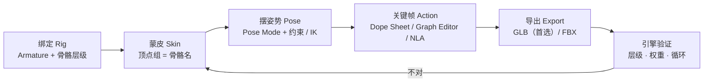
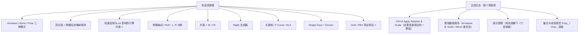
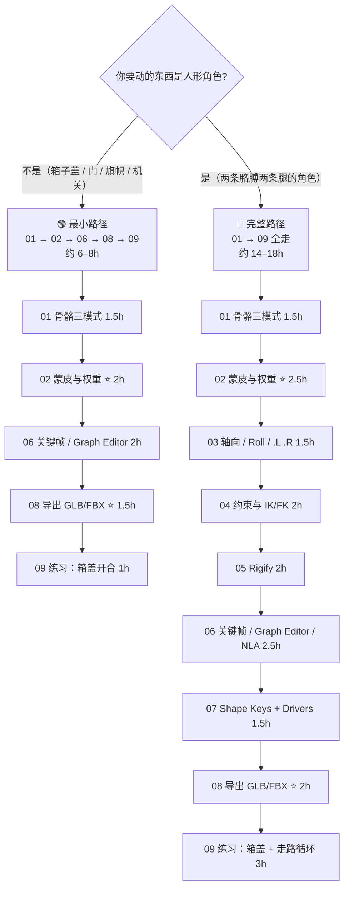
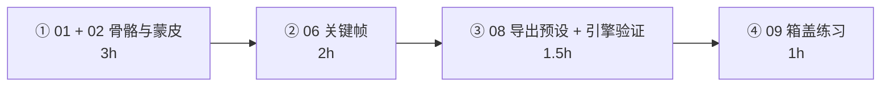
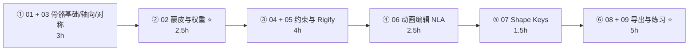

# 支线 · 绑定与动画（原 8–12h · 扩写后 12–18h）

> **一句话目标**：让静态资产「能动起来」，并且**动画能原样进引擎**。
> 状态：⬜ 未开始　|　开工：　　　|　完成：
> 环境：**Blender 5.2 LTS** · macOS　|　前置：[`../02-硬表面建模工作流/笔记.md`](../02-硬表面建模工作流/笔记.md)（至少一个道具建模完成）、[`../04-UV与贴图坐标/笔记.md`](../04-UV与贴图坐标/笔记.md)（有 UV 才有贴图，否则导出后仍是白模）
> 什么时候开：**做第一个会动的资产之前**。箱子盖、门、旗帜、机关这类东西需要这一支线；纯静态道具（木箱、油桶、储物柜）不需要。

---

## 0. ⚠️ 先订正：路线图里关于这条支线的六条说法要更新

| # | 路线图 / 常见说法 | **5.2 的实际情况** | 依据 |
| - | ---------------- | ------------------ | ---- |
| 1 | 路线图 Stage 6 第 350 行：「**5.0 重做了骨骼轴向处理**」 | ❌ **查不到**。5.0 Release Notes 的 Animation & Rigging、Pipeline & I/O 两段都没有任何骨骼轴向条目。5.0 真正改的是 FBX：**新 C++ FBX 导入器成为默认**（4.5 起实验性），Python 版导入器降级为 legacy（手册已拆成 `FBX` 与 `FBX (Legacy)` 两页）。轴向问题**依然存在**：手册原话「FBX bones seem to be -X aligned, Blender's are Y aligned … imported bones in other applications will look wrong」，仍需手动配 `Primary / Secondary Bone Axis` | [5.0 Animation & Rigging](https://developer.blender.org/docs/release_notes/5.0/animation_rigging/) · [5.0 Pipeline & I/O](https://developer.blender.org/docs/release_notes/5.0/pipeline_io/) · [手册 FBX (Legacy)](https://docs.blender.org/manual/en/latest/files/import_export/fbx_legacy.html) |
| 2 | 「带骨骼层级的角色/动画资产用 **FBX** 更稳」 | ⚠️ **这条要打个大问号**。5.2 的 FBX **导出**走的仍是那个 Python add-on（手册 Export 段原话：To export FBX files use the FBX Add-on），而且明确写着缺失：**shape keys 写不进去**、**armature instances 不支持**、**约束本身不导出（只导出烘焙结果）**。反过来 glTF 导出器对骨骼这块有完整开关：`Bone influences`（非 4/8 会在很多查看器里显示错）、`Export Deformation Bones Only`、`Use Rest Position Armature`、`Reset pose bones between actions`、Shape Keys Animations，5.2 还新增了 meshopt 压缩 → **结论：Godot / Unity(URP) / Bevy 优先 GLB；只有目标端明确要求 FBX（UE5 部分流程、商店资产规范）才走 FBX** | [手册 glTF 2.0](https://docs.blender.org/manual/en/latest/addons/scene_gltf2.html) · [手册 FBX (Legacy)](https://docs.blender.org/manual/en/latest/files/import_export/fbx_legacy.html) |
| 3 | 「Rigify 插件（`Preferences → Add-ons` 勾选）」 | 说法没毛病但不完整：Rigify 是**随 Blender 附带**（手册 Note: This add-on is bundled with Blender），默认未启用。真正容易卡住的是后面的动作：`Shift+A → Armature` 选 **Human Meta-Rig** → 调 metarig 比例 → **Armature 属性里的 Rigify 面板生成 rig**。它不是一个「勾上就能绑」的按钮 | [手册 Rigify](https://docs.blender.org/manual/en/latest/addons/rigify/index.html) |
| 4 | 「权重绘制与自动权重的问题排查」 | 这条是本支线最难的一块，而且**失败模式非常固定**：`Bone Heat Weighting: failed to find solution for N bone(s)` 基本就是「网格有脏东西」（重复顶点、内部面、法线反了、模型上有互不连通的碎块）。另外真正的坑在**引擎端**：一个顶点受几根骨头影响必须 ≤4，这在 Blender 里看不出问题，导出后才炸 | [手册 Weight Paint](https://docs.blender.org/manual/en/latest/sculpt_paint/weight_paint/index.html) · glTF 手册 `Bone influences` |
| 5 | 「关键帧与 Dope Sheet / Graph Editor」 | 补一条 5.2 的行为变化：**用户偏好 `Only Insert Available` 现在默认开启**（5.2 release notes）。表现为「我按了 `I` / 开了自动关键帧，但关键帧没插上」。遇到先去 `Preferences → Animation → Keyframes` 把它关掉，别怀疑自己 | [5.2 Animation & Rigging](https://developer.blender.org/docs/release_notes/5.2/animation_rigging/) |
| 6 | 支线清单里**完全没提 shape keys（形态键）** | ❌ 漏了。表情、眨眼、肌肉挤压、箱子挤压变形这类都是 shape keys；glTF 支持 morph target，而 FBX 导出器不支持（见第 2 条）。**要不要 morph target，直接决定了你选 GLB 还是 FBX** | [手册 Shape Keys](https://docs.blender.org/manual/en/latest/animation/shape_keys/index.html) · 5.0 Shape Keys 段 |

> 📌 第 1–2 条请同步回 `Blender学习路线图.md`（Stage 6 第 348–351 行的 FBX 段）；本次撰写已把第 350 行的说法改掉。
> 📌 第 5 条同步回 [`速查/常见坑汇总.md`](../速查/常见坑汇总.md)。
> 📌 通用兜底：**快捷键按不出来或菜单位置对不上，一律 `F3` 搜命令名**（你自己的笔记第 38 节已经这么做了）。

---

## 1. 本支线在解决什么问题

主线走到 Stage 3/4，你手上的道具是**漂亮但死气沉沉**的——它们进入引擎后永远保持那一个姿势。这一支线补的是后半段：**给资产加一套可以被驱动的骨架，并且让引擎认得这套骨架。**

四组必须先分清的概念（新手 80% 的困惑都出在这张图上）：

| 概念 | 是什么 | 常见误解 |
| --- | --- | --- |
| **Armature**（骨架对象） | 一个 Object，容器，里面装 Bone | 以为「骨架」= 一根骨头 |
| **Bone**（骨骼） | Armature 内部的元素，有 head/tail/roll，有父子层级 | 以为它是网格，会跟着 UV/材质 |
| **Pose**（姿势） | 骨骼**相对 rest pose 的偏移**，只存在于 Pose Mode | 在 Edit Mode 里摆姿势（改的是 rest pose，不是动画） |
| **Skinning**（蒙皮） | 网格通过 **顶点组** 与骨骼建立联系，靠 Armature 修改器生效 | 以为「父子级一挂就会跟着动」 |

> **和主线最大的区别**：主线追求「几何正确」，这一支线追求「**运行时正确**」。同一个资产在 Blender 里看着对，导出后歪了、抖了、骨骼多了一倍——这些坑**只有导出验证阶段才会暴露**，所以本支线的验收必须包含一次引擎验证。

---

## 2. 学习路径（两条路，按需选）

| # | 文件 | 核心问题 | 预估 | 最小路径 |
| - | ---- | -------- | ---- | -------- |
| 01 | [`01-骨骼基础-Armature与三种模式.md`](01-骨骼基础-Armature与三种模式.md) | Object / Edit / Pose 到底差在哪、rest pose 是什么 | 1.5h | ✅ |
| 02 | [`02-蒙皮与权重绘制-自动权重排错.md`](02-蒙皮与权重绘制-自动权重排错.md) ⭐ | 怎么让网格跟着骨头动、为什么有的顶点不动 | 2–2.5h | ✅ |
| 03 | [`03-骨骼轴向-Roll-左右对称与X轴镜像.md`](03-骨骼轴向-Roll-左右对称与X轴镜像.md) | 骨骼歪了怎么转正、左右骨为什么快捷键会动错边 | 1.5h | |
| 04 | [`04-约束与IK-FK.md`](04-约束与IK-FK.md) | 手臂为什么不跟手把手.StreamIK、Pole Target 怎么调 | 2h | |
| 05 | [`05-Rigify快速绑定.md`](05-Rigify快速绑定.md) | 用生成器 5 分钟拿到一套可用的角色 rig | 2h | |
| 06 | [`06-关键帧与动画编辑-DopeSheet-GraphEditor-NLA.md`](06-关键帧与动画编辑-DopeSheet-GraphEditor-NLA.md) | 插值、缓动、循环、多个动作怎么组织 | 2–2.5h | ✅ |
| 07 | [`07-形状键ShapeKeys与驱动器Drivers.md`](07-形状键ShapeKeys与驱动器Drivers.md) | 挤压/表情/修正形变，以及 glTF 的 morph target | 1.5h | |
| 08 | [`08-骨骼动画导出-GLB与FBX.md`](08-骨骼动画导出-GLB与FBX.md) ⭐ | 导出预设、单位、骨骼数爆炸、丢动画 | 1.5–2h | ✅ |
| 09 | [`09-练习项目-箱盖到走路循环.md`](09-练习项目-箱盖到走路循环.md) | 把 01–08 用一遍并跑通引擎闭环 | 1–3h | ✅ |

> **最小路径 ≈ 6–8h**，正好落在路线图原本给的 8–12h 区间里。
> **02 和 08 不要压缩**：前者决定「能不能动」，后者决定「能不能用」。
> **07 可以跳过实操**——但要不要 morph target 会影响 08 的格式选择，所以至少读一遍。

---

## 3. 必学清单

> 判断标准不是「我看过了」，而是「不看教程能当场做出来 / 说出来」。

### 模块 1 · 骨骼基础（[01](01-骨骼基础-Armature与三种模式.md)）

- [ ] 说出 **Edit Mode 改的是 rest pose、Pose Mode 改的是相对偏移**，以及两者混淆会造成什么后果
- [ ] 会在 Pose Mode 下用 `Alt+G / Alt+R / Alt+S` 清除变换
- [ ] 会用一个 `Shift+A → Armature → Single Bone` 挤出一条三节骨链
- [ ] 说出 Armature 修改器是谁加的、`Ctrl+P → Armature Deform` 三种选项的区别
- [ ] 说出为什么 Rest Position 是导出的默认参考姿势

### 模块 2 · 蒙皮与权重（[02](02-蒙皮与权重绘制-自动权重排错.md)）⭐

- [ ] 说出**顶点组名必须等于骨骼名**这条铁律，以及它对 Deform 勾选的依赖
- [ ] 会用 `Ctrl+P → With Automatic Weights`，说清选择顺序（先网格，后骨架）
- [ ] 能独立排掉 `Bone Heat Weighting: failed to find solution` 的 4 类成因
- [ ] 会进 Weight Paint 模式、`Ctrl+LMB` 选骨、看权重色带
- [ ] 会跑 `Weights → Normalize All` 与 `Weights → Limit Total`（限制为 **4**）
- [ ] 说出为什么「权重和 = 1」与「≤4 影响」是两条必须同时满足的硬约束

### 模块 3 · 轴向与对称（[03](03-骨骼轴向-Roll-左右对称与X轴镜像.md)）

- [ ] 会看/`Ctrl+N` 调整骨骼 Roll，知道 roll 决定 Bend 方向（膝盖往哪弯）
- [ ] 说出 `.L / .R` 后缀的作用，会用 `Armature → Names → Auto-Name / Flip Names`
- [ ] 会用 X-Axis Mirror 画对称骨骼
- [ ] 知道 5.2 新增 `Duplicate and Rename`（避免复制出 `Bone.001` 命名）

### 模块 4 · 约束与 IK/FK（[04](04-约束与IK-FK.md)）

- [ ] 说出 IK 与 FK 各自的适用场景（脚踩地 vs 挥手）
- [ ] 会加 IK 约束、设 Chain Length、配 Pole Target 与 Pole Angle
- [ ] 知道 `Ctrl+L → Copy Constraints`（5.2 新增）能批量复制约束
- [ ] 知道约束**不会被导出**，结果必须烘焙成关键帧

### 模块 5 · Rigify（[05](05-Rigify快速绑定.md)）

- [ ] 会 `Shift+A → Armature → Human Meta-Rig` 并按模型比例调整
- [ ] 会生成 rig 并把模型绑上去（挂在 DEF 层要注意的点）
- [ ] 认识 `DEF- / ORG- / MCH- / CTRL-` 四类骨骼前缀的含义
- [ ] 知道导出时该用哪一条（Export Deformation Bones Only）

### 模块 6 · 关键帧与动画编辑（[06](06-关键帧与动画编辑-DopeSheet-GraphEditor-NLA.md)）

- [ ] 会插关键帧（`I`）、会用 Dope Sheet 看帧分布、Graph Editor 调曲线
- [ ] 说出 Bezier / Linear / Constant 三种插值的手感差别
- [ ] 会做**无缝循环**（首尾帧一致 + Linear 或 cycle modifier）
- [ ] 知道 Action / Slot / NLA strip 的关系，会把 action 推进 NLA
- [ ] 知道 5.2 起 `Only Insert Available` 默认开启这个坑

### 模块 7 · Shape Keys 与 Drivers（[07](07-形状键ShapeKeys与驱动器Drivers.md)）

- [ ] 会新建 Basis + 至少一个形变键，理解 Relative 的含义
- [ ] 会用一个简单的 Driver 把刀锋角度映射到形变值
- [ ] 知道 glTF 有 `Export shape keys (morph targets)`、FBX 导出器写不进去

### 模块 8 · 导出（[08](08-骨骼动画导出-GLB与FBX.md)）⭐

- [ ] 能背出 GLB 骨骼资产导出预设（含 `Bone influences = 4`）
- [ ] 知道 FBX 的三个坑（Add Leaf Bones、armature instances、shape keys）
- [ ] 知道 UE5 的单位问题（厘米 vs 米）
- [ ] 做完 Glossary 自检里的**一次引擎闭环**

---

## 4. 时间怎么切

### 🟢 最小路径（做道具动画，约 6–8h 拆成 4 段）

### 🔵 完整路径（做角色，约 14–18h 拆成 6 段）

> 单次动手不超过 **45 分钟**。刷权重、调曲线和建模一样高度依赖手眼协调——疲劳后刷出来的权重，第二天基本要重刷。

---

## 5. 练习项目

| # | 项目 | 要点 | 完成度 | 文件 |
| --- | --- | --- | --- | --- |
| 1 | **箱子盖开合**（最小路径首选） | 1 根盖骨 + 1 根底骨，让分离件各自成一个整体 | ⬜ | `../资产/练习文件/支线-绑定与动画/` |
| 2 | 门 / 舱门 | 原点放铰链、旋转动画、循环开合 | ⬜ | 同上 |
| 3 | 旗帜 / 布料条場合 | 骨链 + Simple Deform | ⬜ | 同上 |
| 4 | **简单走路循环**（完整路径验收） | Rigify rig + 权重 + 24 帧循环 + GLB 进引擎 | ⬜ | 同上 |

> 详细参数、面数账、「做崩了怎么救」见 [`09-练习项目-箱盖到走路循环.md`](09-练习项目-箱盖到走路循环.md)。
> 命名规范沿用主线：`Prop_<名称>_<变体>_<序号>`；角色用 `Char_<名称>_<变体>_<序号>`（规范见 [`../07-资产规范与引擎导出/笔记.md`](../07-资产规范与引擎导出/笔记.md)）。

---

## 6. 验收标准（可判定，不是感觉）

- [ ] 箱子盖能做一段 0–60 帧的开合动画，导入引擎后**逐帧位置一致**
- [ ] 摆一个极端姿势，没有顶点被拉爆（权重合理，不是某根骨拉全部）
- [ ] 所有受影响顶点的每骨骼影响数 ≤ 4（`Weights → Limit Total` 已跑）
- [ ] 骨骼层级里没有多余的 leaf bone（FBX 关掉了 Add Leaf Bones / GLB 勾了 Deformation Bones Only）
- [ ] 走路循环首尾帧一致、引擎里 loop 不抖
- [ ] **至少一次完整闭环**：导出 → 引擎导入 → 播放 → 与 Blender 一致

### 6 条自检（全部通过才算这条支线完成）

| # | 自检点 | 怎么判定 |
| - | ------ | -------- |
| ① | 三模式说得清 | 说出「Edit 改 rest pose / Pose 改偏移」，并解释为什么在 Edit Mode 里改 P 位置的姿势是错的 |
| ② | 蒙皮排错 | 给一个报 `Bone Heat Weighting failed` 的模型，能在 10 分钟内找出原因并绑定成功 |
| ③ | 影响数有约束感 | 说出为什么引擎要 ≤4 影响，以及在哪一步统一处理（`Limit Total`） |
| ④ | 骨骼数受控 | 解释 Add Leaf Bones / Deformation Bones Only 的作用，并能说出导出后骨骼数应该等于什么 |
| ⑤ | 循环做得出 | 做一个 24 帧走路循环，首尾帧位置一致、引擎里循环播放不跳帧 |
| ⑥ | 闭环 | 导出 GLB，在目标引擎里确认「层级 + 蒙皮 + 动画」三者都正常 |

---

## 7. 常见坑

- ❌ **在 Edit Mode 里摆姿势想做动画** → 那是改 rest pose，Pose Mode 才是动画
- ❌ **忘了给骨架加 Armature 修改器 / 挂错父级** → 摆姿势网格完全不动
- ❌ **顶点组名和骨骼名不一致** → 那根骨头对这个网格完全没作用，且不报错
- ❌ **报 `Bone Heat Weighting: failed to find solution` 就删骨头重来** → 真正原因通常是网格脏：先用 `M → By Distance`、`Shift+N`、删掉不连通的碎块
- ❌ **一个顶点 8 根骨头影响** → 引擎里只认前 4 个，结果和 Blender 里不一致
- ❌ **导出没关 FBX 的 Add Leaf Bones** → 引擎里多出一倍骨骼
- ❌ **想靠 FBX 导出 shape keys** → 5.2 的 FBX 导出器写不了 → 用 GLB（morph target）
- ❌ **骨骼有非均匀缩放却没 Apply** → 导出后骨骼错位、蒙皮撕裂
- ❌ **导出时模型还挂 a mirror / SubD 也忘了 Apply Modifiers** → 只有半张皮
- ❌ **Export: 忘了 `Use Rest Position Armature`** → 关节的 rest pose 用了当前帧姿势，导入引擎后角色扭曲
- ❌ **5.2 起 `Only Insert Available` 默认开启** → 按 `I` 没反应，去 Preferences 关掉
- ❌ **多个 action 直接导出，以为都能进** → glTF 要靠 NLA 或 `Export all Armature Actions`；FBX 默认只导出当前 active action
- ❌ **UE5 不设导入缩放** → GLB 是米、UE 是厘米，角色变成 1 厘米

---

## 8. 资源

> 本支线**只允许 1–2 个主资源**（路线图第 7 节防弃坑规则）。

- **主资源 1**：本目录 [`01`](01-骨骼基础-Armature与三种模式.md)–[`09`](09-练习项目-箱盖到走路循环.md)
- **主资源 2**：官方手册 5.2 LTS · [Armatures](https://docs.blender.org/manual/en/latest/animation/armatures/index.html) / [Skinning](https://docs.blender.org/manual/en/latest/animation/armatures/skinning/parenting.html) / [Constraints](https://docs.blender.org/manual/en/latest/animation/constraints/index.html) / [glTF 2.0](https://docs.blender.org/manual/en/latest/addons/scene_gltf2.html)
- YouTube · **Pierrick Picaut (P2DESIGN)**（路线图原推荐，rigging 讲得最系统）
- YouTube · **Nathan Vegdahl · Humane Rigging**（Rigify 作者本人，讲骨骼原理与 Rigify 用法）
- YouTube · **Dikko**、**CGDive**（Rigify / Game-ready rigging，免费）
- 付费：GameDev.tv · *Blender Character Creator for Video Games*（34.5h，4.8 分）—— 真要做角色时最省时间的一条
- 参考角色：Blender Studio 的开放角色资产（有现成 Rigify rig 可以拆开看）

---

## 我的记录

### ____-__-__ · 第 __ 次练习

- **练了什么**：
- **卡点**：
- **怎么解决的**：
- **下次要注意**：

---

## 阶段复盘

1. 学会了什么（3 条以内，用自己的话）：
2. 踩过的坑（≥3 条；够通用的同步到 `速查/常见坑汇总.md`）：
3. 还差什么：
4. 产出物清单（文件路径 + 骨骼数 + 面数 + 动画条数 + 引擎截图）：

---

> **下一步**：回到主线 [`../07-资产规范与引擎导出/笔记.md`](../07-资产规范与引擎导出/笔记.md)，把动画资产的导出检查项并进你的导出清单。
> 这条支线留下的最重要的一条判断习惯是：**先定目标再绑定**——目标引擎决定了导出格式（GLB 还是 FBX），而格式决定了你能不能用 morph target、要不要收摊 leaf bone、每顶点允许几根骨头。**这些答案是写进流程里的，不是导出时才想。**
